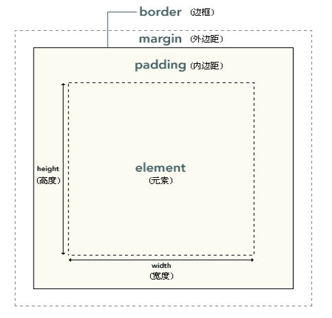

---
盒子模型
---

容器、盒子、有宽度有高度的长方形

## css层叠样式表

​	**内部样式**

```css
div{color:red; font-size:14px;}  选择器{属性：值；}
```

s	**行内样式**

```html
<div style="width:100px; height:100px;"></div>
```

​	**外部引入样式**

放到头部 head 不要在放到style中  外部样式结尾  .css

```css
<link rel="stylesheet" href="style.css">  /*href 后跟路径  外部样式内容*/
```


```css
@charset "utf-8";
div{
		width:200px;
  	height:200px;
  	background:red;
}
```

## 一、边框线  border

**1.三要素 大小 风格 颜色**

```css
border:1px solid red;
```

**2.单独定义某条边框线**

```css
border-top:1px solid red; 	 	/*上边框*/

border-right:1px solid red;  	/*右边框*/

border-bottom:1px solid red; 	/*下*/

border-left:1px solid red; 		/*左*/
```

 **3.三要素详解 分解写法**

**边框大小**

```css
border-width:1px;
/*边框大小粗细*/
border-top-width:1px;
```

**边框颜色**

```css
border-color:blue;

边框颜色:;  英文单词  red yellow 	transparent  是透明
					十六进制   #124547
					rgb/rgba    rgb(255,255,255)
```

**边框风格**

```css
border-style:solid;

边框风格①无边框		none
实线					solid
虚线					dashed
点状线			   	   dotted
双线					double
3d 凹槽				groove
3d 垄状				ridge
3d inset边框			inset
3d outset边框			outset
```

 

## 二、外边距  margin

1.margin围绕在元素边框的空白区域，设置外边距会在元素外创建额外的“空白”

2.边框以外是外边距，外边距默认是透明的，因此不会这挡其后的元素

3.margin属性**接受任何长度单位、百分数值甚至负值。**

​	**百分比是按照父级的宽度来算**

```css
margin-top		距离顶部的距离
margin-right	距离右边的距离
margin-bottom	距离下边的距离
margin-left		距离左边的距离
```

## h1--h6

```css
margin:50px;				/*上下左右*/
margin:50px 60px;			/*上下50  左右60*/
margin:50px 60px 70px;		/*上 左右  下*/
margin:50px 60px 5px 6px;	/*上 下 左 右*/
margin 0 auto;            	 /*居中*/
```

​						

## 三、内边距 padding

​	1.padding属性定义元素的内边距(边框和内容之间)

​	2.padding属性接受长度值或百分比，

​	**但不允许使用负值 **

​	**不能使用auto**

```css
padding-top:20px / 10%;			/*顶部内边距*/
padding-right:20px / 10%;		/*右边内边距*/
padding-bottom:20px / 10%;		/*下面内边距*/
padding-left:20px / 10%;		/*左边内边距*/
```

​	3.元素框的最内部分是实际的内容，直接包围内容的是内边距。

​	4.内边距呈现了元素的背景

​	5.内边距的边缘是边框

​	6.css中  1.**width和height是指的内容区域的宽度和高度**

​			 2.**增加内边距、边框、和外边框不会影响内容区域的尺寸**

​			但是会增加元素框的总尺寸

 

​	**盒子模型占位宽高计算**

​		1.盒子模型占位宽

​		自身宽（width）+左右内边距（padding）+左右边框（border+左右外边距（margin）

​		2.盒子模型占位高

​		自身高(height)+上下内边距+上下边框+上下外边距

​	

## 总结

​		Css样式

​		写法

​		简单的css样式

​		元素内容的大小由宽高决定

​		4.border

​		三要素：大小 颜色 风格及分解写法

​		5.margin：

​		具体值px 百分比 负值 分解写法 复合写法

​		6.Padding

​		**撑大盒子，不支持负值！**