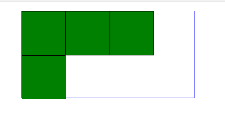
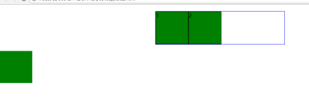

---
浮动
---


## 浮动的定义

使元素**脱离文档流**，按照指定的方向（左右发生移动），遇到**父边界或者相邻的浮动元素**停了下来

**文档流**

是文档中可显示对象在排列时所占用的位置/空间（在页面中占位置）

**脱离文档流**

在页面中不占位置

属性

```css
float: left;
float: right;
```


## 浮动的几种情况

#### 1.左、右浮动


#### 2.上一个元素没有浮动

1.如果前面一个元素浮动，后面的元素没有浮动就会移到它的下面，被他覆盖（因为变为浮动元素以后只有遇到父边界或者相邻的浮动元素停下来）。


#### 3.浮动只会影响浮动后面的元素

**给了浮动的元素只会影响他后面的元素**，如果上面元素不浮动，给下面的元素浮动他不会浮动上去，上方是一个块级元素


#### 4.父级宽度不够，会换行

如果父元素太窄，无法容纳所有的浮动元素，无法容纳的浮动元素会换行显示



## 浮动特殊情况

#### 1.卡住换行元素

以换行的那个元素为基准，如果有浮动元素的高度大于换行的那个元素，那么当换行元素换行时会被高的那个元素“卡住”


#### 2.浮动对文字的影响

浮动框只会占据自己的位置，使文字可以围绕浮动框显示

文字在两浮动框之间


在文字前面加浮动元素


在文字后面加浮动元素


## 浮动和inline-block

| 浮动特征                             | inline-block特征          |
| ------------------------------------ | ------------------------- |
| 块级（横排显示）                     | 块级（横排显示）----友好  |
| 内联  支持宽高                       | 内联标签支持宽高          |
| 元素没有设置宽度时，宽度为内容撑开宽 | 默认 内容撑开宽度         |
| 支持 margin                          | 支持 margin               |
| 脱离文档流                           |                           |
| 提升层级 半层                        | 问题1：标签间空格被解析   |
| 问题：不支持 margin:auto;            | 问题2.不支持 margin:auto; |

**任何元素都可以浮动，而无论它本身是何种元素，浮动元素会生成一个块级框。**


## 清除浮动

#### 1.为什么清除浮动

**浮动会造成父级元素的坍塌**，当浮动元素的父级元素没有给定高度时，子元素就会造成父级元素的坍塌。**导致布局错乱**

#### 2. clear使用注意

**1.要加给浮动元素末尾的元素，而不是父级或者浮动元素本身**

**2.但是这个元素不能是行内特性**

 

#### 3.方法

##### 1.父级：紧邻兄弟法

给紧邻的兄弟加clear属性，值（left、right、both）

缺点：只是让后面的元素正常显示，并没有撑开高度

```css
给2一个 clear:both;
```

		

##### 2.子元素最后添加空的 块标签  

```css
div{clear：both；}  可以清除不符合代码规范
```

**可以清除，不符合代码规范**


##### 3.父级元素

1.加高     **扩展性不好**，一般是内容撑开高度


2.display：inline-blcok;  **margin:auto; 失效，**有间隙


3.over-flow:hidden   比如你需要滚动条，或者有绝对定位的子元素在外边.,**需要配合宽度**


4.after伪类（时下主流）

```css
.clearfix：after{content：""; display:block; clear:both;}
.clearfix{zoom:1;} 为了兼容IE
```



 


##  学习时的烦恼

浮动是脱离了文档流，为什么清除浮动是因为 脱离文档流，父级的盒子撑不开，  清除浮动之后浮动的元素会模拟占据他浮动的位置 ，会撑开高度，清除的方法记住就好了


原理，可以在后面加一个块级的标签

 

浮动  自己的猜想 都不正确

脱离文档流 然后又说对前方的元素没有影响

只会影响后面的元素，但是这个又影响了他前面的元素

他浮动不上去是因为是块级元素吗  ，浮动上去就因为是行内或者是行内块元素

行内块和行级的元素吗

 

clear 是不允许浮动 ，然后前面的元素就不浮动了吗

clear 属性规定元素的哪一侧不允许出现浮动元素。

 

如果给他clear：both；属性

就是他已经浮动完之后 你再清除，就是按之前浮动的位置占位，

 

 

清除浮动 

是让他重新占据文档流吗，占据位置。

啊啊  懂了一些 

最后的子元素后面加上空盒子标签标签  `<div></div>`

给他设置一个属性  div{clear:both;}

和这个一样 aftere：{content””; display:block; clear:both;}

 

给父级加一个高度只能成为这种样子的 外面的元素才没有影响

 

Display：inline-block;