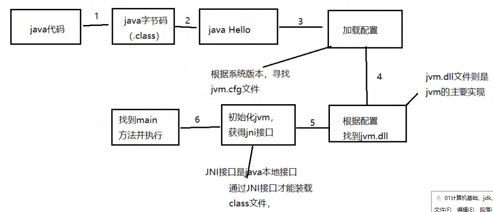

## 一、基础知识

### 1-1 计算机组成


+ 硬件

  硬件包含：输入设备、输出设备、存储设备、CPU、其他设备。

  输入设备中常见的：鼠标、键盘、麦克风...

  输出设备常见的：显示器、音响、打印机...

  存储设备常见的：硬盘、内存条、U盘、光盘...

  CPU(中央处理器)包含两部分：运算器、控制器...

  其他设备有：机箱、

+ 软件

  软件又分为：系统软件、应用软件

  系统软件常见的：Win7、win8、win10、Linux、Mac

  应用软件常见的：电脑上的软件

  应用软件包含两种结构：

  ​	C/S(Client/Server)：客户端/服务器

  ​	先下载，然后再安装，最后才可以使用

  

  B/S(Browser/Server):浏览器/服务器


### 1-2 存储单位

计算机中存储二进制信息，也就是0和1，而日常生活中使用十进制。

8bit -----------------> 1byte

1024byte ---------> 1KB

1024KB------------->1MB

1024MB ------------>1GB

1024GB ------------->1TB


### 1-3 常见的DOS命令

1.命令

2.如何打开DOS窗口？

```js
1.在开始菜单找
2.按住shift右键打开
3.在文件管理上面的文件里面输入 cmd 回车
4.win+R 输入cmd
```

3.路径（不做过多解释了）

+ 绝对路径
+ 相对路径

4.常见DOS命令

```html
dir 查看某一个路径下所有的文件

cd 在同一个盘符下面切换目录
	相对路径或者绝对路径
cd .. 返回上一级目录
cd / 返回当前根目录
D: 更改盘符
cls 清屏
exit 退出、关闭
```


```html
md 文件名   新建一个文件夹
rd 文件夹名 删除一个文件夹
如果一个文件夹下有文件  del 文件夹名
```


### 1-4 计算机语言发展史

计算机语言：人与计算机交互所使用的语言。

发展史

第一代：机器语言

​	编写二进制，以打孔机为代表

第二代：低级语言

​	出现少量单词

第三代：高级语言

​	如Java、C、C++......


### 1-5 Java语言发展史

在1995年诞生的，当时SUM公司（太阳微电子公司），后来被Oracle（甲骨文）公司收购了。

派James Gosling领导团队开发了一款语言，Oak语言（橡树语言）

Oak语言改名为Java语言。


Java之父？James Gosling

发展史？

​	在1996年发布JDK1.0

​	JDK：Java开发工具包，也就是说如果想开发Java程序必须安装JDK。

​	...

​	最新版本 JDK10.0

​	目前所使用JDK8.0


Java语言包含三大块：

+ JavaME 微型版，用于开发小型设备、智能卡、移动端应用

+ JavaSE：标准版，用于创建桌面应用程序。（企业用JavaSE创建桌面应用比较少）。它是整个Java技术的基础和核心

+ JavaEE：企业版，用于创建企业应用那个，（JavaEE是JavaSE的升级版，语言基础依然是JavaSE，核心算法依然是JavaSE）

注意：在JDK5.0时改名了JAVASE、JAVAEE、JAVAME

主要做企业级开发，


### 1-6 Java语言特性

+ **简单性**：Java舍弃了C++中难以掌握并不安全的功能，如：指针，多继承等。

  Java语言底层是C++实现的

+ **面向对象**：Java和C++一样，是一种面向对象语言。

+ **安全性**：如：运行时堆栈溢出，强制类型检查。

+ **健壮性**：Java语言在运行过程中产生的垃圾会自动回收，简称GC机制。

+ **可移植性**：Java程序编译一次，不做任何修改时到处运行，也就是跨平台。

  在不同平台上安装不同JVM

+ ......


### 1-7 Java的加载与执行

```js

Java源代码 --> 编译 --> Java字节码（可跨平台） --> 运行 --> JVM Java虚拟机 --- 这一步的对应看下面的图（windows/ Linux / / Mac）

```

  

注意：JVM本身并不具备跨平台功能，每个操作系统都有不同版本的虚拟机。


+ **第一步：编写Java源代码**，注意：后缀名是.java 如 Hello.java

+ **第二步：编译**   也就是检查Java语法格式。

  使用javac 命令编译java源文件 如：javac Hello.java

  当编译成功时，则自动生成一个字节码文件(.class)，如 Hello.class

  当编译失败时，则改错然后重新编译。

+ **第三步：运行** 注意：运行的是字节码文件

  注意：如果想要在当前操作系统上运行字节码文件，则必须保证有JVM

  JVM：Java虚拟机，不能单独安装

  解决办法：

  ​	1.在安装JDK的同时安装JVM

  ​	2.在安装JRE的同时安装JVM


JDK、JRE、JVM各自是什么，以及之间的关系?

​	JDK：Java开发工具包

​	JRE：Java运行环境

​	JVM：Java虚拟机 （不能单独安装的）

我们想要运行一个已有的Java程序，那么只需要安装`JRE`即可

我们想要开发一个全新的Java程序，那么必须安装`JDK`。

 


### 1-8 java代码是如何执行的




### 1-9 一个class文件


## 二、java

### 2-1 编写第一个java程序

+ 第一步：编写Java程序

```java
class Hello{
	public static void main(String[] args){
		System.out.print("Hello World");
	}
}
```

```java
/**
 * public 修饰符 公共
 * static 静态
 * void 无返回值
 * main 主方法
 * String [] args 参数
 */
public class HelloWorld {
	public static void main(String [] args) {
		// 写上我们的注释内容
		System.out.println("Hello world");
		
	}
}
```

+ 第二步：编译

  javac Hello.java

```js
javac 不是内部命令，也不是可运行的程序或批处理文件
```


### 2-2 下载JDK与配置环境变量

当编译后出现以上问题时，解决办法：

​	安装JDK以及配置环境变量。

​	配置环境变量

注意：当环境变量配置成功后，则必须将之前的DOS命令窗口关闭。

```html
安装的时候，那三个可以把最后一个jre去掉，因为jdk已经包含了jre和jvm
或者安装一个之后再下一步的过程中直接取消。
```

```js
javac Hello.java  运行dos命令
java Hello 运行出结果
```


### 2-3 Java源文件组成部分

第一部分：编写类也叫做外部结构。

```java
class Student{
    
}
```


第二部分：**编写main方法，也叫做主方法或程序入口。**

​	注意：1.编写在类中

​				2.在一个类中的main方法是可有可无的。

​				3.如果编写main方法，则在一个类中最多有一个

```js
class Student{
    public static void main(String[] argus){
        
    }
}
```

第三部分：编写代码

​	注意：1.暂时将代码编写在入口中

​				2.可以在入口中编译 N 条语句，语句也就是以英文分号作为结束。


### 2-4 输出语句

```js
System.out.print("编写大小写字母，汉字、数字以及特殊符号，但是输出之后不换行，");
System.out.println("输出内容同上，但是输出后换行");
```


### 2-5 注释

​	作用：解释说明，在程序中并不运行。

​	目的：增加程序可读性。

​	注释分类：三种

```java
单行注释：// 
多行注释： /*    注释内容  */

文档注释
    /**
    	注释内容
    	*/
```


### 2-6 public class 与 class区别

+ 一个类前面的 public 是可有可无的

+ 如果一个类使用 public 修饰，则文件名必须与类名一致。

+ 一个类前面如果没有public修饰，则文件名可以与类名不一致，**当编译成功后会生成对应类名的字节码文件**。

+ 一个类中的main方法是可有可无的，如果没有编写main方法，编译成功，但是不能运行。

+ 在一个源文件中可以编写任意多个类，当编译成功后，会自动生成类的个数的字节码文件，并可以运行每个字节码文件(必须保证有入口)。

   

```html
在整个java中只允许有一个public class声明，但允许声明其他的class声明
在编写java程序的时候，类的名称
```


### 2-7 classpath

注意：在默认情况下，运行某个字节码文件时在当前目录下找。

​			如果找到运行的字节码文件则执行，否则报错。

**配置classpath**

+ 临时配置 classpath

```dos
使用set命令完成临时配置classpath
	set classpath=F:\work-kaifa\学习目录\java\00

使用set命令完成查看是否配置 classpath
	set classpath

使用set命令完成删除classpath的配置
	set classpath=
	配置完成后，关闭dos命令窗口 classpath 就失效了。

set classpath=F:\work-kaifa\学习目录\java\00  后面没有加分号 
如果用setclasspath做了配置了，不管你当前目录下有没有，直接去配置的classpath里面去找，找到运行，找不到报错。(不管当前目录有没有此类)

set classpath=F:\work-kaifa\学习目录\java\00; 
	加了分号之后，在配置目录下找，找不到再来当前目录找一下。

也可以写多个，用分号隔开，查找顺序的优先级
```


+ 永久配置 classpath

在环境变量那里和path是一个级别的 classpath 那里配置，用分号隔开。


### 2-8指定 class 文件的生成目录

```cmd
javac -d 要生的目录 java文件所在目录

javac -d bin src/Hello.java
```


**执行**

```cmd
java -cp bin Hello
```


## 三、基础知识

### 3-1 关键字

> 被java定义好的， 在java中具有特殊意义 赋予特殊含义的单词，全部采用小写字母

```java
比如 class public static void ...
```


### 3-2 标识符 命名规范

```html
java中的包、类、方法、参数和变量的名字
```

也就是名字，对类名、变量名称、方法名称、参数名称等的修饰。

标识符的命名规则：

+ 以字母、下划线或$开头，其后可以是字母、数字、下划线_或\$
+ 区分大小写，
+ 不能使用关键字

标识符命名规范

+ 建议：见名知意，也就是说最好编写单词，如：name,age
+ 建议：类名每个单词首字母大写，如：Hello、Student
+ 建议：变量名称、方法名称、参数名称采用**驼峰命名法**， getInfo、
+ 建议：标识符的长度不要超过15个字符。

```htm
有几个是有特殊意义，不要作为标识符。
true，false、null 不要使用这几个作为关键字
```


在java中GOTO和Const没有任何意义。

assert是在JDK1.4之后增加进来的

enum是在JDK1.5后增加进来的


### 3-3 字面值

+ **整数类型字面值**，如：100、9、-1、0

+ **浮点类型字面值**，如：0.1     3.14159   -98.999

+ **字符串类型字面值**，如： "你好"  "98" "3.19"

  ​	字符串：表示一次可以存放0个、1个或多个，但是必须使用英文的**双引号引起来**。

+ **字符类型字面值**, 如： 'a'  '6' '男'

  字符类型：表示一次只能存放一个，并且使用英文的**单引号引起来**。

+ **布尔值类型字面值** true、false

```java
public class DataType {
	public static void main(String [] args) {
		// 整型 
		// int 1 2 3 4 6
		int sum = 181;
				
		// 小数
		float age = 1.1f;
		
		// 布尔值
		// true false
		boolean flag = true;
		System.out.println(sum);
		System.out.println(age);
		System.out.println(flag);
		
		// 字符类型
		char name = 'a';
		
		char name1 = 'b';
		System.out.println(name);

		
		// 字符串类型
		String str = "我是一个字符串";
		System.out.println(str);
		
		
		String demoName = null;
		System.out.println(demoName == null);
		
		
		
	}
}
```


### 3-4 进制以及进制之间转换

常用进制

+ 二进制：在计算机中使用，取值范围0和1
+ 八进制：取值范围 0--7
+ 十进制：在日常生活中使用，取值范围 0--9
+ 十六进制：取值范围 0---9和 A--F


进制转换基本的，不写笔记了。


### 3-5 字符编码

**字符编码**：按照某种格式规定将数据存储在计算机中。

常用字符编码

+ ASCII

   'a' -------> 97     'b' -----> 98

+ iso8859 - 1 西欧语言编码，兼容ASCII

+ GBK/GB2312:中文编码

+ Unicode：统一全球所有国家文字

  常用的有：utf-8  utf-16 utf-32

  注意：java源代码采用的unicode编码。

  乱码、编码、解码


### 3-7 变量和常量

变量：存放数据的，并且该变量中的数据是可以发生改变的。

常用的数据类型：

+ 整数类型 int
+ 浮点类型 double
+ 字符串类型 String
+ 字符类型 char
+ 布尔类型 boolean

变量的操作步骤

```java
第一步：声明变量，也就是确定当前变量存放数据的类型。
    语法格式：数据类型 变量名称
    如 int a;
第二步：赋值，也就是将 = 右侧的值赋给等号左侧的变量名称。
    语法格式：变量名称 = 值；
    如 a = 10;
第三步：使用
    注意：暂时使用为输出变量中的值。
```

```java
class Var02{
	public static void main(String[] args){
		// 变量操作步骤
		// 第一步：声明变量
		int num;
		double num2;
		String str;
		// 第二步赋值
		num = 2018;
		num2 = 3.14;
		str = "给str赋值字符串";
		// 第三步：使用
		System.out.print("变量的名称" + num);
		System.out.print("num2==>" + num2);
		System.out.print(str);
	}
}
```

**注意：**变量声明之后必须使用，要不然连编译那个步骤都通过不了。


