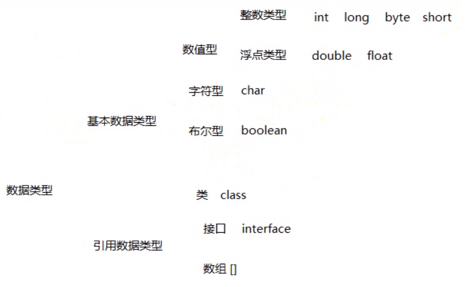
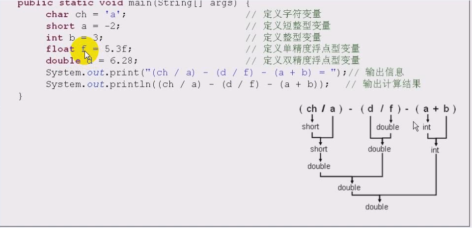
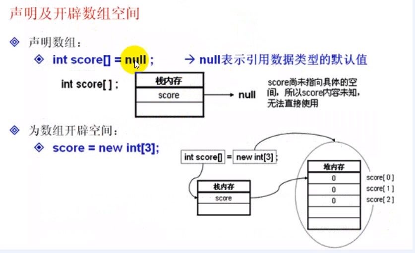
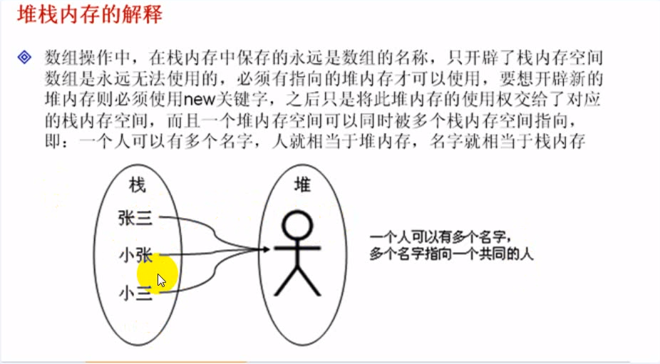
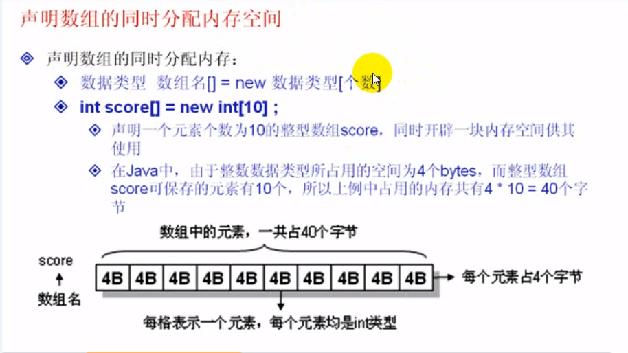
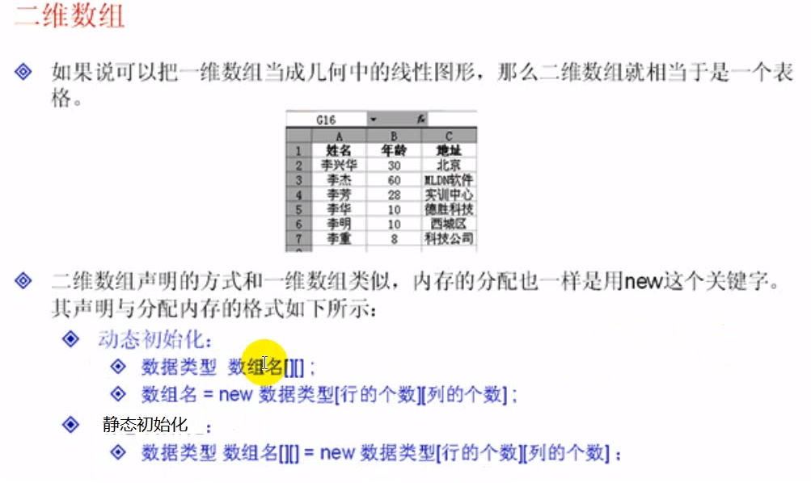
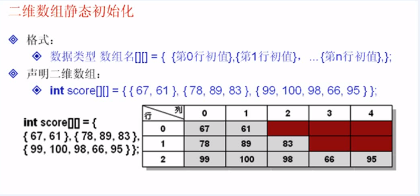
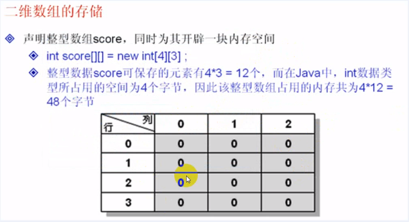

[TOC]

## 数据类型

### 1-1数据类型的划分

主要分为两大类

+ 基本数据类型 (类似于普通的值0)

数值型：

​	整数类型 byte、short、int、long

​	浮点类型（实际上是表示小数）float、double

字符型：

​	char

布尔型：

​	boolean 


+ 引用数据类型 (传递的是内存的地址)

类

接口

数组


**Java的基本数据类型是有取值范围，要使用一个类型的话必须使用使用一个范围指定其内容**


### 1-2八大基本数据类型

| 数据类型        | 默认值    | 大小/位 | 可表示的数据范围                         |
| --------------- | --------- | ------- | ---------------------------------------- |
| long（长整型）  | 0         | 64位    | -9223372036854775808~9223372036854775807 |
| int（整形）     | 0         | 32      | -2147483648——2147483647                  |
| shot(短整形)    | 0         | 16      | -32768~32767                             |
| byte(位)        | 0         | 8       | -128~127                                 |
| char(字符类型)  | \u000(空) | 2       | 0~255                                    |
| float（单精度） | 0.0f      | 32      | -3.4E38（-3.4*10^38）~3.4E38             |
| double(双精度)  |           | 64      | -1.7E308（-1.7*10^308）~1.7E308          |
| boolean         |           |         |                                          |

double类型可以装下全宇宙的数据。

```java
long a = 100l; // 后面是一个小写的 l
```





对于数据来说，设置内容时，应该放在整个的允许的范围之中，如果超过了此范围，则会出现计算不正确的情况。

一个数据有自己的保存范围内，超出范围则编译的时候会报错。

我们有一个数字已经是最大或最小的时候，再进行增加或减少操作，就会产生数据溢出。

**小例子1**

```java
public static void main(String [] args) {
    //		int num; // 定义一个整型的变量
    int num = 2147483647;
    int intMax = Integer.MAX_VALUE; // 整型的最大值
    System.out.println("int类型的最大值" + intMax); // int类型的最大值2147483647
    System.out.println("整型最大值+1===>" + (intMax + 1)); // 整型最大值+1===>-2147483648
    System.out.println("整型最大值+1===>" + (intMax + 2)); // 整型最大值+1===>-2147483647
    
    System.out.println((long)intMax + 2); // 整型最大值+1===>-2147483647
    // 类型装换了
}

如果我们现在想要避免这种数据溢出的话，可以采用扩大数据类型的方式 int--> long
```


转义字符在开发中使用的非常多

转义字符  描述

| 转义字符 | 描述     |
| -------- | -------- |
| \f       | 换页     |
| \b       | 倒退一个 |
| \r       | 归位     |
| \\\      | 反斜杠   |
| \‘       | 单引号   |
| \n       | 换行     |
| \\"      | 双引号   |


**小例子2**

```java
// 用单引号引起来
public static void main(String [] args) {
    char ch1 = 'a';
    char ch2 = 97;
    System.out.println("ch1 = " + ch1); // ch1 = a
    System.out.println("ch2 = " + ch2); // ch2 = a
    // 这里可以通过把字符串通过数字定义  通过ASCII码转义
    char ch3 = '\"';
    char ch4 = '\\';

    System.out.println("ch3 = " + ch3); // ch3 = "
    System.out.println("ch4 = " + ch4); // ch4 = \

    System.out.println("\"Hello World!\""); // "Hello World!"

}
```


定义两个小数相乘

​	在Java中一个数字或一个小数实际都是存在一个默认类型的

​	小数（1.1，1.2） 默认类型是double类型 所以在后面加一个f定义为浮点类型

​	整数（1,2,3,）的默认类型是int类型

```java
public static void main(String [] args) {
    float num = 3.0f; // 定义一个浮点型变量
    System.out.println("两个小数相乘" +  num * num);
}
```

**注意：**在开发中基本上使用到float就够了


布尔值

在一般语言中（C语言）使用0 1的标识 true 和 false

**小例子**

```java
public static void main(String [] args) {
    boolean flag = true;
    System.out.println("flag = " +  flag); // flag = true
}
```


### 1-3数据类型的相互转换

> 类型转换分为2种
>
> ​	自动类型转换
>
> ​	强制类型转换


+ 自动类型转换

1、转换前的数据类型与转换后的数据类型兼容

2、转换后的数据类型的表示范围比转换前的类型大。

String表示一个字符串，可以直接声明的方式来完成定义。

```java
public static void main(String [] args) {
    int x = 30; // 定义整型变量
    float y = 22.19f; // 定义浮点型变量

    System.out.println("x / y = " + (x / y)); // x / y = 1.3519603
    System.out.println("10 / 3.5 = " + (10 / 3.5)); // 10 / 3.5 = 2.857142857142857
    System.out.println("10 / 3 = " + (10 / 3)); // 10 / 3 = 3
    // 10 / 3 应为其默认类型是int型、所以说所有的数据类型都会以整型的形式出现，那么结果就是3 小数点会省略掉
}
```

```java
public static void main(String [] args) {
	String str = "我的名字";
	int x = 30;
	str = str + x; // 修改 str 的内容，并将修改后的内容赋值给str
	System.out.println(str);
	// 如果说，现在要使用字符串的常量进行输出的话，也要注意
	
	int i = 1; // 定义整型变量
	int j = 2; // 定义整型变量 
	System.out.println("1+2 = " + i + j); // 1+2 = 12
	System.out.println("1+2 = " + (i + j)); // 1+2 = 3
	System.out.println(i + j + "1+2 = " + i + j); // 31+2 = 12
	// 所有的数据类型都会 向字符串转换

}
```


+ 强制类型转换

（预转换数据类型）变量

**小例子**

```java
public static void main(String [] args) {
    float f = 30.3f; // 浮点类型
    int x = (int)f; // 强制类型转换
    System.out.println("x = " + x); // 30
    System.out.println("10 / 3 = " + (10 / 3)); // 10 / 3 = 3
    System.out.println("10 / 3 = " + ((float)10 / 3)); // 10 / 3 = 3.3333333
}
```

> 总结
>
> 1.Java中的数据类型划分
>
> 2.8中基本数据类型，包括长度、常量的默认值
>
> 3、String 任何类型都会向 String进行转换


## 运算符

#### 2-0 一元运算符

| 一元运算符 | 描述    |
| ---------- | ------- |
| +          | 正      |
| -          | 负      |
| ！         | NOT、否 |

> ! 表示取反操作


#### 2-1算术运算符

| 算术运算符 | 描述 |
| ---------- | ---- |
| +          |      |
| -          |      |
| *          |      |
| /          |      |
| %          | 取模 |


#### 2-2关系运算符

| 关系运算符 | 描述     |
| ---------- | -------- |
| >          | 大于     |
| <          | 小于     |
| >=         | 大于等于 |
| <=         | 小于等于 |
| ==         | 等于     |
| !=         | 不等于   |

在数学中使用 = 判断相等，但是 = 在程序中代表赋值操作，在程序中使用 == 判断是否相等。


#### 2-3递增 递减

| 自增与自减 | 描述           |
| ---------- | -------------- |
| ++         | 自增，变量值+1 |
| --         | 自减，变量值-1 |


#### 2-4逻辑运算符

| 逻辑运算符 | 描述    |
| ---------- | ------- |
| &          | And,与  |
| &&         | 短路 与 |
| \|         | or 或   |
| \|\|       | 短路或  |


不管是短路还是非短路，其基本操作结果是一样的。

使用与操作的时候，要求前后几个表达式的内容都要是true，最终结果才是true。如果有一个是false，则最终结果就是false


使用或操作的时候，要求前后几个表达式只要有一个true，最终结果就是true。如果全部都是false，最终结果才是false。

**注意**

对于 **&** 来说，要求所有的条件都判断，而如果使用短路与 **&&**，如果第一个条件为false，则后面的条件都不在判断。


对于**|**表示对于 或 来说，要求所有的条件都判断，而如果使用短路或 **||**，如果第一个条件为true，则后面的条件将不再判断。


#### 2-5括号运算符

| 括号运算符 | 描述                     |
| ---------- | ------------------------ |
| ()         | 提高括号中表达式的优先级 |

括号可以改变优先级

#### 2-6运算符的优先级

| 运算符 | 范例   | 执行前a | b    | 说明                                        | 执行后a | b    |
| ------ | ------ | ------- | ---- | ------------------------------------------- | ------- | ---- |
| +=     | a+=b   | 12      | 3    | a+b的值存放到a中（同a = a+b）               | 15      | 3    |
| -=     | a-=b   | 12      | 3    | a-b的值存放到a中 （同a = a-b）              | 9       | 3    |
| *=     | a*=b   | 12      | 3    | a*b的值存放到a中 （同a = a\*b）             | 36      | 3    |
| /=     | a/=b   | 12      | 3    | a/b的值存放到a中（同a = a/b）               | 4       | 3    |
| %=     | a%=b   | 12      | 3    | a%b的值存放到a中 （同a = a%b）              | 0       | 3    |
| b++    | a*=b++ | 12      | 3    | a*b的值存放到a后，b加1 （同a=a\*b;b++）     | 36      | 4    |
| ++b    | a*=++b | 12      | 3    | b加1后，再将a*b的值存放到a（同b++；a=a\*b） | 48      | 4    |
| b--    | a*=b-- | 12      | 3    | a*b的值存放到a后，b减1（同a = a\*b;b--）    | 36      | 2    |
| --b    | a*=--b | 12      | 3    | b减1后，再将a*b的值存放到a（同b--；a=a\*b） | 24      | 2    |


#### 2-7表达式的类型转换

当Java发现程序的表达式中有类型不相符的情况，会依据以下方式进行转换。

1、占用字节较少的类型转换成占用字节较多的类型。

2、字符型会转成int类型

3、int会转换成float类型

4、表达式中若某个操作的类型为double，则另一个操作数字也会转换成double类型。

5、布尔类型不能转换成其他类型。

  


## 程序执行结构

#### 3-1顺序结构

程序至上而下逐行执行，一条语句执行完成之后继续执行下一条语句，一直到程序末尾。


#### 3-2选择结构

选择结构是根据条件的成立与否，再决定要执行哪些语句的一种结构。

```java

if(){
    
}else{
    
}

三目运算符
    
else if
    
    
swicth
```

**注意：**在使用switch进行表达式判断的时候一定要注意，在表达式中只能使用数字或字符。

switch 的判断只支持4中类型，int、char、 sort、byte类型 jdk7支持了 String类型


#### 3-3循环结构

```java
for
```

```java
do while
```

```java
while
```

```java
两种循环中断操作  break 和 continue
```

```java
// 这个和JavaScript的for in循环差不多
for(int a:scoreArr) {
    System.out.print(a + " ");
}
```


## 数组

#### 4-1介绍

掌握数组的作用

掌握数据的声明以及内存分配

通过数组的简单范例加深数组操作的原理


数据：

数组是一组相关变量的集合，一个数组实际上就是一连串的变量。

数组按照使用可以分为 一维数组、二维数组、多维数组

```java
不使用数组定义100个整型变量 int i1; int i2; int i3;

使用数组定义 int i[100];
```

一维数组可以存放上千万个数据，并且这些数据的类型是完全相同。


#### 4-1语法

```java
要使用Java的数组，必须经过两个步骤：(1)声明数组 (2)分配内存给数组。

声明形式一、
声明一维数组：数据类型 数据名[] = null;
分配内存给数组：数组名 = new 数据类型[长度];

声明形式二、
声明一维数组：数据类型[]数据名 = null;

引用数据类型：数组、接口

引用传递就是一个内存的使用权。一块内存空间，可能有多个人同时使用。
```










数据的访问也可以通过循环的方式来操作，循环操作的时候只需要改变其索引（下标）即可；

**访问注意**：score【3】如果超出就会报错。

```java
in thread "main" java.lang.ArrayIndexOutOfBoundsException: 3
// 数组越界
```


#### 4-2方法

```java

arr.length;  // 求数组的长度

```


#### 4-3静态初始化默认值

之前看到的数组，都是采用的方式是动态初始化，即：所有的内容在数据的声明的时候并不具体的指定，而都是以默认值的形式出现。

```java
数据类型 数组名 [] = {初始值0,初始值1，...}

int score[] = {91,92,93,7};
```


#### 4-4二维数组


二维数组的定义




**动态初始化**

```java
// 二维数组的动态初始化
int score[][] = new int[4][3]; // 声明并实例化二维数组

score[0][0] = 100;
score[1][2] = 30;
score[2][2] = 20;
score[3][2] = 30;
score[2][2] = 30;
score[3][0] = 99;


System.out.println("数组的长度" + score.length);
System.out.println("数组的列" + score[0].length);

for(int i=0;i<score.length;i++) {
    for(int j=0;j<score[i].length;j++) {
        System.out.print(score[i][j] +"\t"); 
    }
    System.out.println("");

}
```





**静态初始化**

```java
int score[][] = {
    {67,61},
    {78,79,83},
    {99,100,98,66,95}
}; // 静态初始化完成，每行的数组元素个数是不一样的

System.out.println("数组的长度" + score[0].length);

score[0][2] = 100;
System.out.println(score[0][2]);
```


二维数组的存储




**多维数组**

```java
// 多维数组
int score[][][] = {
    {
        {5,1},{6,7}
    },
    {
        {9,4},{8,3}
    }
};
/*
		 * score[0][0][0] = 5;
		 * score[0][0][1] = 1;
		 * score[0][1][0] = 6;
		 * score[0][1][1] = 7;
		 * 
		 * score[1][0][0] = 9;
		 * score[1][0][1] = 4;
		 * score[1][1][0] = 8;
		 * score[1][1][1] = 3;
		 * 
		 */


for(int i=0;i<score.length;i++) {
    for (int j = 0; j < score[i].length; j++) {
        for (int k = 0; k < score[i][j].length; k++) {
            System.out.println("score["+i+"]["+j+"]["+k+"]=" + score[i][j][k]);
        }
    }
}
```


#### 总结

数组的使用分为两个步骤

1、声明数组

​	声明数组，是在栈内存中声明的。

2、为数组开辟空间

​	为数组开辟空间，是使用 new 关键字在堆内存中完成的。

当然也可以一起完成， 数据类型 数组名 [] = new 数据类型[长度]

可以通过数组名称.length的形式求出数组长度。


数组中有很多常见的算法和题目，只要控制好其下标就可以完成。

数组下标是不能越界，越界之后程序会出现错误，如果开辟3个空间，则下标是0~2


数组维度在开发中最多就使用到二维数组，就相当于一个表格。

多维数组因为其比较复杂，所以不建议过多使用。


```html
数组的特点

数组下标从0开始
```


