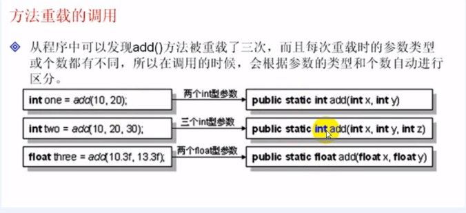

## 方法

掌握方法的作用，定义格式

掌握方法重载的概念及使用

方法的命名规则 ----> 驼峰命名法

可以使用return结束一个方法

掌握方法递归调用


**方法的重载**：方法的重载就是方法名称相同，参数的类型和参数的个数不同，通过传递参数的个数以及类型不同完成不同功能方法的调用。


#### 1-1方法的定义

> 方法就是一段可重复调用的代码段，例如：有某段长度约为100行的代码，要在多个地方使用此段代码，如果各个地方都重复编写此部分代码的话，则肯定会比较麻烦，而且此部分代码如果修改的话也比较困难，所以此时可以将此部分代码定义成一个方法，以供程序反复调用。


**方法的定义格式**

```java
public static 返回值类型 方法名称(类型 参数1，类型 参数2, ...){
    方法的主体
    程序语句；
    [return 表达式];
}

在这里定义的方法，因为其可以直接使用主方法（main()）调用，所以将方法声明处加上了public static两个关键字。
```


**例子1 尝试定义并使用一个方法**

```java
/**
 * 如果在返回值类型上写上void，则表示此方法没有返回值，就不能使用return返回内容。
 * 
 */
public class MethodDemo1 {
	public static void main(String[] args) {
		printInfo();// 调用printInfo()方法
		printInfo();// 调用printInfo()方法
		printInfo();// 调用printInfo()方法
		System.out.println("Hello world!!");
	}
	
	public static void printInfo() {
		char c[] = {'H', 'e', 'l', 'l', 'o'}; // 定义字符数组
		for(int i=0;i<c.length;i++) { // 循环输出
			System.out.print(c[i]);
		}
		System.out.println("");//换行
	}
}
```


**例子2 有返回值的方法**

```java
public class MethodDemo2 {
	public static void main(String[] args) {
		int x = 5;
		int y = 10;
		int result = addOne(x, y); // 调用整数的加法
		
		float result2 = addTwo(x, y);
		
		float result3 = addTwo(10.3f, 10.01f);
		
		
		System.out.println("结果为" + result);
		System.out.println("第二个返回结果为" + result2);
		System.out.println("第3个返回结果为" + result3);
	}
	
	// 定义方法，完成两个数组相加操作，方法返回一个int型的数据
	public static int addOne(int x, int y) {
		return x + y;
	}
	
	// 定义方法，完成两个数字的相加操作，方法返回一个float类型的数据
	public static float addTwo(float x, float y) {
		return x + y; // 方法中的参数是局部变量
	}
}
```


#### 1-2方法的重载

**方法的重载**：方法的重载就是方法名称相同，参数的类型和参数的个数不同，通过传递参数的个数以及类型不同完成不同功能方法的调用。

**注意事项：**方法的重载**一定只是在参数的类型或个数不同**。





**提示：System.out.println()方法也属于重载方法**

```java
public class MethodDemo4 {
	public static void main(String[] args) {
		System.out.println(3); // 输出整数
		System.out.println(33.3); // 输出浮点数
		System.out.println('3'); // 输出字符
		System.out.println(true); // 输出布尔值
		System.out.println(3 + 3); // 输出计算结果
	}
}
```


#### 1-3 return

可以使用return结束一个方法

return可以返回一个方法的结果，那么Java也可以使用return来结束一个方法

```java
public static void main(String[] args) {
	System.out.println("1、调用fun的方法之前：");
	fun(10);
	System.out.println("1、调用fun的方法之后：");
}

public static void fun(int x) {
	System.out.println("3、进入到fun方法");
	if(x == 10) {
		return; // 结束方法，返回调用处
	}
	System.out.println("4、正常执行完fun方法");
	
}
```


#### 1-4递归调用

> 递归调用是一种特殊的调用形式，是**方法自己调自己**。


求累加和可以使用for循环，这里使用递归实现以下。

```java
/**
 * 在递归操作中，一定要明确的写出方法的结束判断，否则会出现异常。
 */
public class MethodDemo6 {
	public static void main(String[] args) {
		int result = sum(100);
		System.out.println(result);
	}
	
	public static int sum(int num) { // 定义方法求和操作
		if(num == 1) { // 判断是否
			return 1;
		}else {
			return num + sum(num - 1); // 递归调用
		}
		
	}
}
```


#### 1-5数组的引用传递

 可以使用方法接收或返回一个数组

一个方法可以接收一个数组，可以返回一个数组。如果方法接受一个数组的话，则此方法对数组所做的修改将全部被保留下来。


方法除了可以接收数组之外，也可以通过方法返回一个数组，只需要在返回值类型上明确的声明处返回的类型是数组即可。


**例子1，传递参数为数组**

```java
/**
 * @explain 数组的应用传值
 */
public class MethodDemo7 {
	public static void main(String[] args) {
		int tmp[] = {1,3,5}; // 利用静态初始化方式来定义数组
		fun(tmp);
		for(int i=0;i<tmp.length;i++) {
			System.out.println("tmp["+i+"] = " + tmp[i]);
		}
	}
	
	// 接收整型的数组的引用
	public static void fun(int x[]) {
		x[0] = 100; // 修改第一个元素
	}
    // 数组的第一项是被修改了的
}
```


**例子2，一个方法返回一个数组**

方法除了可以接收数组之外，也可以通过方法返回一个数组，只需要在返回值类型上明确的声明处返回的类型是数组即可。

```java
/**
 * @explain 返回一个数组
 */
public class MethodDemo8 {
	public static void main(String[] args) {
		int tmp[] = fun();
		print(tmp);
	}
	
	// 打印数组
	public static void print(int x[]) {
		for(int i=0;i<x.length;i++) {
			System.out.println("arr["+i+"] = " + x[i]);
		}
	}
	
	// 返回一个数组
	public static int[] fun() {
		int ss[] = {100, 20, 80};
		return ss;
	}
}
```


**例子3、方法的复用**

```java
/**
 * @explain 数组的应用传值
 * 	以下代码只是完成了整型数组的排序操作，如果一个操作中，要求排序整型
 * 	也可以排序浮点型等各种数据，如果分别实现会比较麻烦。
 * 	所以在Java中为了数组操作方便，提供了一个支持。
 * 
 */
public class MethodDemo9 {
	
	public static void main(String[] args) {
		int score[] = {10,9,8,7,6,5,4};
		int score2[] = {100,65,54,788,54};
		
		sort(score); // 数组排序
		print(score);
		
		System.out.println();
		System.out.println("=====================");
		
		sort(score2); // 数组排序
		print(score2);
	}
	
	public static void sort(int x[]) {
		for(int i=0;i<x.length;i++) {
			for(int j=0;j<x.length-i-1;j++) {
				if(x[j] > x[j+1]) {
					int tmp = x[j+1];
					x[j+1] = x[j];
					x[j] = tmp;
				}
			}
		}
	}

	// 打印数组
	public static void print(int x[]) {
		for(int i=0;i<x.length;i++) {
			System.out.print(x[i] + " ");
		}
	}
}
```


**Java提供了数组支持方法**

```java
int score[] = {10,9,8,7,6,5,4};
// 通过Java提供的方法排序数组
java.util.Arrays.sort(score);
```


#### 1-6数组拷贝

> 可以将一个数组中指定的内容拷贝给另外一个数组，如果，此时要设计方法的话，此方法中应传递多少个参数呢？

原数组

原数组的开始点

目标数组

目标数组的开始点

拷贝的长度


```java

```

```java
// Java自身也是有这个方法的
// 原数组 原数组起始点 目标数组，目标数组起始点，长度
System.arraycopy(score, 1, score2, 2, 3);
```


#### 总结


1、方法是指的是主方法调用的方法。

2、方法定义的时候如需要返回值，则明确写出返回值的类型。（就是Java的数据类型，基本数据类型和引用类型）如果不需要返回值，则直接写上void即可。

3、在方法中可以进行重载。

4、在方法中可以使用return来结束一个方法的操作。

5、方法自己调用自己，成为递归操作。递归操作中必须有明确的结束条件。


数组的引用传递就是堆内存的使用权，可以将一个数组传递的方法之中，传递的时候不需要写上 【】,直接写名字即可

方法中对数组所做的修改都会被保留下来

在Java中提供了一些对数组操作支持的方法。


## 面向对象


#### 2-1面向对象的基本概念

>程序的发展经历了两个主要阶段：面向过程、面向对象。
>
>对于面向对象与面向过程可以用一个例子解释，如果一个木匠要做一个盒子，那么做这个盒子的出发点会有两种方式。
>
>面向对象：先想好要做的盒子，之后再去找相应的工具去做。
>
>面向过程：不去想要做什么样的盒子，随需取用工具。


#### 2-2面向对象的主要特性

**封装：**封装对外不可见，可以保护程序中的某些内容。


**继承：**拓展功能。


 **多态性：**方法的重载


#### 2-3掌握类与对象的关系

> 类是对某一类事物的描述，是抽象的、概念上的定义；对象是实际存在的该类事物的每个个体，因而也称实例。


>换种方式解释：类与对象的关系
>
>类就相当于一个模板，依照此模板产生产品。


面向对象的核心


#### 2-4定义类和对象

```java
class 类名称{
	数据类型 属性;
}
```


**对象的创建需要两个部分**

```java
类名 对象名称 = null;

对象名称 = new 类型（);   // 实例化对象
```


```java
类型 对象名称 = new 类名();
```


**实例化一个Person类**

```java
class Preson {
	// 人中有姓名和年龄两个属性
	String name; // 表示姓名
	int age; // 表示年龄
	public void tell() {
		System.out.println("姓名：" + name + " 年龄：" + age);
	}
}

public class PresonDemo2{
	public static void main(String[] args) {
		Preson user = new Preson();
		
		user.name = "张三";
		user.age = 12;
		System.out.println("姓名：" + user.name);
		System.out.println("年龄：" + user.age);
		
		user.tell();
		
	}
}
```


掌握面向对象的声明与使用。


掌握Java中的内存划分

Java的引用传递

垃圾的产生分析


```java
Preson user = new Preson();

Preson user 声明对象： Person per  栈内存中声明的，与数组一样，数组名称保存在栈内存之中。
只开辟了栈内存的对象，无法使用的，必须有堆内存引用才能使用。

实例化对象：new Person() 在堆中开辟空间，所有的内容都是默认值。
    
String: 是一个字符串。本身就是一个类，就是一个引用数据类型。则对象的默认值null;

int age;是一个整数，本身就是一个数字，所以是基本类型，则默认值是0;
```


**GC：**垃圾收集机制的简称


#### 2-5总结

掌握栈与堆内存的关系

对象保存在栈内存之中，而具体的内容保存在堆内存之中。

对象之间的引用传递，实际上传递的是堆内存的空间的使用权。

垃圾产生


#### 2-6掌握封装的产生目的

封装就是保护里面的内容，

保证某些属性或方法可以不被外部看见。

被封装的属性看，如果需要被外部访问，那么我们就需要提供get set方法。

```html
例如：现在有一个属性：private String name;

set(设置) public void setName(String name){
	
}

get(取得) public String getName();
```


**例子1、私有属性的设置和获取**

```java
class Person1 {
	private String name; // 姓名
	private int age; // 声明年龄属性
	
	
	// 设置姓名、年龄
	public void setName(String newName) {
		name = newName;
	}
	public void setAge(int a) {
		if(age <0 || age > 150) {
			age = a;
		}
	}
	
	// 获取方法
	public String getName() {
		return name;
	}
	public int getAge() {
		return age;
	}
	
	public void tell(){
		System.out.println("姓名：" + name + " 年龄：" + age);
	}
}

public class EncDemo2 {
	public static void main(String[] args) {
		Person1 user = new Person1();
		
		user.setName("张三");
		user.setAge(19);
		System.out.println(user.getAge());
		user.tell();
	}
}
```


封装的目的

掌握set get的方法定义，set及get方法的作用

掌握封装的实现 封装性在Java中有很多种形式，private只是最基本的一种形式，也是一种比较常见的形式

​	类中的每一个属性都必须封装。


#### 2-7掌握构造方法的概念及调用时机

类名称 对象 = new 类名称();


因为有(),所以表示的是一个方法，这实际上就是一个构造方法。

只要一有对象对象实例化则就会调用构造方法。

构造方法的定义格式

```java
class 类名称  {
	访问权限 类名称 (类型1 参数1, 类型2 参数2,...)
	程序语句
	....//构造方法没有返回值
}
```


**注意：**构造方法的声明中一定要牢记以下几点：

构造方法的名称必须与类名称一致。

构造方法的声明处不能有任何返回值类型的声明。

不能在构造方法中使用 `return` 返回一个值。

构造方法是在`new`的时候才执行的。


```java
class Person5 {
	private String name;
	private int age;
	
	public Person5(String n, int a) { // 声明构造方法
		this.setName(n);
		this.setAge(a);
		System.out.println("一个新的Person对象产生");
	}
	
	public void setName(String n) {
		name = n;
	}
	public void setAge(int a) {
		if(a >= 0 && a<150) {
			age = a;	
		}
	}
	
	public int getAge() {
		return age;
	}
	public String getName() {
		return name;
	}
	
	public void tell() {
		System.out.println("姓名：" + name + " 年龄：" + age);
	}
	
}

public class EncDemo3 {
	public static void main(String[] args) {
		System.out.println("声明对象：Person per = null");
		Person5 user = new Person5("张三", 90); // 一个新的Person对象产生
		System.out.println("实例化对象");
		user.tell();
	}
}
```


在整个Java的操作中，如果一个类中没有明确的声明一个构造方法，则会自动生成一个无参（什么都不做）的构造方法，供我们使用，就类似于以下形式。

```java
class Person{
    public Person(); // 如果没有编写构造方法，则会自动生成此代码。
}
```

构造方法的主要目的是为类中的属性初始化，既然是方法，则此方法中肯定可以传递参数。

可以定义一个构造方法，里面传递参数。


#### 2-8掌握构造方法的重载

构造方法本身于普通方法一样，都是支持重载操作的，只要参数的类型不同，那么就可以完成构造方法重载。

```java
class Person5 {
	private String name;
	private int age;
	
	public Person5(String n, int a) { // 声明构造方法
		this.setName(n);
		this.setAge(a);
		System.out.println("一个新的Person对象产生");
	}
	
	public Person5(String name) { // 声明有一个参数的构造方法
		System.out.println("声明有一个参数的构造方法");
		this.setName(name);
	}
	
	 public Person5() { // 声明无参的构造方法。
		 System.out.println("声明无参的构造方法");
	 }
	
	public void setName(String n) {
		name = n;
	}
	public void setAge(int a) {
		if(a >= 0 && a<150) {
			age = a;	
		}
	}
	
	public int getAge() {
		return age;
	}
	public String getName() {
		return name;
	}
	
	public void tell() {
		System.out.println("姓名：" + name + " 年龄：" + age);
	}
	
}

public class EncDemo3 {
	public static void main(String[] args) {
//		System.out.println("声明对象：Person per = null");
//		Person5 user = new Person5("张三", 90); // 一个新的Person对象产生
//		System.out.println("实例化对象");
//		user.tell();
		
		Person5 user2 = new Person5("张三", 40);
		user2.tell();
	}
}
```

**通过不同个数的参数调用不同的构造方法**


#### 2-9掌握匿名对象的使用

匿名：没有名字，在Java中如果一个对象只使用一次，则就可以将其定义成匿名对象。


所谓的匿名对象就是比之前的对象少了一个栈内存的引用关系。

```java
class Person6 {
	private String name;
	private int age;
	
	public Person6(String n, int a) { // 声明构造方法
		this.setName(n);
		this.setAge(a);
		System.out.println("一个新的Person对象产生");
    }
    
	public void setName(String n) {
		name = n;
	}
	public void setAge(int a) {
		if(a >= 0 && a<150) {
			age = a;	
		}
	}
	
	public int getAge() {
		return age;
	}
	public String getName() {
		return name;
	}
	
	public void tell() {
		System.out.println("姓名：" + name + " 年龄：" + age);
	}
	
}

public class NoName {
	public static void main(String[] args) {
		System.out.println("匿名函数");
		new Person5("张三", 40).tell();
	}
}
```


**总结**

1.构造方法定义及使用的原则

对象在实例化时必须调用构造方法

每个类中都有只有一个构造方法

2.匿名对象，只开辟了一个堆内存的实例对象。


