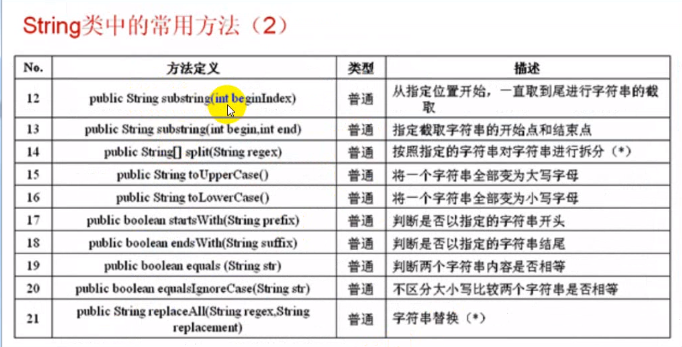

## 字符串

#### 1-1实例化的两种方式

实例化String的两种方式


**方法一：**直接赋值

```java
String name = "张三";
```

**方法二：**通过关键字 `new`

```java
String name1 = new String("张三");
```


#### 1-2 String的内容比较

基本数据类型使用 `==` 进行数据的比较。


**例子1**

```java
public static void main(String[] args) {
    int x = 30;
    int y = 30;

    System.out.println("比较两个数字的结果" + (x == y)); // 比较两个数字的结果true
}
```


**例子2**

```java
public static void main(String[] args) {
		String str1 = "hello"; // 直接赋值
		String str2 = new String("hello"); // 通过new 赋值
		String str3 = str2; // 传递引用
		// String str4 = "hello";
		
		System.out.println("str1==str2  " + (str1 == str2)); // false
		System.out.println("str2==str3  " + (str2 == str3)); // true
		System.out.println("str1==str3  " + (str1 == str3)); // false
		
		// System.out.println(str1 == str4); // true
	}
```


现在是用的判断相等，是判断地址空间是否相等，判断的是地址值。

如果要判断其内容是否相等，则就必须使用String类中提供的  `equals()` 方法来完成。


**例子3 使用 equals **

```java
public static void main(String[] args) {
    String str1 = "hello"; // 直接赋值
    String str2 = new String("hello"); // 通过new 赋值
    String str3 = str2; // 传递引用

    System.out.println("str1 equals str2  " + (str1.equals(str2))); // true
    System.out.println("str2 equals str3  " + (str2.equals(str3))); // true
    System.out.println("str1 equals str3  " + (str1.equals(str3))); // true
}
```


**结论：**String有两种比较方式

第一种使用  `==` 完成，**比较的是地址值**。

第二种使用  `equals` 方法完成，**用来比较的是具体的内容，开发中比较常用**


#### 1-3深入分析两种实例化方式区别

在String中可以使用直接赋值，和 `new` 调用构造方法的方式来完成，那么该使用哪种方式更合适呢？


一个字符串就是 `String` 的匿名对象

```java
System.out.println("hello".equals("hello")); // true
```


```java
String name = "张三";
// 就是表示将一个堆内存空间指向给了栈内存空间。
```

只有掌握这一点之后才可以分析出使用哪种实例化方式更合适。


**例子1，直接赋值发现一样**

在比较一次，发现三个都是true，证明以下三个对象的内存地址都一样。

**使用直接赋值的方式可以有效的节省内存**

```java
public static void main(String[] args) {
    String str1 = "hello"; // 直接赋值
    String str2 = "hello"; // 直接赋值
    String str3 = "hello"; // 直接赋值

   	System.out.println("str1==str2  " + (str1 == str2)); // true
	System.out.println("str2==str3  " + (str2 == str3)); // true
	System.out.println("str1==str3  " + (str1 == str3)); // true
}
```


**注意：直接赋值的方式**，在声明另外一个对象的时候，如果发现在堆内存的地方已经存在，那么就会指向已经存在的地址。


如果使用  `new String` 的方式就会新开辟两个堆内存地址。实例化的时候


**使用直接赋值的方式只需要一个实例化对象即可，如果使用new String()方法，就意味着要开辟两个内存对象。**

在开发中最好使用直接赋值的方式来完成。


**字符串的内容是不可改变的。**

```java
以下代码，字符串对象是改变了，但是字符串变了吗？

实际上字符串的内容改变，改变的是地址的引用关系，所以在开发中应该避免如下操作。

public class StringDemo4 {
	public static void main(String[] args) {
		String str = "hello"; // 声明字符串
		str = str + "world"; // 修改字符串
		
		System.out.println("str = " + str);
	}
}
```


```java
/**
 * 但是这样的操作，要断开连接的引用才可以完成。
 * 这样的操作性能很低，避免操作。
 * 如果非要使用这种操作的话，在后面的java常用类库中到时候会讲。StringBuffer类完成。
 */
public class StringDemo4 {
	public static void main(String[] args) {
		String str = "hello"; // 声明字符串对象
		for(int i=0;i<100;i++) { // 循环修改内容
			str += i; // 字符串的引用不断改变
		}
		System.out.println(str);
	}
}
```


#### 1-4掌握String类中的常用方法

String类的常用方法


字符数组和字符串。

一个字符串可以变成一个字符数组，同样，也可以把一个字符数组变成一个字符串。

在String类中提供了以下操作方法：


**例1、将字符串变成字符数组。**

```java
public class StringMedhode1 {
	public static void main(String[] args) {
		String str1 = "hello"; // 定义字符串
		char c[] = str1.toCharArray(); // 将一个字符串变成字符数组
		
		for(int i=0;i<c.length;i++) {
			System.out.print(c[i] + "、"); // h、e、l、l、o、
		}
		System.out.println(""); // 换行
		
		String str2 = new String(c);// 将全部的字符数组变成String
		String str3 = new String(c, 0, 3); // 将部分字符数组变为String
		
		System.out.println(str2); // hello
		System.out.println(str3); // hel
	}
}
```


**例2、从字符串中取出指定位置字符**

```java
String str1 = "hello"; // 定义字符串
System.out.println(str1.charAt(1)); // 取出第二个字符 e
```


**例3、字符串与byte数据转换**

byte数组（字节数组），在一般的IO操作中会经常使用到。

在String提供了以下的方法可以进行字符串与字节数组间转换。

字符串变为字节数组：

 ```java
String str1 = "hello"; // 定义字符串
byte b[] = str1.getBytes(); // 将字符串变为byte数组

System.out.println(new String(b)); // 将全部的byte数组变为字符串
System.out.println(new String(b, 1, 3)); // 将部分的byte数组变为字符串

//hello
//ell
 ```


**例4、取得一个字符串的长度**

```java
String str1 = "hello"; // 定义字符串

str1.length(); // 5
```


**例5、查找指定的字符串是否存在**

```java
public int indexOf(int ch)
```

从头开始查找

从指定位置开始查找

查找的时候，方法的返回值：是一个int类型的数据

此数据表示的是一个字符串的具体的位置，如果没有查找到此字符串，则返回  -1

```java
String str1 = "hello world"; // 定义字符串

System.out.println(str1.indexOf("wor")); // 6
if(str1.indexOf("el") > -1) {
    System.out.println("存在此字符");
}else {
    System.out.println("不存在此字符");
}	
```


**例6、去掉空格**

如果假设一些信息是由用户输入的话，则就有可能出现多余空格，在这种操作中，就可以利用 `trim()` 去掉左右空格，但是字符串中间的空格是不可能去掉的。

 ```java
String str1 = "    hello world     "; // 定义字符串

System.out.println(str1); //     hello world     
System.out.println(str1.trim()); // hello world
 ```





**例7、字符截取**

从一个指定的字符串取出里面的部分内容，使用方法是：

从指定位置开始一直截取到结束位置

```java
public String substring(int beginIndex, int endIndex)
    
返回一个字符串，该字符串是此字符串的子字符串。 子串开始于指定beginIndex并延伸到字符索引endIndex - 1 。 因此，子串的长度为endIndex-beginIndex
```

截取指定范围的字符串。

```java
String str1 = "hello world"; // 定义字符串

System.out.println(str1.substring(1)); // ello world
System.out.println(str1.substring(1,2)); // e
```


**例8、拆分字符串**

如果现在需要按照指定的字符串去拆分一个字符的话，则使用 `split` 方法

```java
String str1 = "hello world"; // 定义字符串
String s[] = str1.split(" "); // 按照空格进行字符串拆分

for(int i=0;i<s.length;i++) {
    System.out.println(s[i]);
}
// hello
// world
```


**例9、大小写转换**

大小写转换

```java
String str1 = "hello ZAB world"; // 定义字符串

System.out.println(str1.toLowerCase()); //hello zab world
System.out.println(str1.toUpperCase()); // HELLO ZAB WORLD
```


**例10、判断是否以指定字符串开头或结尾**

```java
public boolean startsWith(String prefix)
```

```java
public boolean endsWith(String suffix)
```

```java
String str1 = "hello ZAB world"; // 定义字符串

System.out.println(str1.startsWith("hello")); // true
System.out.println(str1.startsWith("a")); // false
System.out.println(str1.endsWith("ld")); // true
```


**例11、不区分大小写比较**

equalsIgnoreCase

在String类中 `equals()` 方法可以用来进行字符串比较的，但是此种比较方法只能针对大小写完全一致

```java
String str1 = "hello"; // 定义字符串
String str2 = "Hello";

System.out.println(str1.equals(str2)); // false
// 不区分大小写字母
System.out.println(str1.equalsIgnoreCase(str2)); // true
```


**例12、字符串替换功能**

```java
String str1 = "hello"; // 定义字符串
String newStr = str1.replace("hel", "替换后的字符");

System.out.println(str1); // hello
System.out.println(newStr); // 替换后的字符lo

String newStr2 = str1.replace("l", "a");
System.out.println(newStr2); // heaao
```


#### 总结

1、String要使用直接赋值方式、因为使用 `new` 会开辟2个空间，造成内存浪费。

2、一个字符串就是 String 的匿名对象

3、字符串比较有两种方式 `==` 和 `equals`

4、掌握常用的字符串方法，必要的时候查找 API 文档。


---


## this关键字

#### 2-1掌握this关键字的作用

`this` 表示类中的一个属性（在大部分操作的时候，属性都最好使用 `this.属性` 的形式表示 ）


**错误例1**

```java
class Person{ // 定义Person类
	private String name;
	private int age;
	
	public Person(String name, int age) { // 构造方法赋值
        // 我在我自己的这里有 name、age、就不会往外层找了
		name = name; // 为name属性赋值
		age = age; // 为age属性赋值
	}

	public String getInfo() { // 取得信息的方法
		return "姓名：" + name + " 年龄： " + age;
	}
}

public class This2 {
	public static void main(String[] args) {
		Person user = new Person("null", 20);
		
		System.out.println(user.getInfo());
		// 这里打印出来的内容
        // 姓名：null 年龄： 0
        // 说明上面的构造函数没有赋值成功，使用了默认值
	}
}
```


**例2、正确赋值**

```java
class Person{ // 定义Person类
	private String name;
	private int age;
	
	public Person(String name, int age) { // 构造方法赋值
        
		this.name = name; // 为name属性赋值
		this.age = age; // 为age属性赋值
	}

	public String getInfo() { // 取得信息的方法
		return "姓名：" + name + " 年龄： " + age;
	}
}

public class This2 {
	public static void main(String[] args) {
		Person user = new Person("张三", 20);
		
		System.out.println(user.getInfo());
		// 这里打印出来的内容
        // 姓名：张三 年龄： 20
	}
}
```


#### 2-2使用this调用其他构造方法

使用 `this(若干参数)` 来调用构造方法

​	注意点：在使用 `this` 关键字来调用其他构造方法的时候，都有以下几点限制

​	`this() ` 调用构造方法的语句只能放在构造方法的首行。

​	在使用 `this` 调用本类中其他构造函数的时候，至少有一个构造方法是不用 `this` 调用的。


```java
class Person{ // 定义Person类
	private String name;
	private int age;
	
	private Person() {
		this("张三");
		System.out.println("实例化");
	}
	
	public Person(String name) {
		this.name = name;
	}
	
	public Person(String name, int age) { // 构造方法赋值
		this();
		this.name = name; // 为name属性赋值
		this.age = age; // 为age属性赋值
		
	}

	public String getInfo() { // 取得信息的方法
		return "姓名：" + name + " 年龄： " + age;
	}
	
	public void tell() {
		System.out.println("新对象实例化");
	}
}

public class This3 {
	public static void main(String[] args) {
		Person user = new Person("张三", 20);
		
		System.out.println(user.getInfo());
	}
}
```

`this()` 会根据不同的参数进行选择不同的构造函数进行调用。


#### 2-3使用this表示当前对象

什么叫做当前对象？

当前对象，当前正在调用方法的对象


**例1**

```java
class Person3{ // 定义Person类
	public String getInfo() { // 取得信息的方法
		System.out.println("直接打印this-->" + this);
		return null;
	}
	
	public void tell() {
		System.out.println("新对象实例化");
	}
}

public class This2 {
	public static void main(String[] args) {
		Person3 user = new Person3();
		Person3 user2 = new Person3();
		System.out.println(user);
		user.getInfo();
		
		System.out.println(user2);
		user2.getInfo();
	}
}

// com.day09.Person3@15db9742
// 直接打印this-->com.day09.Person3@15db9742
// com.day09.Person3@6d06d69c
// 直接打印this-->com.day09.Person3@6d06d69c
```


生成两个对象，当两个对象中的姓名和年龄完全相等的时候，则认为对象是相等的

但在此时，我们就会产生2个问题


如何来进行对象的比较？

在哪一块进行对象的比较


**例1、直接比较内容**

String本身是一个类，如果要进行相等比较的，则需要判断内容，就是用到 `equals()` 方法来完成

age是int型，所以直接使用 `==` 比较

```java
class Person{ // 定义Person类
	private String name;
	private int age;
	
	public Person(String name, int age) {
		this.setName(name);
		this.setAge(age);
	}
	
	public void setName(String name) {
		this.name = name;
	}
	public void setAge(int age) {
		this.age = age;
	}
	public String getName() {
		return this.name;
	}
	public int getAge() {
		return this.age;
	}
}

public class This3 {
	public static void main(String[] args) {
		Person user = new Person("张三", 20);
		Person user2 = new Person("张三", 20);
				
		if(user.getName().equals(user2.getName()) && user.getAge() == user2.getAge()) {
			System.out.println("两个对象是相等的");
		}else {
			System.out.println("两个对象是不相等的");
		}
	}
}

// 两个对象是相等的
```


地址相等，则两个对象相等，

如果地址不相等，则依次判断每一个属性的内容是否相等

```java
class Person{ // 定义Person类
	private String name;
	private int age;
	
	public Person(String name, int age) {
		this.setName(name);
		this.setAge(age);
	}
	
	// 比较
	public boolean compare(Person user) {
		// 调用此方法时，里面存在两个对象，当前对象，传入的参数
		
		if(this == user) { // 判断是不是同一个对象
			return true;
		}
		
		System.out.println("打印东西");
		System.out.println(user.name);
		System.out.println(user.age);
		
//		// 分别判断每一个属性是否相等
		if(this.name.equals(user.name) && this.age == user.age) {
			return true;
		}else {
			return false;
		}
		
	}
	
	public void setName(String name) {
		this.name = name;
	}
	public void setAge(int age) {
		this.age = age;
	}
	public String getName() {
		return this.name;
	}
	public int getAge() {
		return this.age;
	}
}

public class This3 {
	public static void main(String[] args) {
		Person user = new Person("张三", 20);
		Person user2 = new Person("张三", 20);
		
				
		if(user.getName().equals(user2.getName()) && user.getAge() == user2.getAge()) {
			System.out.println("两个对象是相等的");
		}else {
			System.out.println("两个对象是不相等的");
		}
		
		System.out.println("第二种比较方式");
		if(user.compare(user2)) {
			System.out.println("两个对象是相等的");
		}else {
			System.out.println("两个对象是不相等的");
		}
		
	}
}
```


#### 2-4 总结

详细的解释了 `this` 关键字的作用

```java
this.属性
this.方法
实际上都表示的当前对象的属性或者当前对象调用的方法
```

this核心，表示当前对象，表示当前正在操作本方法的对象称为当前对象。

使用this来调用其他的构造方法，但是此语句必须放在构造方法的首行


---


## static关键字

#### 3-1 static关键字的作用

了解 `static` 关键字的作用


在Java中可以使用 `static` 声明属性或方法。

因为之前写的属性和方法都属于非 `static` ，这样来说，每个对象都会占有各自的内容，如果现在希望一个属性被所有的对象共同拥有，则声明为 `static` 类型，这样属性和方法之后此属性和方法称为类方法。可以由类名称直接调用。


**例1、**

```java
/**
 * 以下的代码确实实现了一些基本功能
 * 但是如果此时，城市的名称不叫A城，而改成了B城
 * 如果有5000个人，那么一个一个的改下去很烦
 */

class Person8{
	String name; // 定义name属性，暂时不会封装
	int age; // 定义age属性，暂时不会封装
	String country = "A城"; //定义城市属性，默认值
	
	public Person8(String name, int age){
		this.name = name;
		this.age = age;
	}
	
	public void info() {
		System.out.println("姓名：" + this.name + " 年龄：" + this.name + "城市：" + this.country);
	}
}


public class Static01 {
	public static void main(String[] args) {
		Person8 p1 = new Person8("杯子", 12);
		Person8 p2 = new Person8("小明", 10);
		Person8 p3 = new Person8("张三", 15);
		
		System.out.println(p1.name);


		p1.info();
		p2.info();
		p3.info();
	}
}

// 姓名：杯子 年龄：杯子城市：A城
// 姓名：小明 年龄：小明城市：A城
// 姓名：张三 年龄：张三城市：A城
```


修改一个对象中的country属性，其他对象的country属性内容全部改变了

证明了此属性是所有对象共享的

```java
class Person9{
	String name; // 定义name属性，暂时不会封装
	int age; // 定义age属性，暂时不会封装
	static String country = "A城"; //定义城市属性，默认值
	
	public Person9(String name, int age){
		this.name = name;
		this.age = age;
	}
	
	public void info() {
		System.out.println("姓名：" + this.name + " 年龄：" + this.name + "城市：" + this.country);
	}
}


public class Static2 {
	public static void main(String[] args) {
		Person9 p1 = new Person9("杯子", 12);
		Person9 p2 = new Person9("小明", 10);
		Person9 p3 = new Person9("张三", 15);

		System.out.println("----------修改之前------------------");
		p1.info();
		p2.info();
		p3.info();
		System.out.println("----------修改之后------------------");
	
		p1.country = "B城"; // 在此时直接修改
		
		p1.info();
		p2.info();
		p3.info();
	}
}


----------修改之前------------------
姓名：杯子 年龄：杯子城市：A城
姓名：小明 年龄：小明城市：A城
姓名：张三 年龄：张三城市：A城
----------修改之后------------------
姓名：杯子 年龄：杯子城市：B城
姓名：小明 年龄：小明城市：B城
姓名：张三 年龄：张三城市：B城
```


每一个对象都拥有各自的堆栈空间，堆栈空中中保存着各自的属性，但是所有的static属性是保存在全局数据区之中，所有的对象指向全局数据区中的一个内容，所以当一个对象修改之后，所有对象的内容全部将变化。


#### 3-2 Java有多少个内存区域？

栈内存：可以保存对象的名称（保存，访问的堆内存的地址）

堆内存：保存每个对象的具体属性

全局数据区：保存 `static` 类型的属性

全局代码区：保存所有方法的定义。


#### 3-3 static的声明和使用

掌握 `static` 属性， `static` 方法的声明及使用。

如果一个方法使用static关键字声明，则此方法可以直接使用类名称直接调用。

```java
Person9.country = "C城"; // 也可以直接使用这个更改
```


#### 3-4 static 其他的运用

可以使用静态变量来统计一共构造出来了多少个实例化对象

```java
class Person11{
	private static int count = 0;
	private static void addObjectCount() {
		count++;
        System.out.println("实例化产生了" + count + "个对象");
	}
	
	public Person11(){
		addObjectCount();
	}
}

public class Static4 {
	public static void main(String[] args) {
		new Person11();
		new Person11();
		new Person11();
	}
}
```


#### 3-5 static的使用限制

掌握 `static` 使用限制

**注意：** 使用 `static` 方法，不能调用非 `static` 的属性或方法。

因为 `static` 属性或方法可以在对象没有实例化的时候就直接进行调用。

```java
class Person11{
	private static String country = "A城";
	private String nameString = "Hello";
	public static void sFun(String c) {
        
		System.out.println("name = " + name); // 错误，不能调用非static属性
		fun(); // 错误，不能调用非 staitc 静态方法
	}
	
	public void fun() {
		System.out.println("World");
	}
}
```


#### 总结

使用static声明属性与非static声明的属性区别

使用 `static` 声明的属性或方法可以直接由类名称来调用。

使用 `static` 方法的时候一定要注意，只能访问 `static` 声明的属性或方法，而非 `static`声明的属性和方法是不能被访问的，因为 `static` 可以在对象没有实例化时，就直接调用，而其他的属性或方法必须在对象实例化之后才可以调用。

了解 `static` 使用的两个案例


