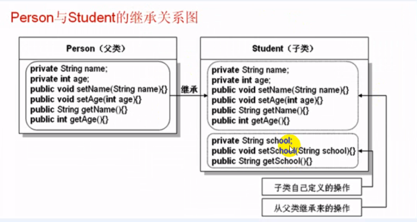
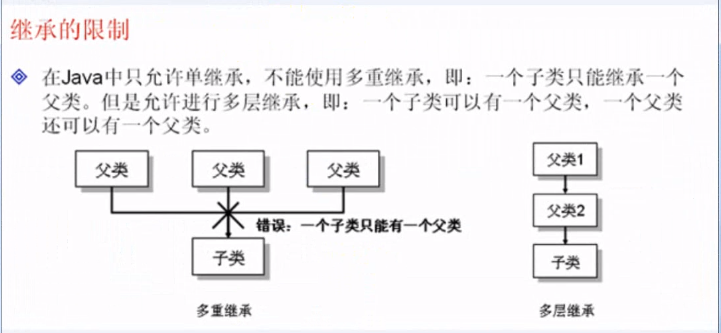
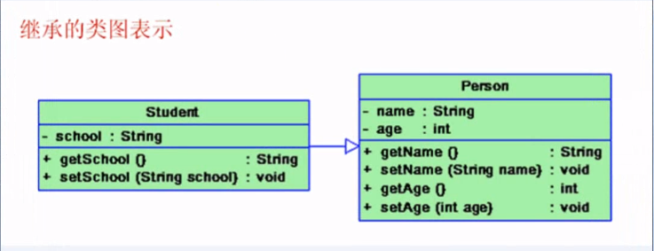
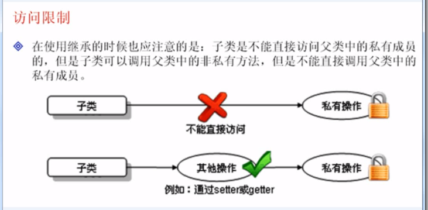
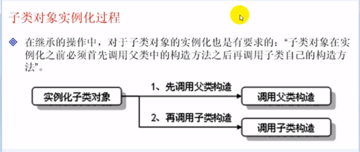
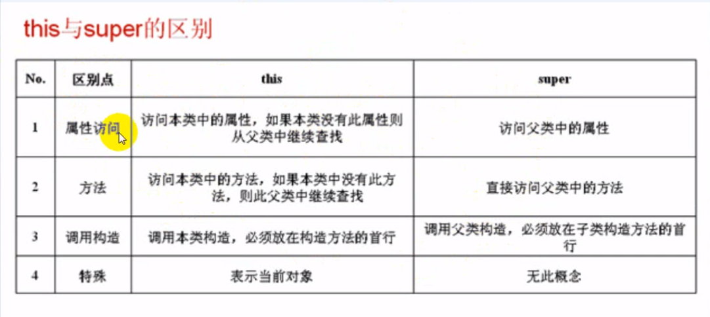
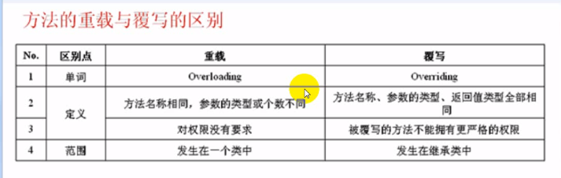

## 继承

掌握基础的基本概念及实现


#### 1-1一段不继承的代码

从下面的代码可以看到除了拓展出来一个 School 类，产生了很多重复的代码。

**Person 类**

```java
class Person{ // 定义Person类
	private String name; // 定义 name 属性
	private int age; // 定义age属性
	
	public void setName(String name) {
		this.name = name;
	}
	public void setAge(int age) {
		this.age = age;
	}
	public String getName() {
		return this.name;
	}
	public int getAge() {
		return this.age;
	}
}
```

**Student 类**

```java
public class Student { // 定义Student类
	private String name; // 定义 name 属性
	private int age; // 定义age属性
	private String school; // 定义学校
	
	
	public void setName(String name) {
		this.name = name;
	}
	public void setAge(int age) {
		this.age = age;
	}
	public String getName() {
		return this.name;
	}
	public int getAge() {
		return this.age;
    }
	public String getSchool() {
		return this.school;
	}
	
	public void setSchool(String school) {
		this.school = school;
	}
}
```


#### 1-2继承的语法及案例

```java
class 父类
class 子类 extends 父级{}
```

**继承：**子类继承父类，可以扩展自己类的功能。

子类有时候称为派生类


```java
public class Student extends Person { // 定义Student类
	// 此时不添加任何的代码
	public static void main(String[] args) {
		Student stu = new Student(); // 实例化子类对象
		
		stu.setName("张三"); // 此方法在 stu 类中没有明确定义。
		stu.setAge(20);
		System.out.println("姓名：" + stu.getName() + " 年龄：" + stu.getAge());
	}
}
```


#### 1-3子类进行拓展

继承了父类所有的东西之后，还可以进行扩充。



```java
public class Student extends Person { // 定义Student类
	// 进行拓展
	private String school; // 定义枚举 school 类
	public String getSchool() {
		return this.school;
	}
	public void setSchool(String school) {
		this.school = school;
	}
	
	// 此时不添加任何的代码
	public static void main(String[] args) {
		Student stu = new Student(); // 实例化子类对象
		
		stu.setName("张三"); // 此方法在 stu 类中没有明确定义。
		stu.setAge(20);
		stu.setSchool("清华大学");
		
		System.out.println("姓名：" + stu.getName() + " 年龄：" + stu.getAge());
		System.out.println("学校：" + stu.getSchool());
	}
}


//---------- 打印 -------------------
姓名：张三 年龄：20
学校：清华大学
//----------------------------------
```


#### 1-4掌握继承实现的各种限制

单继承：一个孩子只能有一个父亲。




**继承的类图**




**访问限制**

通过调用方法访问父级的私有属性。




#### 1-5 子类对象实例化的过程

掌握子类对象的实例化过程

**子类在实例化的时候默认调用父类中无参构造方法**

也是先调用的子类，但是子类的第一行默认有一个 `super()` 去调用父类的构造。





**Person类**

```java
class Person{ // 定义Person类
	private String name; // 定义 name 属性
	private int age; // 定义age属性
	public Person() { // 构造方法
		System.out.println("父类Person无参构造方法");
	}
	public void setName(String name) {
		this.name = name;
	}
	public void setAge(int age) {
		this.age = age;
	}
	
	public String getName() {
		return this.name;
	}
	
	public int getAge() {
		return this.age;
	}
}
```


**Student类**

```java
public class Student extends Person {
	private String school; // 定义学校私有属性
	public Student(String name,int age,String school) {
        
        
        
        super(); // 默认隐藏
        
        
		System.out.println("子类Student无参构造方法执行");
		this.setName(name);
		this.setAge(age);
		this.setSchool(school);
	}
	public void setSchool(String school) {
		this.school = school;
	}
	public String getSchool() {
		return this.school;
	}
	public void tell() {
		System.out.println(this.getName() + "  " + this.getAge() + "  " + this.getSchool());
	}
	
	public static void main(String[] args) {
		Student stu = new Student("张三", 20, "河北");
		stu.tell();
	}
}

//-----------执行结果---------------------
父类Person无参构造方法
子类Student无参构造方法执行
张三  20  河北
//-----------执行结果---------------------
```


#### 1-6掌握方法重写的概念及实现

掌握方法重写的概念及实现

方法的重写有很多要求，属性的覆盖，主要就是在子类中声明了与父类同名的属性

**定义了与父类同名的函数，就会调用自己的，不会调用父类的**

同名方法的子类中的方法的访问权限只能同级或者增加，不能减小。


**例1，扩大访问权限**

```java
class Person2{ // 定义Person类
	void print(){ // 默认的访问权限
		System.out.println("Person类中的print");
	}
}

public class Student2 extends Person2 {
	public void print(){ // 扩大了访问权限
		System.out.println("Student类中的print");
	}
	public static void main(String[] args) {
		Student2 stu = new Student2();
		stu.print();
	}
}

//-----------执行结果---------------------
Student类中的print
//-----------执行结果---------------------
```


**例2、缩小访问权限 会报错**

当父类的访问权限是 public 而子类重写缩小父类的访问权限的话，执行结果就会报错

```java
class Person2{ // 定义Person类
	public void print(){ // 访问权限
		System.out.println("Person类中的print");
	}
}

public class Student2 extends Person2 {
	void print(){ // 错误的，降低了访问权限
		System.out.println("Student类中的print");
	}
    
	public static void main(String[] args) {
		Student2 stu = new Student2();
		stu.print();
	}
}

//-----------执行结果---------------------
Exception in thread "main" java.lang.Error: Unresolved compilation problem: 
	Cannot reduce the visibility of the inherited method from Person2
//-----------执行结果---------------------
```


#### 1-7掌握`super`关键字的作用

掌握 `super` 关键字的作用

`super` 表示的是从子类中调用父类中的指定操作。

​	例如：属性、方法、构造方法等等，因为子类在实例化的时候，会默认调用父类中的无参构造方法，如果我们现在希望调用有参的构造函数，必须在子类明确的声明。


**例1、子类访问父类中被重写过的方法**

`super.方法名` 明确了从父类中找

```java
class Person2{ // 定义Person类
	void print(){ // 默认的访问权限
		System.out.println("Person类中的print");
	}
}

public class Student2 extends Person2 {
	public void print(){
		super.print(); // 访问父类中被子类重写过的方法
		
		System.out.println("Student类中的print");
	}
    
	public static void main(String[] args) {
		Student2 stu = new Student2();
		stu.print();
	}
}

//-----------执行结果---------------------
Person类中的print
Student类中的print
//-----------执行结果---------------------
```


**例2、死循环**

```java
class Person2{ // 定义Person类
	void print(){ // 默认的访问权限
		System.out.println("Person类中的print");
	}
}

public class Student2 extends Person2 {
	public void print(){
		print(); // 这里还是调用的自己
		System.out.println("Student类中的print");
	}
    
	public static void main(String[] args) {
		Student2 stu = new Student2();
		stu.print();
	}
}
```


问题：如果现在父类中使用 `private` 关键字声明了方法，那么在子类中使用 `default` 权限。


**默认的访问权限**

```java
class Person2{ // 定义Person类
	void print(){ // 默认的访问权限
		System.out.println("Person类中的print");
	}
	public void fun() { // 定义了一个fun方法
		this.print(); // 调用print方法
	}
}

public class Student2 extends Person2 {
	void print(){ // 重写父类中的方法
		super.print(); // 访问父类中被子类重写过的方法
		System.out.println("Student类中的print");
	}
    
	public static void main(String[] args) {
		Student2 stu = new Student2();
		stu.fun();
	}
}

//-----------执行结果---------------------
Person类中的print
Student类中的print
//-----------执行结果---------------------
```


**父类中私有的访问权限 private --> 子类中的 default **

**此时方法并没有被重写，而是相当于在子类中重新定义了一个新的方法出来**

```java
class Person2{ // 定义Person类
	private void print(){ // 默认的访问权限
		System.out.println("Person类中的print");
	}
	public void fun() { // 定义了一个fun方法
		this.print(); // 调用print方法
	}
}

public class Student2 extends Person2 {
	void print(){ // 重写父类中的方法
		super.print(); // 访问父类中被子类重写过的方法
		System.out.println("Student类中的print");
	}
    
	public static void main(String[] args) {
		Student2 stu = new Student2();
		stu.fun();
	}
}

//-----------执行结果---------------------
Person类中的print
//-----------执行结果---------------------
```


方法的重写有很多要求，属性的覆盖，主要就是在子类中声明了与父类同名的属性


**访问父类的属性**

```java
class Person2{ // 定义Person类
	public String info = "父类"; // 定义一个公共属性
}

public class Student2 extends Person2 {
	String info = "信息"; // 定义了一个与父类属性名称一致的属性
	
	void print() {
		System.out.println("父类中的属性 =  " + super.info);
		System.out.println("子类中的属性 =  " + this.info);
	}
	
	public static void main(String[] args) {
		Student2 stu = new Student2();
		stu.print();
	}
}

//-----------执行结果---------------------
父类中的属性 =  父类
子类中的属性 =  信息
//-----------执行结果---------------------
```


#### 1-8 this 和 super的区别



这两个关键字肯定不可能同时出现。


#### 1-9访问权限

在Java中的访问权限一共有四种

```java
private 封装性 代表着只能在类的内部，自己看见
最小的访问权限
```

`default ` 什么都不去声明

```java
String name; // 这个时候它的访问权限就是默认的 default
```

`public` 最大的访问权限


**大小关系 private < default < public**


#### 1-10 方法的重写和重载的区别？




#### 总结

继承的主要目的，扩展类的功能

在Java中一个子类能继承一个父类。

Java中不允许多重继承，但是允许多层继承。


重写与重载的区别，重写的实现，权限：private < default < public

子类对象实例化过程：先调用父类的构造，再调用子类的构造

`super` 与 `this` 关键字的区别


---


## final

掌握  `final` 关键字的使用要求。


#### 2-1使用final修饰类

使用 `final ` 标记的类，不能有子类。

```java
final class A{ // 使用 final 定义类，不能有子类
	
}

class B extends A{ // 错误，不能被继承

}
```


#### 2-2 使用 final修饰类的方法

使用final声明的方法不能被重写。


**报错，不能重写A中的 final 方法**

```java
class A{
	final void print() { // 使用 final 声明的方法不能被重写
		System.out.println("hello");
	}
}

class B extends A{
	
	void print() { // 错误， 报错，不能重写A中的 final 方法
		System.out.println("子类 hello");
	}
}
```


#### 2-3 常量

常量命名规则，必须是全部大写。

不允许修改，

初始化时就要赋值

```java
class A{ // 使用 final 定义类，不能有子类
	private final String INFO = "abc"; // 声明常量
}
```


#### 掌握全局常量声明

```java
public static final String INFO = "常量";
```


#### 总结

在一般开发中，使用 `final` 定义常量是最常见的

使用 `static final` 修饰可以声明全局常量。


