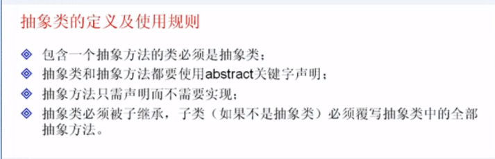
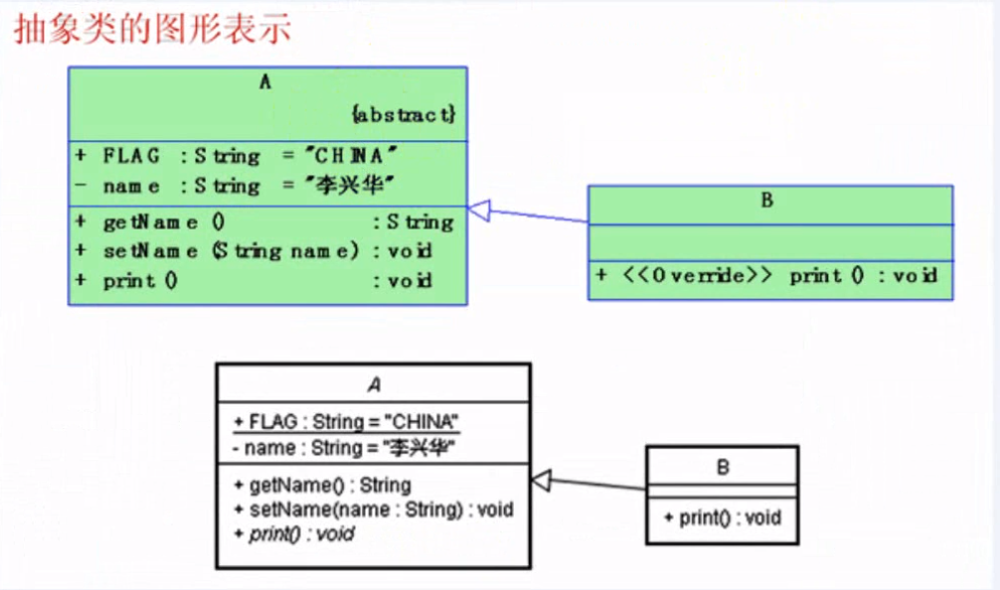
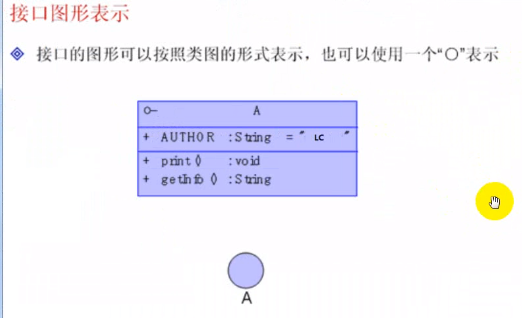
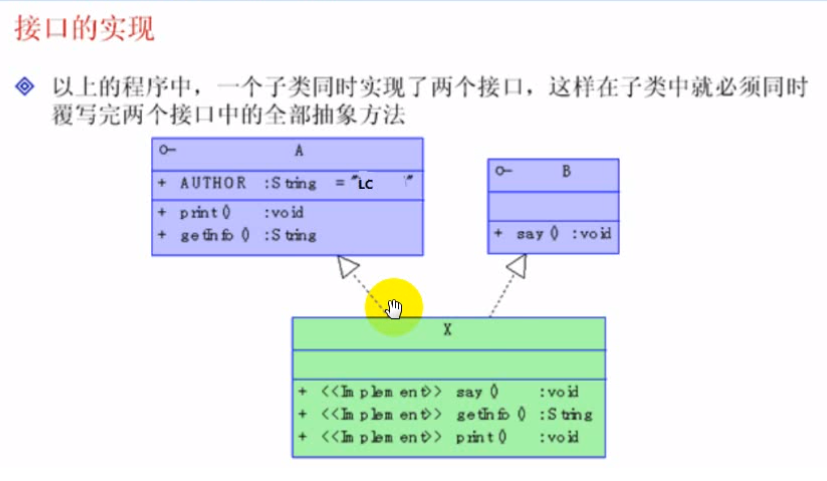
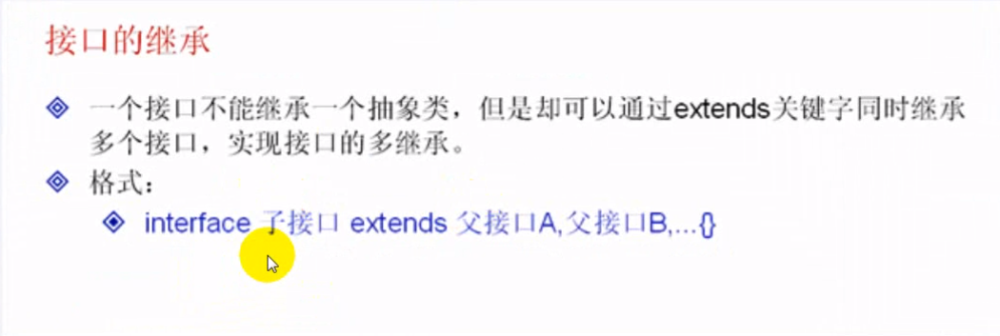

## 抽象类

>抽象类的概念：包含一个抽象方法的类就称为抽象类。
>
>抽象方法：只声明而未实现的方法称为抽象方法，抽象方法必须使用 `abstract` 进行声明。





#### 1-1掌握抽象类的定义格式

```java
abstract class 抽象类名称{
	属性：
	访问权限 返回值类型 方法名称 (参数) { // 普通方法
		
		【return 返回值】
	}
	
	访问权限 abstract 返回值类型 方法名(参数)  // 定义抽象方法
	// 在抽象方法中是没有方法体的
}
```


**代码实现**

抽象类的定义虽然和普通的类非常相似，但是却不能被直接实例化。

**抽象类必须有子类，子类必须重写抽象类中的全部抽象方法**


```java
/**
 * 从代码中，可以知道
 * 抽象类就是比普通方法多了一个抽象方法。除此之外，其他都一样。
 */
abstract class Abs{
	public static final String GLOBALCL = "全局常量"; // 全局常量
	private String name; // 定义一个普通的属性
	
	public void setName(String name) {
		this.name = name;
	}
	public String getName() {
		return name;
	}
	
	public abstract String print(); // 定义抽象方法
}

public class Demo{
    public static void main(String[] args){
        Abs abs = new Abs(); // 实例化对象
    }
}

//-------------运行结果---------------
不能实例化
Cannot instantiate the type Abs
//-------------运行结果---------------   
```


#### 1-2抽象类继承

```java
abstract class Abs{
	public static final String GLOBALCL = "全局常量"; // 全局常量
	private String name; // 定义一个普通的属性
	
	public void setName(String name) {
		this.name = name;
	}
	public String getName() {
		return name;
	}
	
	public abstract void print(); // 定义抽象方法
}

class Bb extends Abs{ // 继承抽象类，因为Bb是普通类，所以必须重写全部的抽象方法
	public void print() {
		System.out.println("GLOBALCL = " + GLOBALCL);
		System.out.println("姓名：" + super.getName());
	}
}


public class AbstractDemo01 {
	public static void main(String[] args) {
		Bb abs = new Bb(); // 实例化对象
		
		abs.print();
	}
}

//-------------运行结果------------------------
GLOBALCL = 全局常量
姓名：null
//-------------运行结果------------------------
```


#### 1-3 抽象类的图形表示

采用斜体表示是一个抽象类。




#### 1-4 不能使用final声明抽象类

一个抽象类不能使用用 `final` 关键字来声明

`final` 定义类是不能有子类的

`abstracct` 是必须有子类的


```java
final abstract class BBBB{
	
}
// 错误：class BBB 被 final 或 abstract 定义，不能全部使用
```


#### 1-5一个抽象类中可以定义构造方法吗？

抽象类是允许存在构造方法的。


掌握抽象类的使用规则


#### 总结

一定要掌握抽象类的定义格式，以及使用规则

抽象类在使用的时候一定要有子类，子类仍然使用 `extends` 关键字来继承一个抽象类，同样会存在继承的关系，一个子类不能同时继承多个抽象类。

抽象类中绝对不能使用 `final` 关键字来声明。

抽象类中允许有构造方法，而且完全符合子类对象实例化过程。


---


## 接口

#### 2-1接口的定义格式及使用

掌握接口的定义格式及使用

> 接口是java中最重要的概念，接口可以理解为一种特殊的类，里面全部都是由全局变量和公共的抽象方法所组成的。


**接口的定义格式**

```java
interface 接口名称{
    全局常量;
    抽象方法;
}
```


**定义的例子**

```java
interface A{ // 定义接口A
	public static final String AUTHOR = "全局常量";
	public abstract void print(); // 抽象方法
	public abstract String getInfo(); // 抽象方法
}
```


**下面两个是一样的**

方法前面加不加抽象是一样的

```java
interface A{ // 定义接口A
	public static final String AUTHOR = "全局常量";
	public abstract void print(); // 抽象方法
	public abstract String getInfo(); // 抽象方法
}

interface A{ // 定义接口A
	String AUTHOR = "全局常量";
	void print(); // 抽象方法
	String getInfo(); // 抽象方法
}
```


**接口的图形表示**




#### 2-2接口的实现




```java
interface A{ // 定义接口A
	public static final String AUTHOR = "全局常量";
	public abstract void print(); // 抽象方法
	public abstract String getInfo(); // 抽象方法
}

interface B{ // 定义接口B
	public abstract void say(); // 定义抽象方法
}

class X implements A,B{ // X类同时实现A和B两个接口
	public void say() {
		System.out.println("Hello World!");
	}
	public String getInfo() {
		return "Hello";
	}
	public void print() {
		System.out.println("全局变量:" + AUTHOR);
	}
}

public class InterfaceDemo01 {
	public static void main(String[] args) {
		X x = new X(); // 实例化子类对象
		x.say();
		x.print();
		System.out.println(x.getInfo());
	}
}
```


#### 2-3继承抽象类实现接口

在使用中，一个抽象类可以实现一个接口，那么对于抽象类的子类则就必须同时重写接口和抽象类中定义的所有的抽象方法。


**例子**

```java
interface A{ // 定义接口A
	public static final String AUTHOR = "全局常量";
	public abstract void print(); // 抽象方法
	public abstract String getInfo(); // 抽象方法
}

abstract class B{ // 定义抽象类
	public abstract void say(); // 定义抽象方法
}


class X extends B implements A{ // X类先继承B类，再实现A接口
	public void say() {
		System.out.println("Hello World!");
	}
	public String getInfo() {
		return "Hello";
	}
	public void print() {
		System.out.println("全局变量:" + AUTHOR);
	}
}


public class InterfaceDemo01 {
	public static void main(String[] args) {
		X x = new X(); // 实例化子类对象
		x.say();
		x.print();
		System.out.println(x.getInfo());
	}
}

```


**第二个例子**

一个接口虽然不能继承抽象类，但是在Java中一个接口可以同时继承多个接口，实现接口的多继承。

```java
/**
 * 一个接口虽然不能继承抽象类，但是在Java中一个接口可以同时继承多个接口，实现接口的多继承。
 * @author PALION15
 *
 */

interface A{ // 定义接口A
	public static final String AUTHOR = "全局常量";
	public abstract void print(); // 抽象方法
	public abstract String getInfo(); // 抽象方法
}

abstract class B implements A{// 定义抽象类实现接口 A
	public abstract void say(); // 定义抽象方法
}


class X extends B{ // X类先继承A3类，再实现A3接口
	public void say() {
		System.out.println("Hello World!");
	}
	public String getInfo() {
		return "Hello";
	}
	public void print() {
		System.out.println("全局变量:" + AUTHOR);
	}
}


public class InterfaceDemo01 {
	public static void main(String[] args) {
		X x = new X(); // 实例化子类对象
		x.say();
		x.print();
		System.out.println(x.getInfo());
	}
}
```


#### 2-4接口的继承




**实现例子**

```java
interface A{ // 定义接口A
	public static final String AUTHOR = "全局常量";
	public void printA(); // 抽象方法
}

interface B{ // 定义接口B
	public void printB();
}

interface C extends A,B{ // 定义接口C 继承了A,B
	public void printC();
}

class X implements C{ // X类继承C接口
	public void printA() {
		System.out.println("重写的A方法");
	}
	public void printC() {
		System.out.println("重写的C方法");
	}
	public void printB() {
		System.out.println("重写的B方法");
	}
}

public class InterfaceDemo01 {
	public static void main(String[] args) {
		X x = new X(); // 实例化子类对象
		x.printA();
		x.printB();
		x.printC();
	}
}
```


#### 接口与抽象类的关系

掌握接口与抽象类的关系


#### 总结

接口是一个特殊的类，只包含了全局常量和抽象方法。

接口中的抽象方法可以不加 `abstract` ，而抽象类中的抽象方法必须有 `abstract` 关键字声明。

一个类只能继承一个父类，但是可以同时实现多个接口。

一个接口可以同时继承多个接口，以实现接口的多继承。

接口和抽象类一样，都必须依靠子类。

抽象类可以实现多个接口，但是一个接口不能继承一个抽象类。


