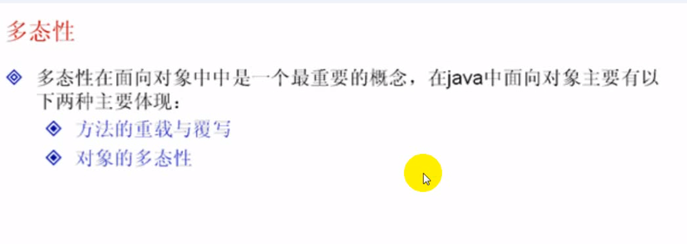
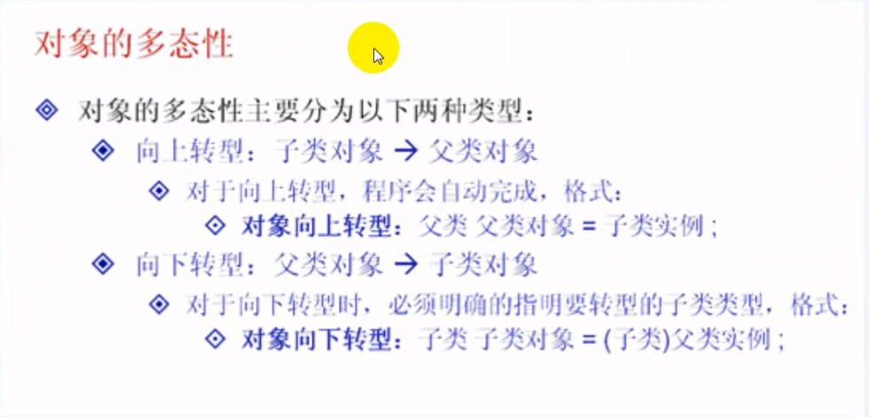

## 多态性


#### 1-1多态性的概念




#### 1-2对象的多态性实现




#### 1-3对象的向上转型

```java
语法格式

父类 父类对象 = 子类实例;
```

是通过子类进行父类的对象的实例化操作的，

**如果调用方法被子类重写过，则肯定调用被重写过的方法。**

**转型之后，因为操作的是父类的对象，所以是无法找到在子类中定义的新方法**。


**例1、子类重写父类方法**

```java
class GG{ // 定义类GG
	public void fun1() {
		System.out.println("GG--> public void fun1(){}");
	}
	public void fun2() {
		this.fun1(); // 调用fun方法
	}
}

class FF extends GG{
	public void fun1() { // 此方法被子类重写
		System.out.println("FF--> public void fun1(){}");
	}
	public void fun3() {
		System.out.println("FF--> public void fun3(){}");
	}
}

public class Demo01 {
	public static void main(String[] args) {
		FF f = new FF(); // 实例化子类对象
		GG g = f; // 向上转型
		g.fun1(); // 此方法被子类重写了
		g.fun2();
	}
}

//-----------运行结果----------------
FF--> public void fun1(){}
FF--> public void fun1(){}
//-----------运行结果----------------
```


**例2**

```java
class GG{ // 定义类GG
	public void fun1() {
		System.out.println("GG--> public void fun1(){}");
	}
	public void fun2() {
		this.fun1(); // 调用fun方法
	}
}

class FF extends GG{
//	public void fun1() {
//		System.out.println("FF--> public void fun1(){}");
//	}
	public void fun3() {
		System.out.println("FF--> public void fun3(){}");
	}
}

public class Demo01 {
	public static void main(String[] args) {
		FF f = new FF(); // 实例化子类对象
		GG g = f; // 向上转型
		g.fun1(); // 此方法被子类重写了
		g.fun2();
	}
}

//-----------运行结果----------------
GG--> public void fun1(){}
GG--> public void fun1(){}
//-----------运行结果----------------
```


#### 1-4对象的向下转型

将父类的对象变为子类对象，称为向下转型，向下转型需要采用强制的手段。


**例子1、对象向下转型**

在m中存在3个方法，所以都可以调用

但是在进行对象向下转型的时候有一个注意点：


```java
class GG{ // 定义类GG
	public void fun1() {
		System.out.println("GG--> public void fun1(){}");
	}
	public void fun2() {
		this.fun1(); // 调用fun方法
	}
}

class FF extends GG{
	public void fun1() { // 此方法被子类重写
		System.out.println("FF--> public void fun1(){}");
	}
	public void fun3() {
		System.out.println("FF--> public void fun3(){}");
	}
}

public class Demo01 {
	public static void main(String[] args) {
		GG g = new FF(); // 向上转型
		FF m = (FF)g; // 发生向下转型关系
		
		m.fun1();
		m.fun2();
		m.fun3();
	}
}

// 在m中存在3个方法，所以都可以调用

//-----------运行结果----------------
FF--> public void fun1(){}
FF--> public void fun1(){}
FF--> public void fun3(){}
//-----------运行结果----------------
```


#### 1-5对象的转型限制

**如果想要产生对象的向下转型，则肯定必须先产生一个向上的转型关系**

`GG = new FF()` 表示建立关系

```java
class GG{ // 定义类GG
	public void fun1() {
		System.out.println("GG--> public void fun1(){}");
	}
	public void fun2() {
		this.fun1(); // 调用fun方法
	}
}

class FF extends GG{
	public void fun1() { // 此方法被子类重写
		System.out.println("FF--> public void fun1(){}");
	}
	public void fun3() {
		System.out.println("FF--> public void fun3(){}");
	}
}

public class Demo01 {
	public static void main(String[] args) {
		GG g = new GG(); // 实例化父类对象
		FF m = (FF)g; // 发生向下转型关系

		m.fun1();
		m.fun2();
		m.fun3();
	}
}

//---------运行结果--------------
com.day12.GG cannot be cast to com.day12.FF
//---------运行结果--------------
```


#### 1-6多态性的应用


多态性的应用，设计一个方法，此方法可以接受A类的任意子类对象，并调用方法。

实现一：不使用对象多态性完成，使用方法的重载


如果每增加一个类 下面的就要重载一次

```java
class AAA{ // 定义类GG
	public void fun1() {
		System.out.println("父类--> public void fun1(){}");
	}
	public void fun2() {
		this.fun1(); // 调用fun方法
	}
}

class BBB extends AAA{
	public void fun1() { // 此方法被子类重写
		System.out.println("子类--> public void fun1(){}");
	}
	public void fun3() {
		System.out.println("子类--> public void fun3(){}");
	}
}

class CCC extends AAA{
	public void fun1() { // 此方法被子类重写
		System.out.println("子类C--> public void fun1(){}");
	}
	public void fun5(){
		System.out.println("子类C--> public void fun5(){}");
	}
}

// 多态性的应用，设计一个方法，此方法可以接受A类的任意子类对象，并调用方法。
public class Demo01 {
	public static void main(String[] args) {
		fun(new BBB());
		fun(new CCC());
	}
	
	// 如果每增加一个类 下面的就要重载一次
	public static void fun(BBB b) {
		b.fun1(); // 调用了重写的父类中的fun1方法	
	}
	public static void fun(CCC c) {
		c.fun1(); // 调用了重写的父类中的fun1方法	
	}
	
}
```


**向上转型**

如果采用以下方法，不管有多少个子类，代码都可以轻松的完成它。

```java
class AAA{ // 定义类GG
	public void fun1() {
		System.out.println("父类--> public void fun1(){}");
	}
	public void fun2() {
		this.fun1(); // 调用fun方法
	}
}

class BBB extends AAA{
	public void fun1() { // 此方法被子类重写
		System.out.println("子类--> public void fun1(){}");
	}
	public void fun3() {
		System.out.println("子类--> public void fun3(){}");
	}
}

class CCC extends AAA{
	public void fun1() { // 此方法被子类重写
		System.out.println("子类C--> public void fun1(){}");
	}
	public void fun5(){
		System.out.println("子类C--> public void fun5(){}");
	}
}

// 多态性的应用，设计一个方法，此方法可以接受A类的任意子类对象，并调用方法。
public class Demo01 {
	public static void main(String[] args) {
		fun(new BBB());
		fun(new CCC());
	}
	
	// 如果每增加一个类 下面的就要重载一次
	public static void fun(AAA a) {
		a.fun1(); // 调用了重写的父类中的fun1方法	
	}
}
```


#### 总结

对象的多态性：

​	**向上转型**：自动完成

​	**向下转型**：强制，发生向下转型关系之前必须先发生向上转型的关系。

对象的多态性可以解决方法接收参数的问题。


## instanceof

#### 2-1 instanceof的作用

掌握 `instanceof` 关键字的作用及使用时机

```java
对象 instanceof 类 -> 返回 boolean 类型
```


**判断 实例化对象 是不是 构造函数的实例**

```java
class P{ // 定义类GG
	public void fun1() {
		System.out.println("父类--> public void fun1(){}");
	}
	public void fun2() {
		this.fun1(); // 调用fun方法
	}
}

class Y extends P{
	public void fun1() { // 此方法被子类重写
		System.out.println("子类--> public void fun1(){}");
	}
	public void fun3() {
		System.out.println("子类--> public void fun3(){}");
	}
}

public class InstanceofDemo01 {
	public static void main(String[] args) {
		P p = new Y(); // 通过向上转型实例化对象
		System.out.println("P p = new Y():" + (p instanceof P) );
		System.out.println("P p = new Y():" + (p instanceof Y) );
		
		P p1 = new P(); // 实例化父类对象
		System.out.println("P p1 = new Y():" + (p1 instanceof P) );
		System.out.println("P p1 = new Y():" + (p1 instanceof Y) );
	}
}

//-------------运行结果----------------------
true
true
true
false
//-------------运行结果----------------------
```


#### 2-2对象转型进行安全验证

可以使用 `instanceof` 对对象转型进行安全验证


```java
public static void fun(P p) {
		p.fun1();
		if(p instanceof Y) {
			Y yp = (Y)p;
			yp.fun3();
		}else {
			System.out.println("你不是我儿子");
		}
	}
```


#### 总结

**一个类永远不要去继承已经实现好的类，而只能抽象类或是实现接口。**

`instanceof` 用于判断一个对象是否是某个类的实例。

在对象向下转型之前最好使用 `instanceof` 关键字进行验证。

