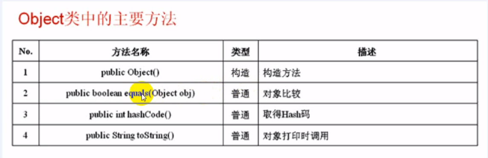
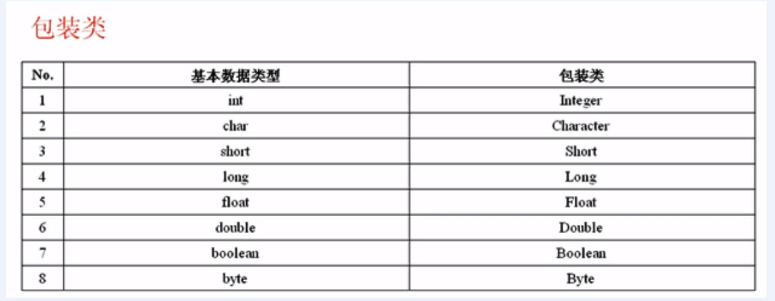
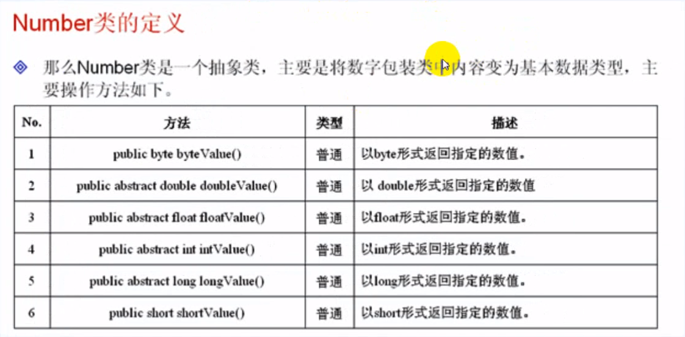
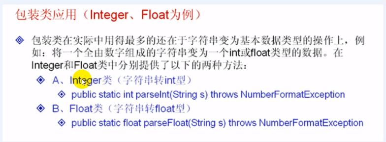

## Object类

#### 1-1掌握 `Object` 类的作用


如果一个类在定义的时候，没有明确指定某个类，则会默认继承 `Object` 类。

Object 类是所有类的父类，则所有类的对象都可以使用 Object 类接收

但是 Object 不光可以接收对象，还可以接收任意的引用的数据类型。

使用 Object 接收接口实例，


Object类的主要方法




#### 1-2toString() equals() 方法

掌握 `Object` 类中的 `toString()` `equals()` 方法的作用


`toString`方法就是打印对象信息

```java
class Demo{ // 定义的Demo类，实际上它就是继承了 Object 类
}

public class ObjectDemo01 {
	public static void main(String[] args) {
		Demo d = new Demo();
		System.out.println("不加toString()方法" + d);
		System.out.println("加toString()方法" + d.toString());
	}
}

//-------------运行结果----------------------
不加toString()方法com.day13.Demo@15db9742
加toString()方法com.day13.Demo@15db9742
//-------------运行结果----------------------
```


```java
class Demo{ // 定义的Demo类，实际上它就是继承了 Object 类
	private String name;
	private int age;
	public Demo(String name,int age) {
		this.name = name;
		this.age = age;
	}
	public String toString() {
		return "姓名：" + this.name + ",年龄" + this.age;
	}
}

public class ObjectDemo01 {
	public static void main(String[] args) {
		Demo d = new Demo("张三", 23);
		System.out.println("不加toString()方法" + d);
		System.out.println("加toString()方法" + d.toString());
	}
}
//-------------运行结果----------------------
不加toString()方法姓名：张三,年龄23
加toString()方法姓名：张三,年龄23
//-------------运行结果----------------------
```


`equals`主要功能：是完成2个对象的比较的，

```java
class Demo{ // 定义的Demo类，实际上它就是继承了 Object 类
	private String name;
	private int age;
	public Demo(String name,int age) {
		this.name = name;
		this.age = age;
	}
	public String toString() {
		return "姓名：" + this.name + ",年龄" + this.age;
	}
	public boolean equals(Object obj) {
		if(this == obj) { // 地址相等
			return true; // 肯定是同一个对象
		}
		if(!(obj instanceof Demo)) {
			return false;
		}
		
		Demo obj1 = (Demo) obj; // 向下转型
		// 依次比较内容
		if(obj1.name.equals(this.name) && obj1.age == this.age) {
			return true;
		}else {
			return false;
		}
	}
}

public class ObjectDemo01 {
	public static void main(String[] args) {
		Demo d = new Demo("张三", 23);
		Demo d2 = new Demo("张三", 23);
		
		boolean flag = d.equals(d2);
		System.out.println(flag);
	}
}
```


#### 1-3接收引用类型的操作

掌握 `Object` 类接收引用类型的操作


**使用Object接收接口**

但是 Object 不光可以接收对象，还可以接收任意的引用的数据类型。

使用 Object 接收接口实例，

```java
interface A{
	String getInfo();
}

class B implements A{
	public String getInfo() { // 重写方法
		return "返回值";
	}
}


public class ObjectDemo01 {
	public static void main(String[] args) {
		A a = new B(); // 向上转型，为接口实例化
		Object obj = a; // 使用 Object接收，向上转型
		
		A x = (A)obj; // 向下转型
		System.out.println(x.getInfo());
	}
}
```


**使用Object类接收数组**

```java
public class ObjectDemo01 {
	public static void main(String[] args) {
		int[] temp = {1,3,5,7,9}; // 定义数组
		Object obj = temp; // 使用 Object接收数组
		print(obj);
	}
	public static void print(Object o) {
		if(o instanceof int[]) { // 判断是否是整型数组
			int a[] = (int [])o;
			for(int i=0;i<a.length;i++) {
				System.out.println(a[i]);
			}
		}
	}
}
```


#### 总结

Object类是所有类的父类，只要是引用数据类型都可以使用 Object 进行接收

对象在进行向下转型之前一定要先向上转型，要使用 `instanceof` 关键字进行判断

`toString()` 对象打印时调用。

`equals` 对象比较时调用。

`String`类也是 `Object` 类的子类。


## 包装类

#### 2-1掌握包装类的作用

一切皆对象，8中基本数据类型不是对象

把 `int` 类型包装成一个类，这样就可以以对象的形式操作基本数据类型








#### 2-2 拆箱及装箱

掌握包装类的自动装箱及自动拆箱的操作


Integer 和 Float 为例：

拆箱及装箱：

​		将基本数据类型变为包装类称为装箱。

​		将包装类的类型变为基本数据类型称为拆箱。




**例子1**

```java
public class IntegerDemo01 {
	public static void main(String[] args) {
		int a = 30; // 基本数据类型
		Integer i = new Integer(a); //装箱，将基本数据类型变为包装类
		int temp = i.intValue(); // 拆箱：将一个包装类变为基本数据类型
		
		System.out.println(temp);
	}
}
```


**例子**

字符串数字可以变为数字

```java
public class IntegerDemo01 {
	public static void main(String[] args) {
		String str1 = "18"; // 由数字组成的字符串
		String str2 = "18.3"; // 由数字组成的字符串
		int x = Integer.parseInt(str1);
		float f = Float.parseFloat(str2);
		System.out.println("整数乘方" + (x * x));
		System.out.println("小数乘方" + (f * f));
	}
}
```


#### 2-3掌握包装类的转换操作

在JDK1.5之前，对于程序本身来说包装类是不能直接进行`+  - * /  ++ --` 是不可以的。

因为是一个类，所以不可以这样操作

但是在jdk1.5版本之后对程序的包装类功能进行了改变，增加了自动装箱及自动拆箱功能，而且也可以使用包装类直接进行数字运算。


```java
public class IntegerDemo01 {
	public static void main(String[] args) {
		Integer i = 30; // 自动装箱成 Integer
		Float f = 30.3f; // 自动装箱成 Float
		int x = i; // 自动拆箱为int
		float y = f; //自动拆箱为 float
	}
}
```


#### 总结

java中有八种基本数据类型的包装类，可以将基本数据类型以类的形式进行操作

基本数据类型变为包装类的过程，称为装箱，将包装类变为基本数据类型的过程，称为：拆箱

jdk1.5 之后提供了自动装箱和自动拆箱的操作。

实际上八个类是java中提供的类库，可以发现里面的定义也是使用了所学过的基本的概念。

包装类可以将字符串进行基本数据类型的转换。


## 匿名内部类

#### 3-1 作用

掌握匿名内部类的作用

> 如果一个类在整个操作中，只使用一次的话，就可以定义为匿名内部类。匿名内部类是在抽象类及接口的基础上发展起来的。


**例1**

假设B类只使用一次，就没有必要把它定义出来的，这时候看一下匿名内部类是如何写的。

```java
interface A{
	public void print();
}

class B implements A{ // 实现接口
	public void print() {
		System.out.println("实现接口");
	}
}

class X{
	public void fun1() {
		this.fun2(new B());
	}
	public void fun2(A a) {
		a.print();
	}
}

public class InnerClassDemo01 {
	public static void main(String[] args) {
		 new X().fun1(); // 实例化X的对象，调用 fun1 的方法
	}
}
```


#### 3-2定义格式

掌握匿名内部类的定义格式

**例2、匿名内部类**

```java
interface A{
	public void print();
}

class X{
	public void fun1() {
		this.fun2(new A() {
			public void print() {
				System.out.println("实现接口");
			}
		});
	}
	public void fun2(A a) {
		a.print();
	}
}

public class InnerClassDemo01 {
	public static void main(String[] args) {
		 new X().fun1(); // 实例化X的对象，调用 fun1 的方法
	}
}
```


#### 总结

在实际的java开发中经常会使用到各种开发的框架，在框架上会大量的引用匿名内部类。

匿名内部类是在抽象类和接口基础之上发展起来的。