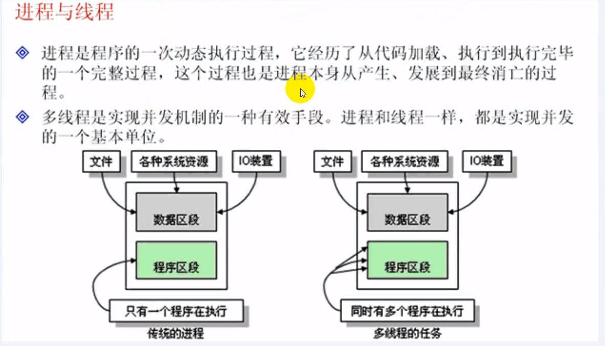
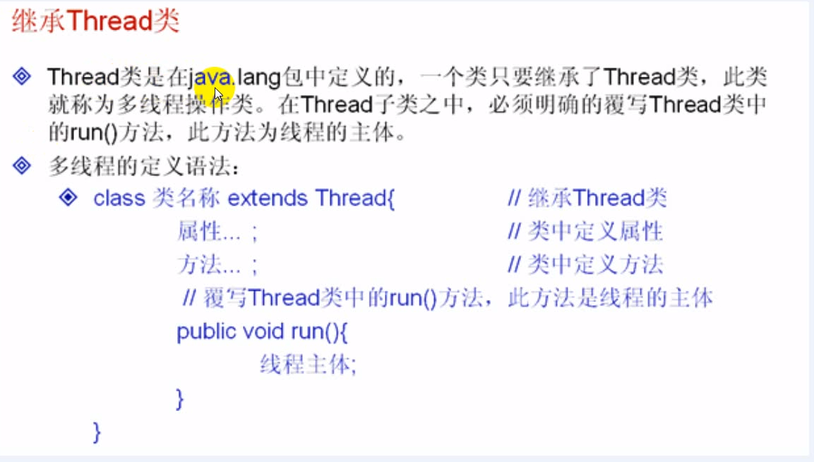
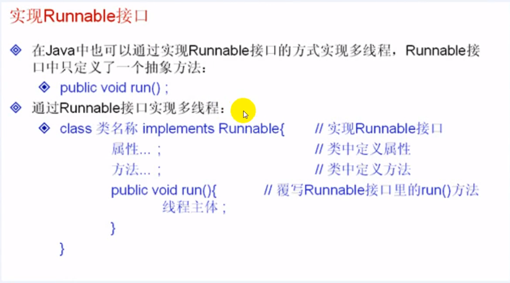
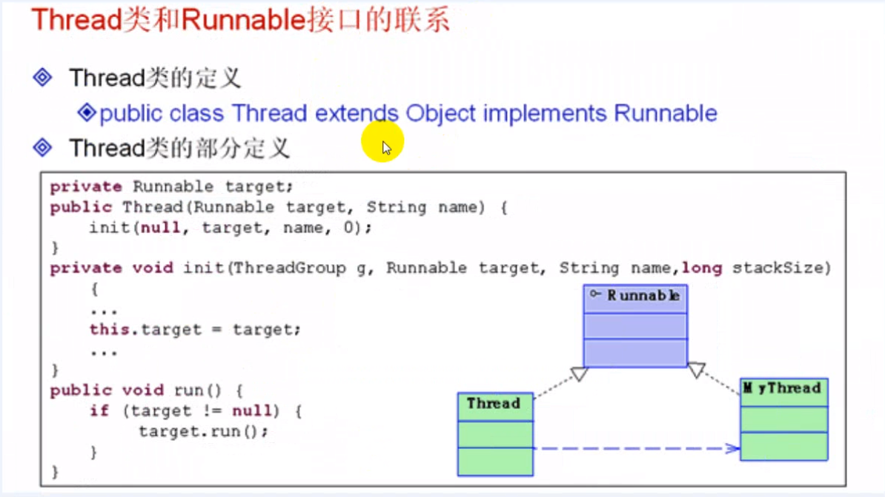
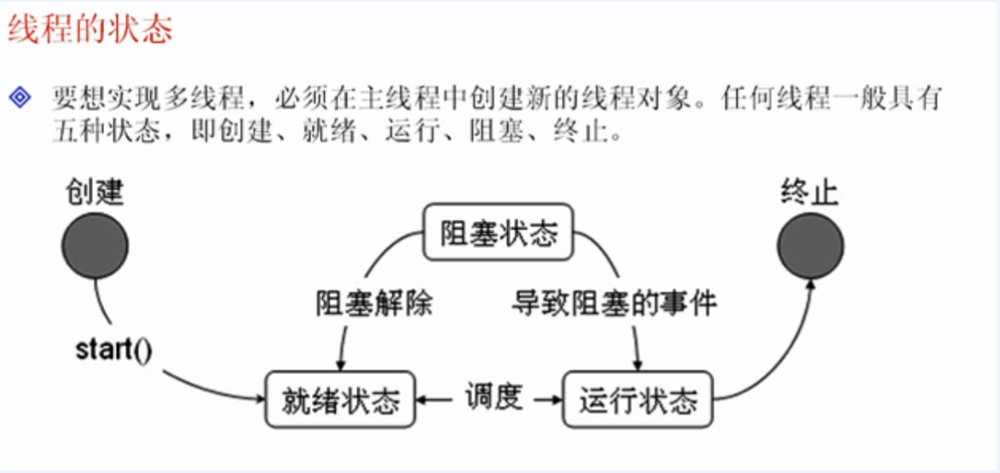
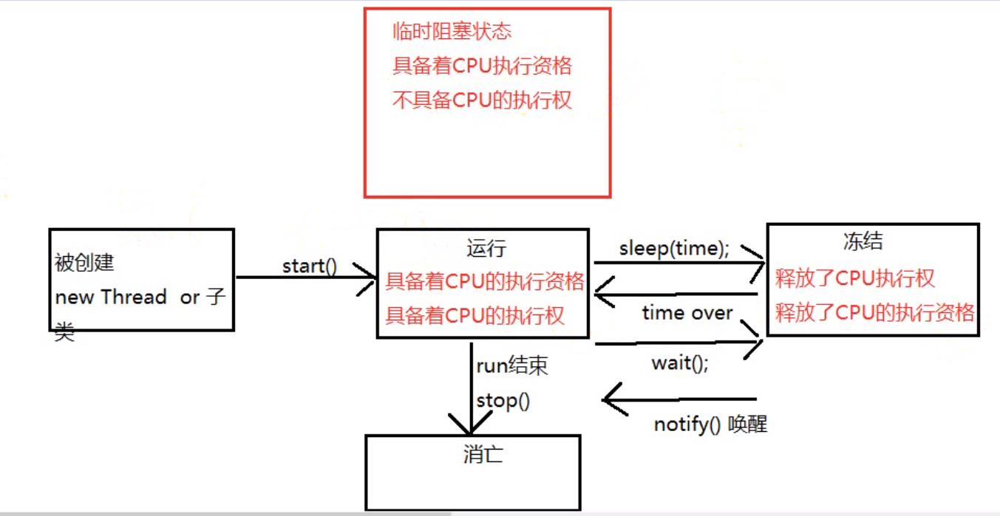
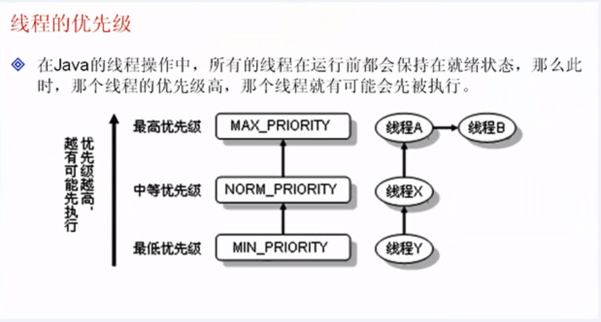

## 多线程

#### 1-1进程和线程


了解进程与线程的区别




线程实际上是在进程基础之上的进一步划分。

如果一个进程没有了，线程肯定会消失，那么如果线程消失，但是进程未必会消失。

所有的线程都是在进程的基础上并发（同时运行）


#### 1-2 java 线程的两种实现方式及区别

掌握 java 线程的两种实现方式及区别


#### 1-3Thread使用格式

**继承  `Thread` 类**

一个类继承 `Thread` 类之后，那么此类就具备了多线程的操作和功能。




了解线程的操作状态

**例子1、**

```java
/**
 * 如果想要启动一个线程必须使用 Thread 类中定义的start()
 */
class MyThread extends Thread{ // 继承 Thread类，作为线程的实现类
	private String name; // 表示线程名称
	public MyThread(String name) { // 通过构造方法配置name属性
		this.name = name;
	}
	
	public void run() { // 重写run方法作为线程的操作主体
		for(int i=0;i<10;i++) {
			System.out.println(this.name + "运行,i = " + i);
		}
	}
}

public class ThreadDemo01 {
	public static void main(String[] args) {
		MyThread mt1 = new MyThread("线程A"); // 实例化对象
		MyThread mt2 = new MyThread("线程B"); // 实例化对象
		
		mt1.run(); // 调用线程主体
		mt2.run(); // 调用线程主体
	}
}
//-------运行结果--------------
线程A运行,i = 0
线程A运行,i = 1
线程A运行,i = 2
线程A运行,i = 3
线程A运行,i = 4
线程A运行,i = 5
线程A运行,i = 6
线程A运行,i = 7
线程A运行,i = 8
线程A运行,i = 9
线程B运行,i = 0
线程B运行,i = 1
线程B运行,i = 2
线程B运行,i = 3
线程B运行,i = 4
线程B运行,i = 5
线程B运行,i = 6
线程B运行,i = 7
线程B运行,i = 8
线程B运行,i = 9
//-------运行结果--------------   
```


如果想要启动一个线程必须使用 Thread 类中定义的start()

**例子2、使用 start 方法**

程序的运行效果，哪个线程先抢占到CPU资源，哪个线程就执行。


一个线程的实例化对象只能执行一次吗，执行多次就报错。


```java
class MyThread extends Thread{ // 继承 Thread类，作为线程的实现类
	private String name; // 表示线程名称
	public MyThread(String name) { // 通过构造方法配置name属性
		this.name = name;
	}
	
	public void run() { // 重写run方法作为线程的操作主体
		for(int i=0;i<10;i++) {
			System.out.println(this.name + "运行,i = " + i);
		}
	}
}

public class ThreadDemo01 {
	public static void main(String[] args) {
		MyThread mt1 = new MyThread("线程A"); // 实例化对象
		MyThread mt2 = new MyThread("线程B"); // 实例化对象
		
		mt1.start(); // 调用线程主体
		mt2.start(); // 调用线程主体
	}
}

//---------------运行结果-----------------------
线程B运行,i = 0
线程A运行,i = 0
线程A运行,i = 1
线程A运行,i = 2
线程A运行,i = 3
线程A运行,i = 4
线程A运行,i = 5
线程B运行,i = 1
线程A运行,i = 6
线程A运行,i = 7
线程A运行,i = 8
线程A运行,i = 9
线程B运行,i = 2
线程B运行,i = 3
线程B运行,i = 4
线程B运行,i = 5
线程B运行,i = 6
线程B运行,i = 7
线程B运行,i = 8
线程B运行,i = 9
//---------------运行结果-----------------------
```


#### 1-4Thread代码实现


在JDK的src.zip中全部都是java的源程序代码，直接找到java.lang.Thread类，就可以打开Therad类的定义。

可以去src的lang源代码的Thread中查看 start的源码

native 关键字表示的是一个由 java代码调用的本地操作系统的方法的一个关键字。

在java中运行java程序调用本机的操作系统方法以完成特定的功能。


如果现在要是实现多线程的话，则肯定需要操作系统的支持，因为多线程中牵扯到一个抢占CPU的情况，要等待CPU进行调度，那么这一点肯定需要操作系统的底层支持，所以使用native调用本机的系统方法。


在各个操作系统中多线程的底层实现代码肯定是不同的，所以使用 `native` 关键字也可以让 `jvm` 自动调整不同的 `jvm` 实现。


#### 1-5Runnable接口





#### 1-6Runnable实现一个多线程

```java
/**
 * public Thread(Runnable target)
 *  就利用以上的构造方法，启动多线程
 */
class MyRunnable implements Runnable{ // 实现 Runnable 接口，作为线程的实现类
	private String name; // 表示线程名称
	public MyRunnable(String name) { // 通过构造方法配置name属性
		this.name = name;
	}
	
	public void run() { // 重写run方法作为线程的操作主体
		for(int i=0;i<10;i++) {
			System.out.println(this.name + "运行,i = " + i);
		}
	}

}

public class RunnableDemo01 {
	public static void main(String[] args) {
		MyRunnable mr1 = new MyRunnable("线程A"); // 实例化对象
		MyRunnable mr2 = new MyRunnable("线程B"); // 实例化对象
		Thread t1 = new Thread(mr1);
		Thread t2 = new Thread(mr2);
		t1.start();
		t2.start();
	}
}
```


#### 1-7 Thread 与 Runnable类的联系

`Thread` 类也是 `Runnable` 类的子类





使用 `Thread` 类在操作多线程的时候无法达到资源共享的目的，而使用 `Runnable` 接口实现了多线程操作，可以实现资源共享。


#### 1-8 Thread 与 Runnable接口使用结论

实现 `Runnable` 接口比继承 `Thread` 类有明显的优点：

1、适合多个相同程序代码的线程去处理同一个资源，可以避免由于单继承局限性所带来的的影响，增强了程序的健壮性，代码能够被多个线程共享、代码与数据是独立的。


**例子1、卖票**

没有实现资源共享

```java
class MyRunnable implements Runnable{ // 实现 Runnable 接口，作为线程的实现类
	private String name; // 表示线程名称
	private int ticket = 5;
	
	public MyRunnable(String name) { // 通过构造方法配置name属性
		this.name = name;
	}
	
	public void run() { // 重写run方法作为线程的操作主体
		for(int i=0;i<100;i++) {
			if(this.ticket > 0) {
				System.out.println(this.name +  "卖票：ticket = " + this.ticket--);
			}
		}
	}
}

public class RunnableDemo01 {
	public static void main(String[] args) {
		MyRunnable mr1 = new MyRunnable("线程A"); // 实例化对象
		MyRunnable mr2 = new MyRunnable("线程B"); // 实例化对象
		mr1.run();
		mr2.run();
	}
}

//-----------------运行结果------------------
线程A卖票：ticket = 5
线程A卖票：ticket = 4
线程A卖票：ticket = 3
线程A卖票：ticket = 2
线程A卖票：ticket = 1
线程B卖票：ticket = 5
线程B卖票：ticket = 4
线程B卖票：ticket = 3
线程B卖票：ticket = 2
线程B卖票：ticket = 1
//-----------------运行结果------------------
```


**例子2、卖票**

```java
class MyRunnable implements Runnable{ // 实现 Runnable 接口，作为线程的实现类
	private String name; // 表示线程名称
	private int ticket = 5;
	
	public MyRunnable(String name) { // 通过构造方法配置name属性
		this.name = name;
	}
	
	public void run() { // 重写run方法作为线程的操作主体
		for(int i=0;i<100;i++) {
			if(this.ticket > 0) {
				System.out.println(this.name +  "卖票：ticket = " + this.ticket--);
			}
		}
	}
}

public class RunnableDemo01 {
	public static void main(String[] args) {
		MyRunnable mr1 = new MyRunnable("线程A"); // 实例化对象
		new Thread(mr1).run();
		new Thread(mr1).run();
		new Thread(mr1).run();
	}
}
//--------------运行结果---------------------
线程A卖票：ticket = 5
线程A卖票：ticket = 4
线程A卖票：ticket = 3
线程A卖票：ticket = 2
线程A卖票：ticket = 1
//--------------运行结果---------------------   
```


#### 1-8线程的状态问题




创建状态：准备好了一个多线程对象

```java
Thread 对象 = new Thread();
```

就绪状态：调用了 `start()` 方法，等待 CPU 的调度

运行状态：执行 `run()` 方法

阻塞状态：暂时停止执行，可能将资源交给其他线程使用。

终止状态（死亡状态）：线程执行完毕，不再使用了。





#### 总结

1.进程与线程的区别，关系

​	线程是在进程的基础上划分的

​	线程消失了进程不会消失，进程如果消失了线程肯定会消失。

2.java实现进程的两种方式

​	继承 `Thread` 类

​	实现`Runnable`接口

3.线程的启动

​	通过`start()` 方法完成，需要进行 CPU 调度，调用`start()` 实际上调用的就是 `run()` 方法

4.`Thread`类也是`Runnable` 类的子类，使用了代理的机制完成

5.在使用多线程的实现中建议通过`Runnable` 接口实现，这样可以避免由于单继承带来的开发局限。而且通过`Runnable`接口也可以达到资源共享的目的。

6.线程的状态问题


## 多线程2


#### 2-1线程的主要方法


#### 2-2设置和获取线程名称

线程名称：

取了名字之后会有名字，不取名字系统会自动的赋一个


**例子**

````java
class MyThread implements Runnable{ // 实现 Runnable 接口
	
	public void run() { // 重写 run 方法
		for(int i=0;i<3;i++) {
			// 取得当前线程的名字
			System.out.println(Thread.currentThread().getName());
		}
	}
}

public class ThreadDemo01 {
	public static void main(String[] args) {
		MyThread mt = new MyThread(); // 实例化Runnable子类对象
		new Thread(mt).start(); // 系统自动设置线程名称
	
		new Thread(mt, "线程-A").start();; // 手动设置线程名称
		new Thread(mt, "线程-B").start();; // 手动设置线程名称
		new Thread(mt).start(); // 系统自动设置线程名称
		new Thread(mt).start(); // 系统自动设置线程名称
	}
}

//------------运行结果------------------------
Thread-0
Thread-0
Thread-0
线程-A
线程-A
线程-A
线程-B
线程-B
线程-B
Thread-2
Thread-2
Thread-2
Thread-1
Thread-1
Thread-1
//------------运行结果------------------------
````


**例2**

发现，程序中由主方法直接通过线程对象调用里面 `run` 方法。

```java
class MyThread implements Runnable{ // 实现 Runnable 接口
	
	public void run() { // 重写 run 方法
		for(int i=0;i<3;i++) {
			// 取得当前线程的名字
			System.out.println(Thread.currentThread().getName() + " i = " + i);
		}
	}
	
}

public class ThreadDemo01 {
	public static void main(String[] args) {
		MyThread mt = new MyThread(); // 实例化Runnable子类对象
		new Thread(mt).start(); // 系统自动设置线程名称
		mt.run();
	}
}

//---------------------运行结果-----------
main i = 0
Thread-0 i = 0
main i = 1
Thread-0 i = 1
Thread-0 i = 2
main i = 2
//---------------------运行结果-----------
```


#### 2-3判断线程是否存活

```java
class MyThread implements Runnable{ // 实现 Runnable 接口
	
	public void run() { // 重写 run 方法
		for(int i=0;i<3;i++) {
			// 取得当前线程的名字
			System.out.println(Thread.currentThread().getName() + " i = " + i);
		}
	}
	
}

public class ThreadDemo01 {
	public static void main(String[] args) {
		MyThread mt = new MyThread(); // 实例化对象

		Thread t1 = new Thread(mt, "线程"); // 系统自动设置线程名称
		System.out.println("线程开始执行之前" + t1.isAlive());
		t1.start(); // 启动线程
		System.out.println("线程开始执行之后" + t1.isAlive());
		
		for(int i=0;i<3000;i++) {
			System.out.println("main运行-->" + i);
		}
		
		// 以下输出结果不确定
		System.out.println("代码执行之后" + t1.isAlive());
	}
}
```


#### 2-4线程的强制运行

了解线程的强制运行，可以使用 `join`方法

```java
class MyThread implements Runnable{ // 实现 Runnable 接口
	
	public void run() { // 重写 run 方法
		for(int i=0;i<3;i++) {
			// 取得当前线程的名字
			System.out.println(Thread.currentThread().getName() + "运行    " + i);
		}
	}
}

public class ThreadDemo01 {
	public static void main(String[] args) {
		MyThread mt = new MyThread(); // 实例化Runnable子类对象
		Thread t =  new Thread(mt); // 系统自动设置线程名称
		t.start(); // 启动线程
		for(int i=0;i<50;i++) {
			if(i>10) {
				try {
					t.join(); // 线程强制运行
				}catch (InterruptedException e) {
					e.printStackTrace(); // 正常开发的时候用这个输出异常
				}
				System.out.println("Main线程运行----->" + i);
			}
		}
		System.out.println("代码执行之后，线程是否还存活" + t.isAlive());
	}
}
```


#### 2-5线程休眠

了解线程的休眠

线程的休眠可以直接调用 `Thread.sleep()` 实现

```java
class MyThread implements Runnable{ // 实现 Runnable 接口
	public void run() { // 重写 run 方法
		for(int i=0;i<50;i++) {
			if(i > 10) {
				try {
					Thread.sleep(500);// 线程休眠500ms
				}catch(InterruptedException e) {
					e.printStackTrace();
				}
			}
			// 取得当前线程的名字
			System.out.println(Thread.currentThread().getName() + "运行    " + i);
		}
	}
}

public class ThreadDemo01 {
	public static void main(String[] args) {
		MyThread mt = new MyThread(); // 实例化Runnable子类对象
		Thread t =  new Thread(mt); // 系统自动设置线程名称
		t.start(); // 启动线程
	}
}
```


#### 2-6线程中断

线程中断可以使用`interrupt`方法实现。

```java
class MyThread implements Runnable{ // 实现 Runnable 接口
	public void run() { // 重写 run 方法
		System.out.println("进入run方法");
		try {
			Thread.sleep(10000);// 线程休眠10s
			System.out.println("2已经完成了休眠");
		}catch (InterruptedException e) {
			e.printStackTrace();
			// TODO: handle exception
			System.out.println("3、休眠被终止");
		}
		System.out.println("4.run()方法正常结束");

	}
}

public class ThreadDemo01 {
	public static void main(String[] args) {
		MyThread mt = new MyThread(); // 实例化Runnable子类对象
		Thread t =  new Thread(mt); // 系统自动设置线程名称
		t.start(); // 启动线程
		try {
			Thread.sleep(2000); // 线程休眠
			t.interrupt(); // 中断线程程序执行
		} catch (Exception e) {
			// TODO: handle exception
		}
		
	}
}
```


#### 2-7设置后台进程

下面的可以在命令行编译，运行测试一下

```java
class MyThread implements Runnable{ // 实现 Runnable 接口
	public void run() { // 重写 run 方法
		System.out.println("进入run方法");
		while (true) {
			System.out.println(Thread.currentThread().getName() + "一直在运行");
		}
	}
}

public class ThreadDemo01 {
	public static void main(String[] args) {
		MyThread mt = new MyThread(); // 实例化Runnable子类对象
		Thread t =  new Thread(mt, "线程"); // 系统自动设置线程名称
		t.setDaemon(true); // 此线程在后台运行
		t.start(); // 启动线程
	}
}
```


#### 2-8线程的优先级





优先级只是有可能，并不是一定的

```java
class MyThread implements Runnable{ // 实现 Runnable 接口
	public void run() { // 重写 run 方法
		System.out.println("进入run方法");
		for (int i = 0; i < 5; i++) {
			try {
				Thread.sleep(3000);
			}catch (InterruptedException e) {
				// TODO: handle exception
				
			}
			System.out.println(Thread.currentThread().getName() + "  i = " + i);
		}
	}
}

public class ThreadDemo01 {
	public static void main(String[] args) {
		Thread t1 =  new Thread(new MyThread(), "线程A"); // 系统自动设置线程名称
		Thread t2 =  new Thread(new MyThread(), "线程B"); // 系统自动设置线程名称
		Thread t3 =  new Thread(new MyThread(), "线程C"); // 系统自动设置线程名称
		
		t1.setPriority(Thread.MIN_PRIORITY); // 设置最低的优先级
		t2.setPriority(Thread.MAX_PRIORITY); // 设置最高的优先级
		t3.setPriority(Thread.NORM_PRIORITY); // 设置普通的优先级
		
		t1.start();
		t2.start();
		t3.start();
	}
}
```


**查看优先级**

```java
class MyThread implements Runnable{ // 实现 Runnable 接口
	public void run() { // 重写 run 方法
		System.out.println("进入run方法");
		for (int i = 0; i < 5; i++) {
			try {
				Thread.sleep(3000);
			}catch (InterruptedException e) {
				// TODO: handle exception
				
			}
			System.out.println(Thread.currentThread().getName() + "  i = " + i);
		}
	}
}

public class ThreadDemo01 {
	public static void main(String[] args) {
		System.out.println("取得主方法的优先级" + Thread.currentThread().getPriority());
		System.out.println("最高优先级 = " + Thread.MAX_PRIORITY);
		System.out.println("默认优先级 = " + Thread.NORM_PRIORITY);
		System.out.println("最低优先级 = " + Thread.MIN_PRIORITY);
	}
}

//-----------运行结果----------------------
取得主方法的优先级5
最高优先级 = 10
默认优先级 = 5
最低优先级 = 1
//-----------运行结果----------------------
```


#### 2-9了解线程称的礼让

了解线程的礼让

```java
class MyThread implements Runnable{ // 实现 Runnable 接口
	public void run() { // 重写 run 方法
		System.out.println("进入run方法");
		try {
			Thread.sleep(500);
		}catch (InterruptedException e) {
			// TODO: handle exception
			e.printStackTrace();
		}
		for(int i=0;i<5;i++) {
			System.out.println(Thread.currentThread().getName() + " 线程在执行");
			if(i == 3) {
				System.out.println("线程  "+Thread.currentThread().getName()+"  礼让");
				Thread.currentThread().yield(); // 线程礼让
				
			}
		}
	}
}

public class ThreadDemo01 {
	public static void main(String[] args) {
		MyThread mt1 = new MyThread();
		Thread t1 = new Thread(mt1, "线程A");
		Thread t2 = new Thread(mt1, "线程B");
		
		t1.start();
		t2.start();
	}
}

```


#### 总结

对于这些操作方法，实际上都是从`Thread`类中找出的，用的时候只需要找出 `Thread` 类即可。


对于休眠操作最好记住，因为以后还要使用的。


## 多线程的拓展


#### 3-1多人买票问题

```java
class Tickets implements Runnable{
	// 1.描述票的数量
	private int tickets = 100;
	
	// 2.售票的动作
	// 进程任务中通常都有循环
	
	public void run() { // 重写run方法
		while(true) {
			if(this.tickets > 0) {
				try {
					Thread.sleep(10);
				}catch (InterruptedException e) {
					// TODO: handle exception
				}
				this.tickets--;
				System.out.println(Thread.currentThread().getName() +  "   当前票的数量 = " + this.tickets);
			}else {
				break;
			}
			
		}
	}
}

public class ThreadDemo {
	public static void main(String[] args) {
		// 1.创建Runnable接口的子类对象
		Tickets t = new Tickets();
		// 2.创建售票窗口
		Thread t1 = new Thread(t, "售票口1");
		Thread t2 = new Thread(t, "售票口2");
		Thread t3 = new Thread(t, "售票口3");
		Thread t4 = new Thread(t, "售票口4");
		
		// 3.开启四个线程
		t1.start();
		t2.start();
		t3.start();
		t4.start();
	}
}

//---------------------因为线程中休眠了一会所以他的票有点乱------------------------
售票口3   当前票的数量 = 4
售票口1   当前票的数量 = 2
售票口2   当前票的数量 = 2
售票口4   当前票的数量 = 1
售票口3   当前票的数量 = 0
售票口2   当前票的数量 = -1
售票口1   当前票的数量 = -1
售票口4   当前票的数量 = -2
//---------------------因为线程中休眠了一会所以他的票有点乱------------------------
```


#### 3-2同步锁解决多线程中出现的安全问题

**解决思路**

只要让一个线程在执行线程任务时将多条操作功能项数据的代码执行完。

在执行过程中，不要让其他的线程参与进来。


**同步的弊端**

降低了程序的性能。


代码体现：

Java中解决此问题通过代码块来完成。

代码块 同步代码块  `synchronized`

```java
synchronized(对象){
	// ...... 这里插入要同步的代码
}
```


```java
class Tickets implements Runnable{
	// 1.描述票的数量
	private int tickets = 100;
	
	private Object obj = new Object();
	
	// 2.售票的动作
	// 进程任务中通常都有循环
	
	public void run() { // 重写run方法
		while(true) {
			synchronized (obj) { // obj相当于一把锁，（火车上的卫生间）
				if(this.tickets > 0) {
					try {
						Thread.sleep(10);
					}catch (InterruptedException e) {
						// TODO: handle exception
					}
					
					this.tickets--;
					System.out.println(Thread.currentThread().getName() +  "   当前票的数量 = " + this.tickets);
				}else {
					break;
				}
			}
		}
	}
}

public class ThreadDemo {
	public static void main(String[] args) {
		// 1.创建Runnable接口的子类对象
		Tickets t = new Tickets();
		// 2.创建售票窗口
		Thread t1 = new Thread(t, "售票口1");
		Thread t2 = new Thread(t, "售票口2");
		Thread t3 = new Thread(t, "售票口3");
		Thread t4 = new Thread(t, "售票口4");
		
		// 3.开启四个线程
		t1.start();
		t2.start();
		t3.start();
		t4.start();
	}
}
```

obj相当于一把锁，（火车上的卫生间）


#### 3-3同步的前提

只有一个线程，还需要同步吗？

必须保证多个线程在同步中使用的是同一把锁


解决了什么问题？

当多线程安全问题发生时，加入同步后、问题依旧，就要通过这个同步的前提来判断同步是否正确。


## 同步函数

#### 4-1同步函数使用的锁是哪个

```java
this
```


```java
public synchronized void sale() {
    if(ticket > 0) {
        try {
            Thread.sleep(100);
        }catch (InterruptedException e) {
            // TODO: handle exception
        }
        ticket--;
        System.out.println(Thread.currentThread().getName() + "售票" + ticket);
    }
}
```


#### 4-2静态同步函数的锁

```java
这个时候的锁就是
类名.class

public static synchronized void sale() {
    if(ticket > 0) {
        try {
            Thread.sleep(100);
        }catch (InterruptedException e) {
            // TODO: handle exception
        }
        ticket--;
        System.out.println(Thread.currentThread().getName() + "售票" + ticket);
    }
}
```

#### 4-3死锁

情况之一：

当线程任务中出现多个同步（多个锁）如果同步中嵌套了其他的同步

这时容易引发一种现象：死锁

```java
synchronized (obj1){
   synchronized (obj2){} 
}

synchronized (obj2){
    synchronized (obj1){}
}
```


**死锁代码示例**

```java
class Tickets implements Runnable{
	private boolean flag;
	public Tickets(Boolean flag) {
		this.flag = flag;
	}
	
	public void run() {
		if(this.flag) {
			synchronized (Myblock.LOCKA) {
				System.out.println("if blockA执行");
				synchronized (Myblock.LOCKB) {
					System.out.println("if block b 执行");
				}
			}
		}else {
			synchronized (Myblock.LOCKB) {
				System.out.println("else blockB执行");
				synchronized (Myblock.LOCKA) {
					System.out.println("else blockA执行");
				}
			}
		}
	}
}


class Myblock{
	public static final Object LOCKA = new Object();
	public static final Object LOCKB = new Object();
}
```


#### 总结

同步函数使用的锁是 `this` 


同步函数和同步代码块区别？

1.同步函数使用的锁是固定的 `this`

2.同步代码块的锁可以是任意对象


