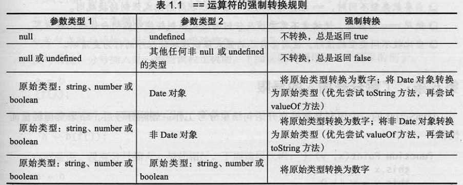

---
算术运算符，类型转换
---


## 一、算术运算符  +  -  \*  /  %

1. 如果+两边又一边是字符串，那么就是拼接


2. \-  \* /  % 如果两边都是数字，那就是数学意义上的运算符

假如有一边是数字，另外一边不是数字，那么会尝试把不是数字的转换为数字，在进行运算，如果没有办法转换为数字，那么就是NaN.

3.NaN  (not a number)不是一个数字.

​        NaN的数据类型是number

   		isNaN()  用来检测一个对象  是不是NaN，如果是NaN那么返回true，反之false。

   		出现NaN的情况，一定是前面有非法的数学运算。

4. % 取余/模


## 二、赋值运算符

​	=    +=     -=     *=     /=    ++    --    %=

## 三、比较运算符

\>     <    >=    <=    !=    ==    ===    !==

## 四、逻辑运算符

&&	与（逻辑与） 并且，遇到true就通过，遇到false就停止

|| 	或（逻辑或）或者，遇到false就通过，遇到true就停止

！	非  取反

**&&比||的优先级还高一点**

```js
var a = 1; 
var b = null;
var c = '12344';
var d = [];
var e = function(){

}
var z = a && b;   //null
var h = 0 || b && d || c && e;  //function(){}
var i = b&&d; //null
```


## 五、显式类型转换

1. Number()

   转换的必须是一个数字字符串,否则会是NaN。会排除开始和结尾的空格，中间的空格不会被过滤。 从第一位不是空格的字符开始一直到最后，如果发现不是一个常规的数字，就会返回NaN

   parseInt()	

   遇到非数字停下来，从第一个不是空格的字符开始，遇到不是数字的地方结束，过滤小数部分。


3. parseFloat()

		遇到非数字停下来，从第一个不是空格的字符开始，到不是数字的地方结束，但是允许小数点出现一次。

**这三种最后无论转换成什么值，都是Number类型**

```js
var str = "100.123px";
alert( Number( str ) ); //NaN;
alert( parseInt(str) ); // 100
alert( parseFloat(str) ); //100.123
```

 补充： **隐式类型转换**

   ````js
+ - * /
   ````

```js
var num = 1;
var sum = num + "1"; //字符拼接
alert( sum ); //11
```

```js
var num2 = 10;
var sum2 = num2/"2"; 
alert(typeof sum2 );  //Number 5

var num3 = 10;
var sum3 = num3 * 2;
alert( typeof sum3 ); // Number 20

var num4 = 10;
var sum4 = 10 - "1";
alert( sum4 ); // Number 9

var num5 = "10/2";
alert( Number(num5) ); //NaN
```


### ==的转换规则

```js
number类型与string类型比较，string会转换为number类型
null和undefined类型比较始终相等
布尔类型与其它任何类型进行比较，布尔类型将会转换为number类型
number类型或string类型与object类型进行比较，number或者string类型都会转换为object类型
```


```js
number类型与string类型比较，string会转换为number类型
'' == '0' //false
0 == ''//true;
0 == '0'//true
' \t\r\n '==0//true
```


```js
null和undefined类型比较始终相等

null == undefined //true
```

```js
布尔类型与其它任何类型进行比较，布尔类型将会转换为number类型
false == 'false'//false
false == '0'//true
false == null//false
null == undefined //true
```

```js
number类型或string类型与object类型进行比较，number或者string类型都会转换为object类型

 var a = 0, b = {}; 
 a == b//false
```





