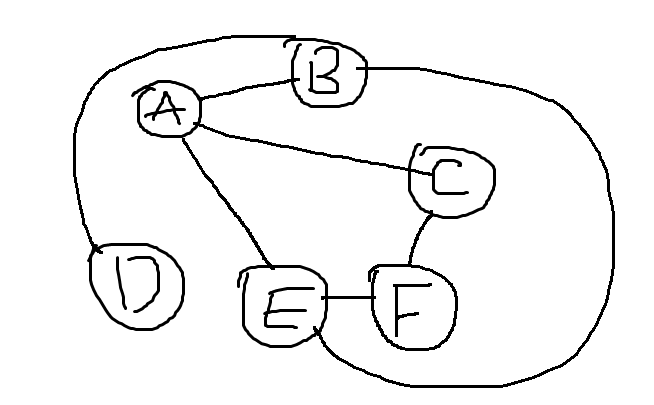

---
Javascript数据结构
---

[TOC]

# JavaScript数据结构

## 前言

数据结构和一些排序算法本来是已经在代码中运行通过的，但是做了的东西不写成笔记感觉记忆就不深刻，故有此文章。

在专门的看到JavaScript实现栈之前，在学校中是学习过数据结构这本书的，因为当时C语言的基础有点差，而且课本上的C语言代码都是伪代码，所以每次上课都是感觉道理和逻辑很简单，但是就是写不出来，没有再深入的去学习了。

目前打算通过一些视频和百度的一些内容以及书本上的知识把这些学习到的一些东西用JavaScript实现一下。

我现在只是介绍一下、就是学习数据结构都可以经常看到的一些知识，理论上系统的知识还是建议去看一下书籍。这里只是简单的介绍一下自己对这些结构的理解和实现。

+ 栈
+ 队列
+ 链表
+ 二叉树
+ 图
+ 哈希表


+ 再有就是一些排序算法了。


## 一、概述

**数据结构**是指相互之间存在的一种或多种特定关系的数据组成的集合。采用合适的数据结构能够提高开发或者存储效率。比如学习js的时候接触过的数据结构（Set、Map），在合适的时机使用它们能够帮助我们更快的解决问题。

这里我们会学习自己创建几种数据结构，来帮助我们在日后的开发中解决特定的某类问题，以及面试的时候的一些需要。


---


## 二、栈

#### 1.创建栈结构

**栈**是一种遵循*后进先出*（LIFO）原则的有序数据集。

> 栈顶、栈底、入栈、出栈。
>
> 栈结构也被用在编译器和内存中保存变量等。

下面来创建**栈**数据结构。功能需求。

+ 添加数据（push）
+ 返回栈顶数据（peek）
+ 从栈中删除栈顶数据并返回（pop）
+ 清空栈（clear）
+ 返回栈中数据个数（size）

```js
// 使用es6的语法我们很容易实现一个栈的类
class Stack{
    constructor(){
        this.items = [];
    }
    push(ele){
        this.items.push(ele);
    }
    pop(){
        return this.items.pop();
    }
    peek(){
        return this.items[this.items.length - 1];
    }
    clear(){
        this.items = [];
    }
    size(){
        return this.items.length;
    }
}
```

```js
// 看一下上面这个结构是否满足了我们的需求呢
// 需要实现的功能有 入栈 出栈 返回栈顶数据 出栈栈顶数据并返回 栈的长度

// 入栈
let stack = new Stack();
stack.push(11);
stack.push(22);
stack.push(33);
console.log(stack); // {items: (3) [11, 22, 33]}

// 出栈
console.log(stack.pop()); // 33
console.log(stack); // {items: (2) [11, 22]}

// 返回栈顶元素
console.log(stack.peek()); // 22

// 返回栈的长度
console.log(stack.size()); // 2
// 清空栈
stack.clear();
console.log(stack); // {items: []}
```

应该挺简单的吧，采用了数组的结构存储数据。

但是上面还存在一个问题，就是实例化对象stack的items属性可以访问到并且更改栈的内容。

所以我们可以采用闭包或者Symbol来避免外界可以访问到我。

```js
const Stack = (function () {
    let sym = Symbol();
    return class Stack {
        constructor() {
            this[sym] = [];
        }
        push(ele) {
            this[sym].push(ele);
        }
        pop() {
            return this[sym].pop();
        }
        peek() {
            return this[sym][this[sym].length - 1];
        }
        clear() {
            this[sym] = [];
        }
        size() {
            return this[sym].length;
        }
    }
})();
```


#### 2.栈结构的应用

+ 进制转换（js自带进制转换，此应用并不实用，仅作为理解原理）

```js
// 2进制转换
function numberTo2(number) {
    let stack = new Stack();

    while (number) {
        stack.push(number % 2);
        number = Math.floor(number / 2);
    }

    let result = "";
    while (stack.size()) {
        result += stack.pop();
    }
    return result;
}

console.log(numberTo2(16)); // 10000
console.log(numberTo2(4)); // 100
console.log(numberTo2(25)); // 11001
```

```js
// 16进制转换
function numberTo16(number, base = 2) {
    let stack = new Stack();
    let str = '0123456789abcdef';
    console.log(number % base);

    while (number) {
        stack.push(str.charAt(number % base));
        number = Math.floor(number / base);
    }

    let result = "";
    while (stack.size()) {
        result += stack.pop();
    }
    return result;
}

console.log(numberTo16(255, 16)); // ff
console.log(numberTo16(25, 16)); // 19
```

+ 判断回文字符串 其实这个也有现成的reserve函数可以颠倒

```js
//判断回文
function isPlalindrome(word){
    if( !word || typeof word !== "string" ){
        throw "参数不为字符或字符为空，我们返回了false";
        return false
    };
    let stack = new Stack();
    let back = ""
    stack.push(...word);
    while (stack.size()){
        back += stack.pop();
    }
    return back === word;
}
console.log(isPlalindrome("我爱你你爱我"));
console.log(isPlalindrome("123456"));

-----------------------
    // 判断一串文字是否为回文
function isHuiwen(str){
  let stack = new Stack();

  [...str].forEach(v => {
    stack.push(v);
  });

  let result = '';
  while(stack.size()){
    result += stack.pop();
  }

  return result === str;
}
```

+ 检测括号匹配

```js
// 检测括号匹配
function signMatch(str) {
    let stack = new Stack();
    let leftSign = ['(', '[', '{'];
    let rightSign = [')', ']', '}'];


    for (let i = 0; i < str.length; i++) {
        let v = str.charAt(i);
		// 左括号入栈
        if (leftSign.indexOf(v) !== -1) {
            stack.push(v);
        // 遇到有括号匹配
        } else if (rightSign.indexOf(v) !== -1) {
            if (leftSign.indexOf(stack.pop()) !== rightSign.indexOf(v)) {
                return false;
            }
        }
    }

    return stack.size() === 0;
}
```


---


## 三、队列

#### 1.创建队列结构

**队列**是一种遵循*先进先出*（FIFO）原则的有序数据集。

> 类似的场景举例... 排队买饭
>
> 入队、出队

创建**队列**数据结构

```js
入队 enqueue
出队 dequeue
返回队首端数据，但不删除 first
清空队列 clear
返回队列长度 size
```

```js
// 队列结构
const Queue = (function () {
    let sym = Symbol();
    return class {
        constructor(){
            this[sym] = [];
        }
        enqueue(ele){
            this[sym].push(ele);
        }
        dequeue(){
            return this[sym].shift();
        }
        // 返回队首元素
        first(){
            return this[sym][0];
        }
        clear(){
            this[sym] = [];
        }
        // 查看队列的长度
        size(){
            return this[sym].length;
        }
    }
})();
```


#### 2.队列结构的应用

队列是极其基础的一种数据结构，不管在哪都能运用到，通常都需要配合其他的代码实现强大的功能。比如整个JavaScript的执行机制，因为其是单线程，所以多任务之间都是队列的形式排好然后执行，再借助事件循环实现这个JavaScript强大的功能。比如JQuery中学习的queue队列，最基本的结构就是刚刚介绍的队列。所以说其实很多地方都在使用着队列，因为它实在太常见太实用了，只不过，使用时的api已经写好的而不需要我们自己来定义实现。

```html
<!DOCTYPE html>
<html lang="en">

<head>
  <meta charset="UTF-8">
  <meta name="viewport" content="width=device-width, initial-scale=1.0">
  <meta http-equiv="X-UA-Compatible" content="ie=edge">
  <title>Document</title>
  <style>
    * {
      margin: 0;
      padding: 0;
    }

    #box {
      position: absolute;
      top: 0;
      left: 0;
      width: 100px;
      height: 100px;
      background-color: pink;
    }
  </style>
</head>

<body>

  <div id="box"></div>

  <script>
    const Queue = (function () {
      let sym = Symbol();
      return class {
        constructor() {
          this[sym] = [];
        }
        enqueue(ele) {
          this[sym].push(ele);
        }
        dequeue() {
          return this[sym].shift();
        }
        first() {
          return this[sym][0];
        }
        clear() {
          this[sym] = [];
        }
        size() {
          return this[sym].length;
        }
      }
    })();


    let Aq = (function () {

      // 继承 Queue
      class _Queue extends Queue {
        constructor(props) {
          super(props);
          this.isRun = false; // 动画是否在运行
        }
        // 遍历整个动画，并逐一执行
        run() {
          console.log('打印我');
          console.log(this);
          if (this.isRun) return;
          // 递归来完成动画队列的清空
          this.isRun = true;
          (function r(){
            if(this.size()){
              new Promise(this.dequeue())
                .then(res => {
                  r.call(this);
                })
            }else{
              this.isRun = false;
            }
          }).call(this);
        }
      }


      // 避免存储对外暴露
      let dom = Symbol();

      // 用来存储所有dom节点的动画队列
      let animateQueue = new Map();

      // Init类
      class Init {
        constructor(selector) {
          this[dom] = document.querySelector(selector);
        }
        animate(options, time) {
          // 判断dom节点是否注册过队列
          !animateQueue.has(this[dom]) && animateQueue.set(this[dom], new _Queue());
          // 获取dom节点的队列
          let queue = animateQueue.get(this[dom]);
          // 动画队列入队
          queue.enqueue((res) => {
            this[dom].style.transition = time / 1000 + 's';
            // 获取元素的东西 主动触发浏览器重绘
            this[dom].offsetTop;

            for (let [attr, val] of Object.entries(options)) {
              this[dom].style[attr] = val + 'px';
            }
            setTimeout(res, time);
          });
          // 动画队列调用
          queue.run();

          return this;
        }
      }

      return function (selector) {
        return new Init(selector);
      }


    })();


    Aq('#box')
      .animate({
        width: 400,
        height: 500
      }, 3000);

    Aq('#box')
      .animate({
        width: 300
      }, 2000)
      .animate({
        top: 100
      }, 1000);

  </script>


</body>
</html>
```


#### 3.优先队列

根据优先级来决定插入的顺序，就好像登机时的贵宾通道一样...

```js
const PriorityQueue = (function () {
  let sym = Symbol();


  class Priority {
    constructor(ele, pri) {
      this.ele = ele;
      this.pri = pri;
    }
  }

  return class {
    constructor() {
      this[sym] = [];
    }
    enqueue(ele, priority) {
      let node = new Priority(ele, priority);
      let i = 0;
      console.log('i = ' + i);
      while (i < this.size()) {
        if (this[sym][i].pri < priority) {
          break;
        }
        i++;
      }
      this[sym].splice(i, 0, node);
    }
    dequeue() {
      return this[sym].shift();
    }
    first() {
      return this[sym][0];
    }
    clear() {
      this[sym] = [];
    }
    size() {
      return this[sym].length;
    }
    print() {
        this[sym].forEach(v => {
            console.log(v);
        })
    }
  }
})();
```


#### 4.双向队列

允许从前面添加取出，也允许从后面添加取出。

```js
let Quele = (function () {

  let sym = Symbol();

  return class {
    constructor() {
      this[sym] = [];
    }
    // 从后入队
    enqueueLast(ele) {
      this[sym].push(ele);
    }
    // 从前入队
    enqueueFirst(ele) {
      this[sym].unshift(ele);
    }
    // 从队首出队
    dequeueFirst() {
      return this[sym].shift();
    }
    // 从队尾出队
    dequeueLast() {
      return this[sym].pop();
    }
    // 返回首部数据 不删除
    front() {
      return this[sym][0];
    }
    // 返回队尾数据 不删除
    back() {
      return this[sym][this[sym].length - 1];
    }
    // 返回队列长度
    size() {
      return this[sym].length;
    }
    // 从前向后打印
    print() {
      this[sym].forEach(v => {
        console.log(v);
      });
    }
  }
})();
```


## 四、链表

#### 1.创建链表结构

存储多个数据常见的结构就是数组，它提供非常方便的[ ]操作符。但是缺点是，当我们往数组中插入或删除数据时，后面所有元素的位置都要进行一次变化。即使提供了便利的splice函数，但内部原理还是一样的。所以，当数据较多，并且会频繁的插入/删除数据时，再用数组来充当存储结构效率是较低的。


**链表（Linked List**也可以用来存储有序的数据，它与数组的不同在于，并不是在内存中连续的存储，而是每一个节点由自身的数据和指向下一个节点的next组成，通过next指针将所有的节点串联起来形成类似于链的结构。


创建**链表**结构

```js
链尾添加节点 append
查找指定数据对应的节点 find
指定数据后面插入节点 insert
移除指定数据对应的节点 remove
打印链表数据 prinf
返回链表长度 size

// 可能额外需要的功能
查找数据对应索引 indexOf
按照索引查找节点 find的参数设计
按照索引插入节点 insert的参数设计
按照索引移除节点 remove的参数数据
```

```js
let LinkedList = (function () {
  let HEAD = Symbol();

  // 定义链表结构
  class Node {
    constructor(data) {
      this.data = data;
      this.next = null;
    }
  }

  return class {
    constructor() {
      this[HEAD] = null;
    }
    // 添加节点
    append(data) {
      let node = new Node(data);
      let head = this[HEAD];
      // 判断有没有节点
      if (head === null) {
        // 没有HEAD节点
        this[HEAD] = node;
      } else {
        // 有HEAD节点
        while (head.next) {
          head = head.next;
        }
        head.next = node;
      }
    }

    // 查找节点
    find(index) {
      let i = 0;
      let head = this[HEAD];
      while (head) {
        if (i === index) return head;
        head = head.next;
        i++;
      }
      return undefined;
    }

    // 插入
    insert(index, data) {
      let newNode = new Node(data);
      if (index === 0) {
        let head = this[HEAD];
        // 判断是不是插入到第一个
        this[HEAD] = newNode;
        newNode.next = head;
        return;
      }
      // 不是第一个
      let beforeNode = this.find(index - 1);
      let afterNode;

      if (beforeNode) {
        afterNode = beforeNode.next;
        newNode.next = afterNode;
        beforeNode.next = newNode;
      } else {
        throw new Error('beforeNode节点不存在');
      }
    }

    // 打印
    print() {
      let head = this[HEAD];
      while (head) {
        console.log(head.data);
        head = head.next;
      }
    }

    // 返回节点长度
    size() {
      let i = 0;
      let head = this[HEAD];
      if (head === null) {
        return 0;
      }

      while (head) {
        head = head.next;
        i++;
      }
      return i;
    }
  }
})();


let link = new LinkedList();

console.log(link);

link.append('王大');
link.append('赵二');
link.append('张三');
link.append('李四');

// console.log(link);
// console.log(link.find(0));
console.log(link.insert(4, '午五'));
link.print();
console.log(link.size());
```


```js
// 之后第二遍又写了一次，两个差不多，就是其中的一些细节不同
// 这里插入的时候和查找的时候，感觉index的理解不同，到时候如果可以用到可以根据需要去更改。

const LinkedList = (function () {
  console.log('链表');

  // 链表的每一项的结构
  class Node {
    constructor(data) {
      this.data = data;
      this.next = null;
    }
  }

  let HEAD = Symbol();
  return class {
    constructor() {
      this[HEAD] = null;
    }

    // 追加一个新的节点
    append(data) {
      let node = new Node(data);
      let head = this[HEAD];
      // 将链表插入进来
      if (!this[HEAD]) {
        this[HEAD] = node;
        return;
      }

      while (head.next) {
        head = head.next;
      }
      head.next = node;
    }

    /**
     * 查找节点 根据值查找
     * @param {String} 值
     * 
     * @return {Object} 
     *  存在 {index: 所在索引, node: 第一项匹配的node项}
     *  不存在 undefined
     */
    find(key) {
      let i = 0;
      let head = this[HEAD];
      if (!head) return undefined;

      while (head.next) {
        if (head.data === key) {
          return {
            index: i,
            node: head
          };
        }
        head = head.next;
        i++;
      }
      return undefined;
    }

    // 查找节点 根据index查找
    findIndex(index){
      let head = this[HEAD];
      let i = 0;
      while(head){
        if(i === index) return head;
        head = head.next;
        i++;
      }
      return undefined;
    }
    
    // 指定节点前面插入一个
    insert(index, key) {
      // 查找到要插入的节点

      if(index < 0){
        throw new Error('插入的值必须大于等于0');
        return ;
      }
      let node = new Node(key);

      if(index === 0){
        node.next = this[HEAD];
        this[HEAD] = node;
        return ;
      }
      // 要插入的节点
      
      let beforeNode = this.findIndex(index - 1);
      if(!beforeNode){
        throw Error('前一项不存在');
        return ;
      }

      if(!beforeNode.next){
        beforeNode.next = node;
        return ;
      }
      // 走到这里就说明是存在了

      node.next = beforeNode.next;
      beforeNode.next = node;
    }

    /**
     * 从链表中移除某一项
     * @param {Number} index 索引
     */
    remove(index){
      let head = this[HEAD];

      // 如果一项也不存在 就退出
      if(!head){
        return ;
      }

      // 如果要移除的是第一项
      if(index === 0){
        this[HEAD] = head.next;
      }
      // 前一项 和后一项的值
      let beforeNode = this.findIndex(index - 1);
      if(!beforeNode || !beforeNode.next){
        return ;
      }
      beforeNode.next = beforeNode.next.next;
    }

    // 打印链表的每一项
    printf(){
      let head = this[HEAD];
      while(head){
        console.log(head.data);
        head = head.next;
      }
    }

    // 打印链表的长度
    size(){
      let i = 0;
      let head = this[HEAD];
      while(head){
        head = head.next;
        i++;
      }
      return i;
    }
  }
})();
```


#### 2.双向链表与循环链表

双向链表指每个节点不仅仅有next指针，还有prev执行指向它的前一个节点。

循环链表指最后一个节点的next指针不是指向null，而是指向第一个节点。

再有了之前的基础之后，写出来就很容易了。


#### 3.总结

与数组对比：1.取节点更麻烦，2.获取节点后做对应的添加和移除很方便，......所以当我们需要对数据进行多次的新增和移除操作时，选用链表结构。


## 五、集合

#### 1.创建集合结构

**集合**由一组无序且唯一的数据组成。ES6的**Set**结构就是集合，无须我们再实现。接下来基于Set数据结构进行讨论。

```js
// 简要介绍一下Set的api add delete has clear size 以及初始化传参

```


#### 2.并集、交集、差集、子集

+ 并集 -- 传入两个集合，返回两个集合的合集。

```js
function union(a, b){
    return new Set([...a, ...b]);
}
```

+ 交集 -- 传入两个集合，返回两个集合共有的数据集合

```js
function intersection(a,b){
    let set = new Set();
    for (let item of a) {
        if( b.has(item) ){
            set.add(item);
        }
    }
    return set;
}
```

+ 差集 -- 传入两个集合，返回a集合中不存在于b集合的数据集合。

```js
function difference(a,b){
    let set = new Set();
    for (let item of a) {
        if( !b.has(item) ){
            set.add(item);
        }
    }
    return set;
}
```

+ 子集

```js
function subset(a,b){
    for (let item of a) {
        if( !b.has(item) ){
            return false;
        }
    }
    return true;
}
```


## 六、字典

#### 1.创建字典结构

**字典**是一种以[键，值]的形式存储数据的数据结构，键用来查找对应的值。就像字典里面每个字(键)对应的有它的解释(值)，再比如电话簿，名字(键)对应电话(值)。

Es6中的**Map**数据结构就是一种字典。

子集实现字典：

```js
设置数据 set
获取数据 get
删除数据 delete
是否存在 has
返回长度 size
```

```js
let Map = (function () {

  let sym = Symbol();

  class Node {
    constructor(key, value) {
      this.node = [key, value];
    }
  }

  return class {

    constructor() {
      this[sym] = [];
    }

    set(key, value) {
      for (let item of this[sym]) {
        if(item[0] === key){
          item[1] = value;
          return ;
        }
      }
      this[sym].push([key, value]);
    }

    get(key) {
      for (let item of this[sym]) {
        if (item[0] === key) {
          return item[1];
        }
      }
      return undefined;
    }

    delete(key) {
      for (let i = 0, len = this[sym].length; i < len; i++) {
        if (this[sym][i][0] === key) {
          this[sym].splice(i, 1);
          return;
        }
      }

    }

    has(key) {
      for (let item of this[sym]) {
        if (item[0] === key) {
          return true;
        }
      }
      return false;
    }

    size() {
      return this[sym].length;
    }
  }
})();


let map = new Map();
console.log(map);
map.set('aa', 111);
map.set('bb', 222);
map.set('cc', 333);
map.set('aa', 100);
map.set('aabb', 100);
map.set('cc', 555);

console.log(map);

map.delete('cc');
console.log(map);
console.log(map.size());
console.log(map.get('aa'));
```


## 七、哈希表

#### 1.创建哈希结构

**哈希表也叫散列表**也是一种基于键值对存储值的一种数据结构，与之前的区别在于，哈希表能快速的定位值的位置，而不需要逐个遍历匹配。

javascript中的对象就具有哈希表结构的特性。

先忘记掉js的对象，我们通过数组来模拟一个哈希表。通过一系列的计算通过key值得到对应的序号，这个计算过程是建立哈希表最重要的过程，叫作哈希函数。比如我们可以通过每个字符的ASCII码相加得到对应的哈希索引

```js
let HashTable = (function () {

  let symbol = Symbol();

  // 哈希函数
  function HASH(key) {
    let hash = 0;
    [...key].forEach(v => {
      hash += v.charCodeAt();
    });
    return hash;
  }


  let sym = Symbol();
  return class {

    constructor() {
      this[sym] = [];
    }

    set(key, value) {
      let hash = HASH(key);
      // 如果值存在，则修改
      // if(this[sym][hash]){
      //   this[sym][hash] = value;
      //   return ;
      // }
      this[sym][hash] = value;
    }
    get(key) {
      let hash = HASH(key);
      return this[sym][hash];
    }
  }

})();

let hash = new HashTable();

console.log(hash);

hash.set('zhang', 10086);
hash.set('aa', 100);
hash.set('bb', 200);


console.log(hash.get('goudan')); // undefined
console.log(hash.get('bb')); // 200
```

很显然，这个哈希函数是 很不合理的。

+ 第一、哈希值太大，只需要存储三个数据却建立了一个长度好几百的数组，一般合理的利用率范围是0.6~0.9,也就是说数据个数与总长度的比例在这之间。
+ 第二，容易出现重复，要是某两个字符码加起来刚好一样就会出现哈希值重复，从而覆盖前一个数据。

#### 2.解决冲突的方法

```js
// 解决第一个问题，我们可以预先设置一个较为合理的数组长度，然后规定序号不会超过长度；
// 解决第二个问题，可以结合之前链表结构来存储，或者线性探测逐位往后推的方法；

// 设定长度37，使用链表来解决冲突（使用质数来定长度是最合适的选择）

let HashTable = (function () {

  // 用于哈希表的链表
  let LinkedList = (function () {
    //避免外部访问
    let HEAD = Symbol();
    //存储数据与next节点的类
    class Node {
      constructor(data) {
        this.data = data;
        this.next = null;
      }
    }
    //类
    return class {
      constructor() {
        //链头
        this[HEAD] = null;
      }
      //追加数据
      append(data) {
        //创建对应的链节点
        let node = new Node(data);
        //获取链头
        let head = this[HEAD];
        if (head === null) {
          //如果链头是null
          this[HEAD] = node;
          return;
        } else {
          //如果不是链头，循环找到链尾
          while (true) {
            if (head.data.key === data.key) {
              head.data.value = data.value;
              return;
            }
            if (head.next !== null) {
              head = head.next;
            } else {
              break;
            }
          }
          head.next = node;
        }
      }
      //取值
      find(index) {
        let head = this[HEAD];
        let i = 0;
        while (head) {
          if (i === index) return head;
          head = head.next;
          i++;
        }
        return null;
      }
      //移除
      remove(index) {
        //当前index所对应的前后node
        let nodeB = this.find(index - 1),
          nodeA = this.find(index + 1);
        if (index === 0) {
          this[HEAD] = nodeA;
        } else {
          nodeB && (nodeB.next = nodeA);
        }
      }
      //长度
      size() {
        let i = 0,
          head = this[HEAD];
        while (head) {
          head = head.next;
          i++;
        }
        return i;
      }
      //返回头
      getHead() {
        return this[HEAD];
      }
    }
  })();

  // 哈希函数
  function HASH(key) {
    let hash = 0;
    [...key].forEach(v => {
      hash += v.charCodeAt();
    });
    return hash % 37;
  }

  // 用于链表存值的类
  class ValuePair {
    constructor(key, value) {
      this.key = key;
      this.value = value;
    }
  }

  let sym = Symbol();
  return class {
    constructor() {
      this[sym] = [];
    }

    set(key, value) {
      let hash = HASH(key);
      let node = new ValuePair(key, value);
      if (typeof this[sym][hash] === 'undefined') {
        this[sym][hash] = new LinkedList();
      }
      this[sym][hash].append(node);
    }

    get(key) {
      let hash = HASH(key);
      let list = this[sym][hash];

      // 不存在
      if(!list){
        return undefined;
      }

      // 存在
      let head = list.getHead();

      while(head){
        if(head.data.key === key){
          return head.data.value;
        }
        head = head.next;
      }
      return undefined;
      
    }
    
    
  }
})();


let hash = new HashTable();

console.log(hash);

hash.set('key', '键的内容值');
hash.set('key', '22');
hash.set('key', '333');
hash.set('yke', 'yke的值');

hash.set('zhangya', '我的名字');

console.log(hash);
console.log(hash.get('key'));
console.log(hash.get('yke'));
console.log(hash.get('eky'));
```


解决冲突的方法有很多，这一个是使用向下先行探索，解决冲突

```js
let HashTable = (function () {

  function HASH(key) {
    let hash = 0;
    [...key].forEach(v => {
      hash += v.charCodeAt();
    })
    return hash % 37;
  }

  class ValuePair {
    constructor(key, value) {
      this.key = key;
      this.value = value;
    }
  }

  let sym = [];

  return class {
    constructor() {
      this[sym] = [];
    }

    set(key, value) {
      let hash = HASH(key);
      let i = hash;
      while (this[sym][hash]) {
        // 如果存在 判断是否是相等的 如果是相等的则更新
        if(this[sym][hash].key === key){
          this[sym][hash].value = value;
          return ;
        }
        hash = (hash + 1) % 37;
        if (i === hash) {
          throw new Error('哈希表已用完');
          return;
        }
      }
      this[sym][hash] = new ValuePair(key, value);
    }

    get(key) {
      let hash = HASH(key);
      let i = hash;
      while(this[sym][hash]){
        hash = (hash + 1) % 37;
        if(i === hash){
          throw new Error('不存在该内容');
        }
      }
      return undefined;
    }
  }
})();
```


#### 3.有名的哈希函数

刚刚写的hash函数并不优秀，因为出现重复的概率比较高。下面列出一些前辈总结的好用的hash函数。

```js
//DJB
function DJBHash(str)    {    
    var hash = 5381;   
    var len = str.length , i = 0
     
    while (len--){    
        hash = (hash << 5) + hash + str.charCodeAt(i++); /* times 33 */    
    }    
    hash &= ~(1 << 31); /* strip the highest bit */    
    return hash;    
}
```

```js
// JS
function JSHash(str)  {  
      var hash = 1315423911;  
      for(var i = 0; i < str.length; i++)  {  
         hash ^= ((hash << 5) + str.charCodeAt(i) + (hash >> 2));  
      }  
      return hash;  
}
```

```js
//PJW
function PJWHash( str)  {  
      var BitsInUnsignedInt = 4 * 8;  
      var ThreeQuarters     =  (BitsInUnsignedInt  * 3) / 4;  
      var OneEighth         = (BitsInUnsignedInt / 8);  
      var HighBits          = (0xFFFFFFFF) << (BitsInUnsignedInt - OneEighth);  
      var hash              = 0;  
      var test              = 0;  
      for(var i = 0; i < str.length; i++)  {  
         hash = (hash << OneEighth) + str.charCodeAt(i);  
         if((test = hash & HighBits)  != 0)  
         {  
            hash = (( hash ^ (test >> ThreeQuarters)) & (~HighBits));  
         }  
      }  
      return hash;  
} 
```

……


## 八、树

#### 1.了解树结构

树是一种重要的非线性结构，以分层的方式存储数据，比如公司的组织架构。

```js
								 A
                               /   \
							  B      C
							/  \    /  \
						    D   E   F   G
						  / | \
                          I J  K
```

顶部节点叫作根节点，其他节点都是它的子节点，有子元素的节点称为内部节点，没有子元素的节点成为外部节点或叶节点。每个节点有层次， A层次为0，D层次为2，树的最大的层次称为该树的深度。每个节点和它的子节点组成子树。


#### 2.二叉树与二叉搜索树

二叉树在计算机科学技术中应用非常广泛。它是一种特殊的树，每个节点最多拥有左右两个子节点。利用它的特性我们可以更高效的对树种的数据进行 增 删 查 等操作。

**二叉搜索树**(BinarySearchTree)是二叉树的一种，它只允许在节点的左侧存储比节点小的值，在节点右侧存储比节点大(或等于)的值。

实现二叉搜索树

```js
插入节点 insert
```

```js
let BST = (function () {

  let ROOT = Symbol();

  // 节点结构
  let BTNode = class {
    constructor(key) {
      this.key = key;
      this.lchild = null;
      this.rchild = null;
    }
  }

  // 递归插入节点
  let recursionInsert = function (root, node) {
    if (node.key < root.key) {
      if(root.lchild){
        recursionInsert(root.lchild, node);
      }else{
        root.lchild = node;
      }
    } else {
      if(root.rchild){
        recursionInsert(root.rchild, node);
      }else{
        root.rchild = node;
      }
    }
  }

  // 二叉搜索树类
  return class {
    constructor() {
      this[ROOT] = null;
    }

    // 插入
    insert(key) {
      let node = new BTNode(key);
      let root = this[ROOT];
      if (!root) {
        this[ROOT] = node;
        return;
      }
      // 递归插入
      recursionInsert(root, node);
    }

    // 查询二叉树是否存在
    has() {
      
    }
  }

})();


let bst = new BST();

bst.insert(20);
bst.insert(15);
bst.insert(7);
bst.insert(40);
bst.insert(30);
bst.insert(45);
bst.insert(50);

console.log(bst);
```

#### 3.树的遍历

二叉树的遍历方式有**先序遍历、中序遍历、后续遍历和层次遍历**，很多算法都是基于这几种遍历方式衍生出来的。

**先序遍历**

```js
先序遍历的操作过程如下

如果二叉树为空树，则什么都不做；否则
1)先访问根节点，
2)先序遍历左子树
3)先序遍历右子树
```


**中序遍历**

```js
中序遍历的操作过程如下

如果二叉树为空树，则什么都不做；否则
1)中序遍历左子树
2)访问根节点
3)中序遍历右子树
```


**后续遍历**

```js
后序遍历的操作过程如下

如果二叉树为空树，则什么都不做；否则
1)后序遍历左子树
2)后序遍历右子树
3)访问根节点
```


**层次遍历**

```js
层次遍历比较简单
一层一层的从左向右的依次遍历出来
它需要依靠队列的辅助，
// 队列结构
class Queue {
    constructor() {
        this.items = [];
    }
    enqueue(data) {
        this.items.push(data);
    }
    dequeue() {
        return this.items.shift();
    }
    size() {
        return this.items.length;
    }
}

// 广度优先遍历
breadthRirstSearch() {
    // 初始化用于广度优先遍历的队列
    let queue = new Queue();
    console.log('根节点', this[ROOT]);

    let arr = [];
    let root = this[ROOT];
    if (!root) return;

    queue.enqueue(root);

    while (queue.size()) {
        let queueFirst = queue.dequeue();
        arr.push(queueFirst.key);
        queueFirst.lchild && queue.enqueue(queueFirst.lchild);
        queueFirst.rchild && queue.enqueue(queueFirst.rchild);
    }

    return arr;
}
```


具体的代码实现

```js
let BST = (function () {

  let ROOT = Symbol();

  // 节点结构
  let BTNode = class {
    constructor(key) {
      this.key = key;
      this.lchild = null;
      this.rchild = null;
    }
  }

  // 递归插入节点
  let recursionInsert = function (root, node) {
    if (node.key < root.key) {
      if (root.lchild) {
        recursionInsert(root.lchild, node);
      } else {
        root.lchild = node;
      }
    } else {
      if (root.rchild) {
        recursionInsert(root.rchild, node);
      } else {
        root.rchild = node;
      }
    }
  };

  // 用于中序遍历二叉树的方法
  let inorderTraversal = function (root, arr) {
    if (!root) return;
    inorderTraversal(root.lchild, arr);
    arr.push(root.key);
    inorderTraversal(root.rchild, arr);
  };

  // 用于先序遍历的递归函数
  let preOrderTraversal = function (root, arr) {
    if (!root) return;
    arr.push(root.key);
    preOrderTraversal(root.lchild, arr);
    preOrderTraversal(root.rchild, arr);
  };

  // 用于后续遍历的递归函数
  let lastOrderTraversal = function (root, arr) {
    if (!root) return;
    lastOrderTraversal(root.lchild, arr);
    lastOrderTraversal(root.rchild, arr);
    arr.push(root.key);
  };

  // 二叉搜索树类
  return class {
    constructor() {
      this[ROOT] = null;
    }

    // 插入
    insert(key) {
      let node = new BTNode(key);
      let root = this[ROOT];
      if (!root) {
        this[ROOT] = node;
        return;
      }
      // 递归插入
      recursionInsert(root, node);
    }


    // 中序遍历二叉树
    inorderTraversal() {
      let arr = [];
      inorderTraversal(this[ROOT], arr);
      return arr;
    }

    // 先序遍历二叉树
    preOrderTraversal() {
      let arr = [];
      preOrderTraversal(this[ROOT], arr);
      return arr;
    }

    // 后续遍历
    lastOrderTraversal() {
      let arr = [];
      lastOrderTraversal(this[ROOT], arr);
      return arr;
    }
  }

})();


let bst = new BST();

bst.insert(20);
bst.insert(15);
bst.insert(7);
bst.insert(40);
bst.insert(30);
bst.insert(45);
bst.insert(50);


console.log(bst);


let a = bst.inorderTraversal();
let b = bst.preOrderTraversal();
let c = bst.lastOrderTraversal();

console.log(a);
console.log(b);
console.log(c);
```

#### 3.二叉树遍历算法的改进

上面介绍的二叉树的深度优先遍历算法都是用递归函数实现的，这是很低效的，原因就在于系统帮你调用了一个栈并做了诸如保护现场和恢复现场等复杂的操作，才使得遍历可以用非常简洁的代码实现。

这里会介绍两种算法：二叉树深度优先遍历的非递归实现和线索二叉树。

第一种算法用用户定义的栈来代替系统栈，也就是用非递归的方式来实现遍历算法，可以得到不小的效率提升；

第二种算法将二叉树线索化，不需要栈来辅助完成遍历操作，更进一步提高了效率。

```js
注意：小拓展
有的人可能会想到，关于二叉树深度优先遍历算法的非递归实现和递归实现，一个是用户自己定义栈，一个是系统栈，为什么用户自己定义的栈要比系统栈执行高效？
一个较为通俗的解释是：递归函数所申请的系统栈，是一个所有递归函数都通用的栈，对于二叉树深度优先遍历算法，系统栈除了记录访问过的节点信息之外，还有其他信息需要记录，以实现函数的递归调用，用户自己定义的栈仅保存了遍历所需的节点信息，是对遍历算法的一个针对性的设计，对于遍历算法来说，显然要比递归函数通用的系统栈更高，也就是一般情况下，专业的要比通用的要好一些。


然而在实际应用中不是这样的，如尾递归在很多机器上都会被优化为循环，因此递归函数不一定就比非递归函数执行效率低。
```

```js
递归写法的算法简单，但是逻辑也很复杂，记住也能写出来了，但是非递归的是真的有点难写
```

**非递归的先序遍历**

```js
preOrderTraversal() {
    console.log('先序遍历');
    let root = this[ROOT];
    // 初始化辅助遍历存储的栈
    let stack = new Stack();

    let arr = []; // 用于存储先序遍历的顺序

    stack.push(root);

    // 如果栈不为空 则一直走
    while (stack.size()) {
        let stackTop = stack.pop();

        // 访问栈顶元素
        arr.push(stackTop.key);
        stackTop.rchild && stack.push(stackTop.rchild);
        stackTop.lchild && stack.push(stackTop.lchild);
    }

    return arr;
}
```

**非递归的中序遍历**

```js
// 中序遍历二叉树
inorderTraversal() {
    // 初始化用于辅助排序的栈
    let stack = new Stack;

    let p = null; // 用于指向当前遍历到的元素
    let arr = []; // 用户记录排序的顺序
    p = this[ROOT];

    while (stack.size() || p !== null) {
        while (p !== null) {
            stack.push(p);
            p = p.lchild;
        }

        // 如果栈不为空 出栈
        if (stack.size()) {
            p = stack.pop();
            arr.push(p.key);
            p = p.rchild;
        }
    }
    return arr;
}
```

**非递归的后续遍历**

```js
// 后续遍历
lastOrderTraversal() {
    console.log('后续遍历');

    // 初始化两个栈
    let stack1 = new Stack;
    let stack2 = new Stack;
    let arr = []; // 用于存储遍历序列的

    let root = this[ROOT];
    stack1.push(root);

    while (stack1.size()) {
        let stackTop = stack1.pop();

        stack2.push(stackTop);
        arr.push(stackTop.key);
        stackTop.lchild && stack1.push(stackTop.lchild);
        stackTop.rchild && stack1.push(stackTop.rchild);
    }
    // 最终结果颠倒一下
    return arr.reverse();
}
```


#### 4.查找与删除

```js
// 查找最小值 getMin
// 查找最大值 getMax
// 查找值是否存在 has
// 移除某个值 remove
```

**删除关键字的操作**当在二叉排序树中删除一个关键字时，不能把以该关键字所在的结点为根的子树都删除，而是只删除这一个结点，并保持二叉排序树的特性。

假设在删除的二叉树的节点为p,是会遇到三种情况

+ **p结点为叶子结点**。由于删除叶子结点后不会破坏二叉排序树的特性，因此直接删除即可。
+ **p节点只有右子树而无左子树，或者只有左子树而无右子树**。这时只需要将p删掉，然后将p的子树直接连接在原来p与其双亲节点相连的指针上即可。
+ **p节点既有左子树又有右子树**此时可以将情况转化为1)或2）中的情况，做法为：先沿着p的左子树根节点的右指针一直往右走，知道来到其右子树的最右边的一个节点r。（也可以沿者p的右子树根结点的左指针一直往左走，直到来到其左子树的最左边的一个节点)。然后将p中的关键字用r中的关键字替代，最后判断如果r是叶子节点，则按照1）中的方法删除r，如果r是非叶子节点，则按照2）中的方法删除r(此时r不可能是有两个子树的节点)。

```js
let BST = (function () {

  let ROOT = Symbol();

  // 节点结构
  let BTNode = class {
    constructor(key) {
      this.key = key;
      this.lchild = null;
      this.rchild = null;
    }
  }

  // 递归插入节点
  let recursionInsert = function (root, node) {
    if (node.key < root.key) {
      if (root.lchild) {
        recursionInsert(root.lchild, node);
      } else {
        root.lchild = node;
      }
    } else {
      if (root.rchild) {
        recursionInsert(root.rchild, node);
      } else {
        root.rchild = node;
      }
    }
  };

  // 用于中序遍历二叉树的方法
  let inorderTraversal = function (root, arr) {
    if (!root) return;
    inorderTraversal(root.lchild, arr);
    arr.push(root.key);
    inorderTraversal(root.rchild, arr);
  };

  // 用于先序遍历的递归函数
  let preOrderTraversal = function (root, arr) {
    if (!root) return;
    arr.push(root.key);
    preOrderTraversal(root.lchild, arr);
    preOrderTraversal(root.rchild, arr);
  };

  // 用于后续遍历的递归函数
  let lastOrderTraversal = function (root, arr) {
    if (!root) return;
    lastOrderTraversal(root.lchild, arr);
    lastOrderTraversal(root.rchild, arr);
    arr.push(root.key);
  };


  // 查找最大值
  let getMax = function (root) {
    while (root.rchild) {
      root = root.rchild;
    }
    return root.key;
  };

  // 获取最小值
  let getMin = function (root) {
    while (root.lchild) {
      root = root.lchild;
    }
    return root.key;
  };

  // 树中是否存在某个值
  let hasValue = function (root, key) {
    if (key < root.key) {
      // 在左子树
      if (root.lchild) {
        return hasValue(root.lchild, key);
      } else {
        return false;
      }
    } else if (key === root.key) {
      return true;
    } else {
      // 在右子树
      if (root.rchild) {
        return hasValue(root.rchild, key);
      } else {
        return false;
      }
    }
  };


  let removeNode = function (root, key) {
    if(!root) return ;
    if(key < root.key){
      // 移除的树在左子树
      root.lchild = removeNode(root.lchild, key);
    }else if(key > root.key){
      // 移除的节点在右子树
      root.rchild = removeNode(root.rchild, key);
    }else{
      // 找到了 移除的元素是当前元素
      // 分为几种情况
      if(!root.lchild && !root.rchild){
        // 要移除的元素既没有左子树也没有右子树 直接删除掉就好了
        root = null;
        return root;
      }else if(root.lchild && !root.rchild){
        // 要删除的元素只有左子树
        return root.lchild;
      }else if(!root.lchild && root.rchild){
        // 要删除的元素只有右子树
        return root.rchild;
      }else{
        // 要删除的元素既有左节点 又有右节点

        root.key = getMin(root.rchild);
        console.log('找到的元素', root.key);
        console.log('右侧的树', root.rchild);
        root.rchild = removeNode(root.rchild, root.key);
        console.log('返回的root', root);
        return root;
      }
    }
    return root;
  };

  // 二叉搜索树类
  return class {
    constructor() {
      this[ROOT] = null;
    }

    // 插入
    insert(key) {
      let node = new BTNode(key);
      let root = this[ROOT];
      if (!root) {
        this[ROOT] = node;
        return;
      }
      // 递归插入
      recursionInsert(root, node);
    }


    // 中序遍历二叉树
    inorderTraversal() {
      let arr = [];
      inorderTraversal(this[ROOT], arr);
      return arr;
    }

    // 先序遍历二叉树
    preOrderTraversal() {
      let arr = [];
      preOrderTraversal(this[ROOT], arr);
      return arr;
    }

    // 后续遍历
    lastOrderTraversal() {
      let arr = [];
      lastOrderTraversal(this[ROOT], arr);
      return arr;
    }

    // 获取最大值
    getMax() {
      let root = this[ROOT];
      if (!root) return undefined;
      return getMax(this[ROOT]);
    }

    // 获取最小值
    getMin() {
      let root = this[ROOT];
      if (!root) return undefined;
      return getMin(root);
    }

    // 是否含有某个值
    has(key) {
      let root = this[ROOT];
      return hasValue(this[ROOT], key);
    }

    // 删除某个值
    remove(key) {
      removeNode(this[ROOT], key);
    }
  }

})();


let bst = new BST();

bst.insert(20);
bst.insert(10);
bst.insert(5);
bst.insert(15);
bst.insert(13);
bst.insert(18);
bst.insert(17);
bst.insert(30);


console.log(bst);


// let a = bst.inorderTraversal();
// let b = bst.preOrderTraversal();
// let c = bst.lastOrderTraversal();

// console.log(a);
// console.log(b);
// console.log(c);

// console.log('最大值', bst.getMax());
// console.log('最小值', bst.getMin());

// console.log(bst.has(50));


console.log(bst.remove(15));
console.log(bst.remove(13));
console.log(bst.remove(20));
console.log(bst);
```


#### 5.平衡二叉树

二叉搜索树有可能出现的一种情况是某一条分支深度特别大，而其他分支深度很低，(例如一个树只有左孩子而且一直左其他没有)。为了解决这个问题，有一种叫作**二叉平衡树**（作者是 Adelson Velskii  和 Landi，所以也叫AVL树）。自平衡树在添加节点时，会按情况分配，保证树中任意节点的左子树和右子树的深度差不超过1。

创建平衡二叉树。

```js
说明：调整方式的命名：LL、LR、RR、RL,并不是对调整过程的描述，而是对不平衡状态的描述
如LL(Left-Left)调整，即新插入的节点落在最小不平衡子树根节点的左(L)孩子的(L)左子树上，对这种不平衡状态的调整称之为LL调整。
又如RL调整(Left-Right)调整，即新插入的节点落在最小不平衡树根节点的左(L)孩子的右(R)子树上。
```


```js
let AVL = (function () {

  class TreeNode {
    constructor(key) {
      this.key = key;
      this.lchild = null;
      this.rchild = null;
    }
  }

  // 插入节点的递归函数
  let insertNode = function (root, node) {
    if (!root) return node;
    if (node.key < root.key) {
      root.lchild = insertNode(root.lchild, node);
      // 插入到左子树中
      if (DeepTree(root.lchild) - DeepTree(root.rchild) > 1) {
        // 这里就是失衡了
        if (node.key < root.lchild.key) {
          // LL
          console.log('LL型失衡', );
          root = LL(root);
        } else {
          // LR
          console.log('LR型失衡');
          root = LR(root);
        }
      }

    } else {
      root.rchild = insertNode(root.rchild, node);
      // 插入到右子树中
      if (DeepTree(root.rchild) - DeepTree(root.lchild) > 1) {
        // 这里就是失衡了
        if (node.key < root.rchild.key) {
          // RL
          console.log('RL型失衡');
          root = RL(root);
        } else {
          // RR
          console.log('RR型失衡');
          root = RR(root);
        }
      }
    }
    return root;
  };


  // 调整树平衡的算法
  let LL = function (root) {
    // 失去平衡因子的最近的那个树
    // 左子树
    let lchild = root.lchild;
    root.lchild = lchild.rchild;
    lchild.rchild = root;
    return lchild;
  };

  let LR = function (root) {
    // 先将树改为 LL 型
    root.lchild = RR(root.lchild);
    // let lchild = root.lchild;
    // root.lchild = lchild.rchild;
    // lchild.rchild = null;
    // root.lchild.lchild = lchild;
    // 调用LL型调整规则
    return LL(root);
  };


  let RR = function (root) {
    let rchild = root.rchild;
    root.rchild = rchild.lchild;
    rchild.lchild = root;
    return rchild;
  };

  let RL = function (root) {
    // 先将RL型转换为RR型
    root.rchild = LL(root.rchild);
    // let rchild = root.rchild;
    // root.rchild = rchild.lchild;
    // rchild.lchild = null;
    // root.rchild.rchild = rchild;
    return RR(root);
  };


  // 检测树深度
  let DeepTree = function (root) {
    if (!root) return 0;
    return Math.max(DeepTree(root.lchild), DeepTree(root.rchild)) + 1;
  };


  let ROOT = Symbol();
  return class {
    constructor() {
      this[ROOT] = null;
    }

    // 插入一个节点
    insert(key) {
      let root = this[ROOT];
      if (!root) {
        this[ROOT] = new TreeNode(key);
        return;
      }
      this[ROOT] = insertNode(root, new TreeNode(key));
      // console.log('每一次的插入结果', JSON.stringify(this[ROOT]));
    }

    // 计算树的深度
    deepTree() {
      return DeepTree(this[ROOT]);
    }
  }
})();


let avl = new AVL();

// avl.insert(40);
// avl.insert(50);
// avl.insert(60);
// 16          
avl.insert(16);
avl.insert(3);
avl.insert(7);
avl.insert(11);
avl.insert(9);
avl.insert(26);
avl.insert(18);
avl.insert(14);
avl.insert(15);

console.log(avl);

// console.log('树的深度', avl.deepTree());
```


#### 6.平衡二叉树删除节点

删除操作和二叉查找树删除一样，分为三种情况讨论。 和二叉搜索树删除一样一样的。去看一下上面的定义和概念，这里简单描述一下。

1）删除节点没有左子树，这种情况直接将删除节点的父节点指向删除节点的右子树。

2）删除借点没有右子树，这种情况直接将删除节点的父节点指向删除节点的左子树。

3）删除节点左右子树都存在，可以采用两种方式，

​	1.让删除节点左子树的最右侧节点代替当前节点。

​	2.让删除节点右子树的最左侧节点代替当前节点。

**这里的难点是删除之后还要判断该树是否还平衡？**


## 九、图

#### 1.了解图结构

**图**由节点(顶点)和边组成，节点之间由边连接，一个边连接两个节点，一个节点可以对应很多条边(这些边的数量成为这个节点的度)。相邻节点按顺序组成的序叫作**路径**。路径中没有重复的点叫作**简单路径**。路径中最后一个顶点和第一个顶点相同的构成**环**。**有向图**的边是带箭头的（有序的）。每个节点之间都有边的图叫**强连通图**。




**邻接矩阵表示图**

```js
图可以用一个图 几个圆圈 互相连一下表示

图可以用 邻接矩阵表示
  A B C D E F
A 0 1 1 0 1 0
B 1 0 0 1 1 0
C 1 0 0 0 0 1
D 0 1 0 0 0 0
E 1 1 0 0 0 1
F 0 0 1 0 1 0
```

**邻接表表示图**

```html
A  B C E 
B  A E D
C  A F
D  B
E  A B F
F  E C
```


#### 2.创建图

要存储图中的节点，并且表明节点间边的关系，我们可以采用多种方式来实现。常见的有**邻接矩阵**和**邻接表**。临街矩阵使用二维数组来描述节点间连接关系，但是当节点比边多很多时，会有很多空位浪费。邻接表采用字典(额可以是表，数组)来存储节点和它对应连接的节点关系。

```js
// 图结构 类 无向图
let Graph = (function () {
  return class {
    constructor() {
      // 存储所有顶点
      this.vertices = [];
      // 存储每个顶点对应的相邻顶点(边)
      this.edges = {};
    }

    // 添加顶点
    addVertex(...rest) {
      rest.forEach(v => {
        // 如果顶点已经添加， return
        if (this.vertices.includes(v)) return;

        this.vertices.push(v);
        // 初始化图的顶点信息
        this.edges[v] = [];
      });
    }

    // 添加边
    addEdge(v1, v2) {
      // 添加顶点
      this.addVertex(v1, v2);
      // this.edges[v1] || (this.edges[v1] = []);
      // this.edges[v2] || (this.edges[v2] = []);
      if (!this.edges[v1].includes(v2)) {
        this.edges[v1].push(v2);
        this.edges[v2].push(v1);
      }
    }
  }
})();

let graph = new Graph;

graph.addEdge('A', 'E');
graph.addEdge('A', 'B');
graph.addEdge('A', 'C');
graph.addEdge('B', 'E');
graph.addEdge('B', 'E');
graph.addEdge('B', 'D');
graph.addEdge('C', 'F');
graph.addEdge('E', 'F');
graph.addEdge('E', 'B');


console.log('图结构', graph);

// 最终的图的存储结构为
graph = {
  edges: {
    A: ["E", "B", "C"],
    B: ["A", "E", "D"],
    C: ["A", "F"],
    D: ["B"],
    E: ["A", "B", "F"],
    F: ["C", "E"]
  },
  vertices: ["A", "E", "B", "C", "D", "F"]
}
```


#### 3.遍历

图的遍历有两种算法：**广度优先（Breadth-First Search）**和**深度优先（Depth-First Search）**。遍历图可以查找某个顶点，寻找两个顶点间的路径、检测图是否连通、检测图是否有环等。

遍历思路：将各个顶点分为三种状态-白、灰、黑，白色代表未被发现，灰色代表已被发现但未被探索，黑色代表已被发现并被谈搜。广度优先遍历过程是，先发现节点所有相邻节点，再遍历这些节点继续按规则往下遍历。深度优先遍历过程是，找到一个相邻节点后，立即再继续找它的相邻节点，以此类推。


**广度优先遍历**的过程中使用了队列的存储结构辅助存储，实现

**深度优先遍历**的过程中使用了栈辅助存储结构

```js
// 图结构 类 无向图
let Graph = (function () {

  // 队列类 辅助广度优先遍历
  class Queue {
    constructor() {
      this.items = [];
    }

    enqueue(item) {
      this.items.push(item);
    }
    dequeue() {
      return this.items.shift();
    }
    size() {
      return this.items.length;
    }
  }


  // 栈类辅助优先存储
  class Stack {
    constructor() {
      this.items = [];
    }

    push(data) {
      this.items.push(data);
    }

    pop() {
      return this.items.pop();
    }

    peek() {
      return this.items[this.items.length - 1];
    }

    clear() {
      this.items = [];
    }
    size() {
      return this.items.length;
    }
  }


  return class {
    constructor() {
      // 存储所有顶点
      this.vertices = [];
      // 存储每个顶点对应的相邻顶点(边)
      this.edges = {};
    }

    // 添加顶点
    addVertex(...rest) {
      rest.forEach(v => {
        // 如果顶点已经添加， return
        if (this.vertices.includes(v)) return;

        this.vertices.push(v);
        // 初始化图的顶点信息
        this.edges[v] = [];
      });
    }

    // 添加边
    addEdge(v1, v2) {
      // 添加顶点
      this.addVertex(v1, v2);
      // this.edges[v1] || (this.edges[v1] = []);
      // this.edges[v2] || (this.edges[v2] = []);
      if (!this.edges[v1].includes(v2)) {
        this.edges[v1].push(v2);
        this.edges[v2].push(v1);
      }
    }

    /*
        广度优先遍历 
        思路是 color 
        white表示未被发现
        grey 为被发现但是未被探索
        black 为被发现 被探索
        @param {String} 从哪一个顶点开始
    */
    bfs(v) {
      let vertices = this.vertices;
      let edges = this.edges;
      let color = {};

      // 判断节点是否存在
      if (!vertices.includes(v)) {
        throw new Error('图中不存在 ' + v + ' 顶点');
      }

      // 初始化节点探索状态
      vertices.forEach(v => {
        color[v] = 'white';
      });

      // 初始化队列
      let queue = new Queue();

      queue.enqueue(v);

      while (queue.size()) {
        let first = queue.dequeue();
        let tips = '' + first + '===>';
        edges[first].forEach(item => {
          if (color[item] === 'white') {
            // 入队未发现节点 并将节点状态改为被发现但未被探索
            tips += item + ' ';
            queue.enqueue(item);
            color[item] = 'grey';
          }
        });

        console.log(tips);
        // 将当前节点状态改为已被探索
        color[first] = 'black';
      }
    }

    /*
      深度优先遍历 使用栈结构表示


      @param {String} 从哪个顶点开始遍历
    */
    dft(v) {
      let vertices = this.vertices;
      let edges = this.edges;
      let color = {};

      if (!vertices.includes(v)) {
        throw new Error('图中不存在 ' + v + ' 顶点');
      }

      // 初始化辅助遍历的栈
      let stack = new Stack();
      let arr = []; // 辅助存储遍历顺序

      // 初始化所有的元素为未被探索状态
      vertices.forEach(v => {
        color[v] = 'white';
      });

      // 初始顶点入栈
      stack.push(v);
      arr.push(v);

      search(stack.peek());
      function search(searchV) {
        color[searchV] = 'grey';
        // debugger
        edges[searchV].forEach(item => {
          let tips = ' ' + searchV + '====>';
          if (color[item] === 'white') {
            tips += item + ' ';
            console.log(tips);
            arr.push(item);
            // console.log(object)
            stack.push(item);
            color[item] = 'grey';
            search(item);
          }
        });
        stack.pop(); // 遍历完成 出栈
        color[searchV] = 'black';
      }

      return arr;
    }
  }

})();


let graph = new Graph;

graph.addEdge('A', 'E');
graph.addEdge('A', 'B');
graph.addEdge('A', 'C');
graph.addEdge('B', 'E');
graph.addEdge('B', 'E');
graph.addEdge('B', 'D');
graph.addEdge('C', 'F');
graph.addEdge('E', 'F');
graph.addEdge('E', 'B');

console.log('图结构', graph);

graph.bfs('A');

console.log('深度优先遍历');
let result = graph.dft('A');
console.log(result);
```